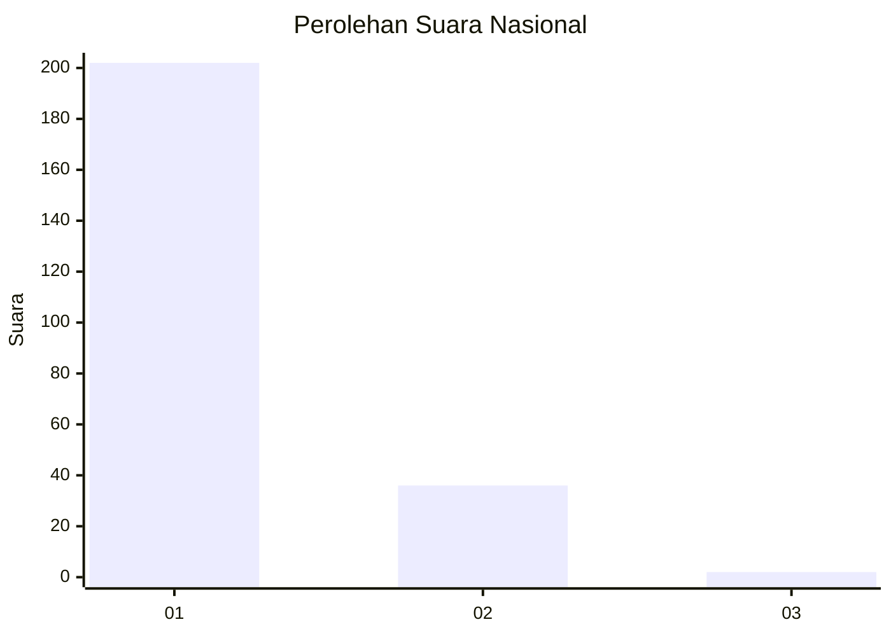
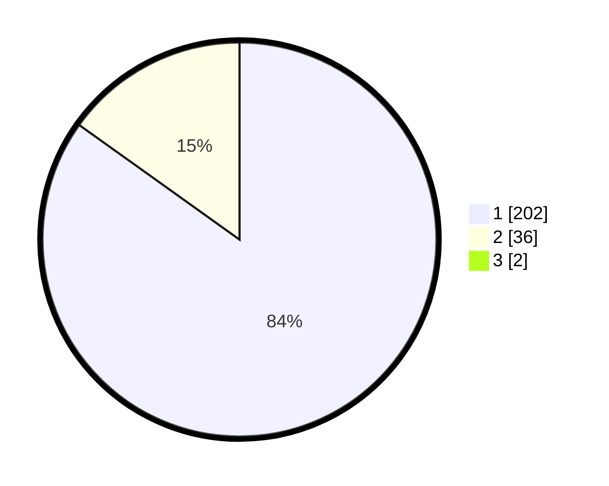

# Hasil

## Grafik

## Tabel

| No. | Nama Paslon    | Suara | Suara (raw) | Persentase |
|:--- |:-------------- | -----:| -----------:| ----------:|
| 1   | ANIES MUHAIMIN | 202   | [202][p-1]  | 84,17      |
| 2   | PRABOWO GIBRAN | 36    | [36][p-2]   | 15,00      |
| 3   | GANJAR MAHFUD  | 2     | [2][p-3]    | 0,83       |

[p-1]: https://github.com/gigit-pemilu/pemilu-2024/blob/main/pilpres/hitung-suara/sub/11-aceh/sub/08-aceh-utara/sub/06-muara-batu/sub/2011-meunasah-aron/sub/003-tps/sub/paslon-1.txt
[p-2]: https://github.com/gigit-pemilu/pemilu-2024/blob/main/pilpres/hitung-suara/sub/11-aceh/sub/08-aceh-utara/sub/06-muara-batu/sub/2011-meunasah-aron/sub/003-tps/sub/paslon-2.txt
[p-3]: https://github.com/gigit-pemilu/pemilu-2024/blob/main/pilpres/hitung-suara/sub/11-aceh/sub/08-aceh-utara/sub/06-muara-batu/sub/2011-meunasah-aron/sub/003-tps/sub/paslon-3.txt

## Foto C Plano

https://sirekap-obj-formc.kpu.go.id/945f/pemilu/ppwp/11/08/06/20/11/1108062011003-20240215-085314--d0022cab-d2f0-4030-bf27-fb4f9e9b59cf.jpg

https://sirekap-obj-formc.kpu.go.id/945f/pemilu/ppwp/11/08/06/20/11/1108062011003-20240215-085505--13fa72d7-cb56-4f1c-a157-5fae8bf953a2.jpg

https://sirekap-obj-formc.kpu.go.id/945f/pemilu/ppwp/11/08/06/20/11/1108062011003-20240215-122953--b7f5fcd1-ad40-4a44-9220-a1c2b5d353a0.jpg

## Metadata

| Key        | Value               |
| ---------- | ------------------- |
| Time Stamp | 2024-02-24 22:31:28 |

