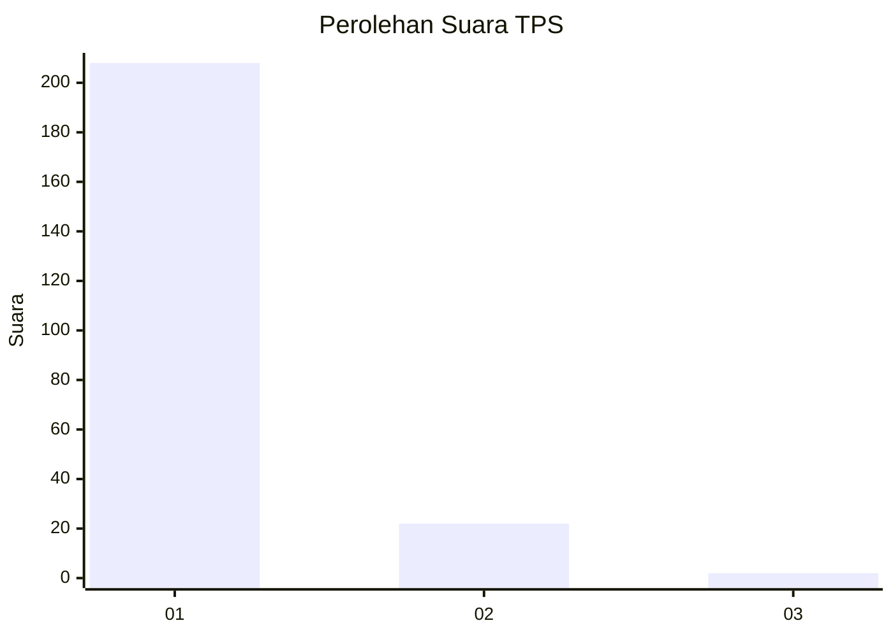
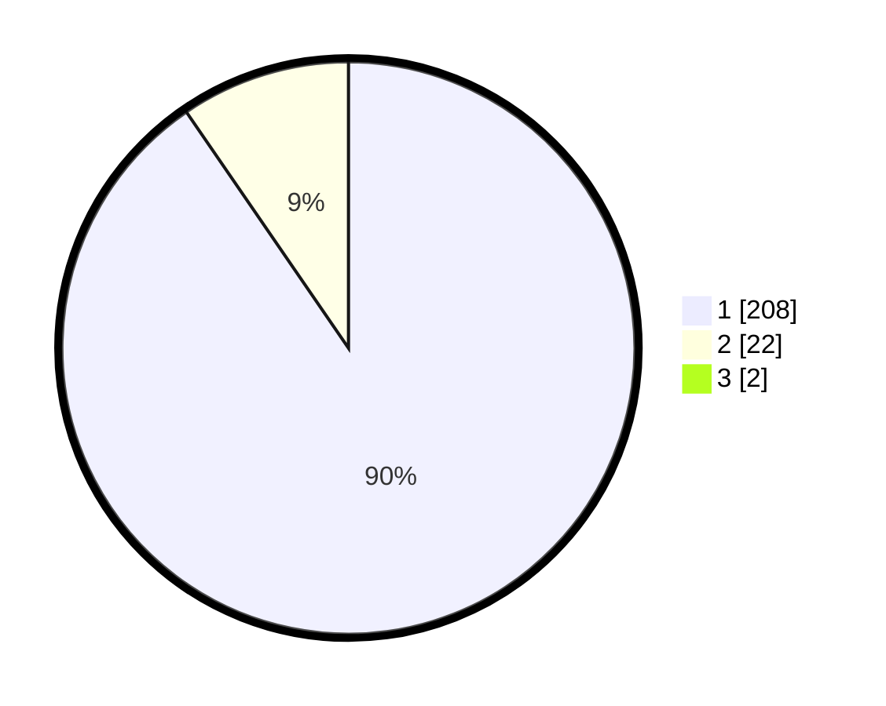

# Hasil

## Grafik

## Tabel

| No. | Nama Paslon    | Suara | Suara (raw) | Persentase |
|:--- |:-------------- | -----:| -----------:| ----------:|
| 1   | ANIES MUHAIMIN | 208   | [208][p-1]  | 89,66      |
| 2   | PRABOWO GIBRAN | 22    | [22][p-2]   | 9,48       |
| 3   | GANJAR MAHFUD  | 2     | [2][p-3]    | 0,86       |

[p-1]: https://github.com/gigit-pemilu/pemilu-2024-11-aceh/blob/main/pilpres/hitung-suara/sub/11-aceh/sub/08-aceh-utara/sub/06-muara-batu/sub/2012-cot-trueng/sub/003-tps/sub/paslon-1.txt
[p-2]: https://github.com/gigit-pemilu/pemilu-2024-11-aceh/blob/main/pilpres/hitung-suara/sub/11-aceh/sub/08-aceh-utara/sub/06-muara-batu/sub/2012-cot-trueng/sub/003-tps/sub/paslon-2.txt
[p-3]: https://github.com/gigit-pemilu/pemilu-2024-11-aceh/blob/main/pilpres/hitung-suara/sub/11-aceh/sub/08-aceh-utara/sub/06-muara-batu/sub/2012-cot-trueng/sub/003-tps/sub/paslon-3.txt

## Foto C Plano

https://sirekap-obj-formc.kpu.go.id/ed78/pemilu/ppwp/11/08/06/20/12/1108062012003-20240215-121250--93e523ef-a300-4367-89e1-798bc28acd85.jpg

https://sirekap-obj-formc.kpu.go.id/ed78/pemilu/ppwp/11/08/06/20/12/1108062012003-20240215-052308--e9b71517-3615-4a70-9cb6-c8b8a255d18a.jpg

https://sirekap-obj-formc.kpu.go.id/ed78/pemilu/ppwp/11/08/06/20/12/1108062012003-20240215-051339--d774fa88-a045-4f58-bcbc-8cb91c22062f.jpg

## Metadata

| Key        | Value               |
| ---------- | ------------------- |
| Time Stamp | 2024-02-17 16:00:02 |

