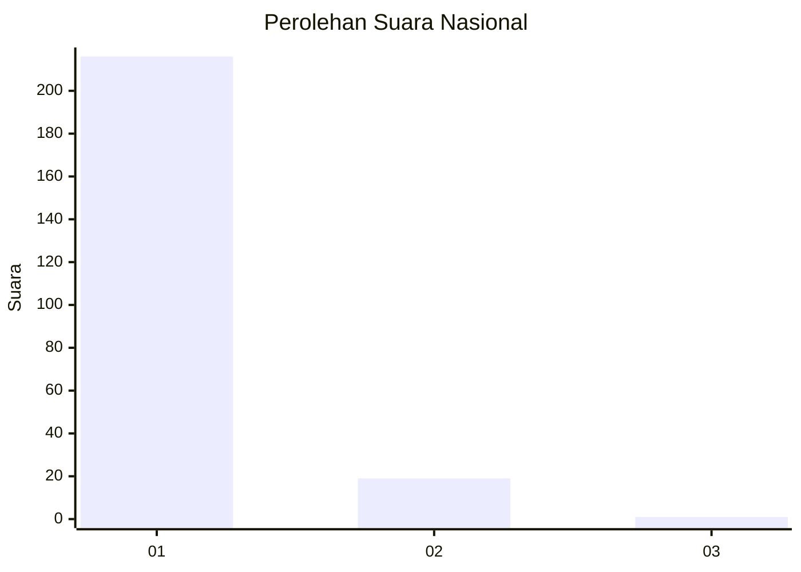
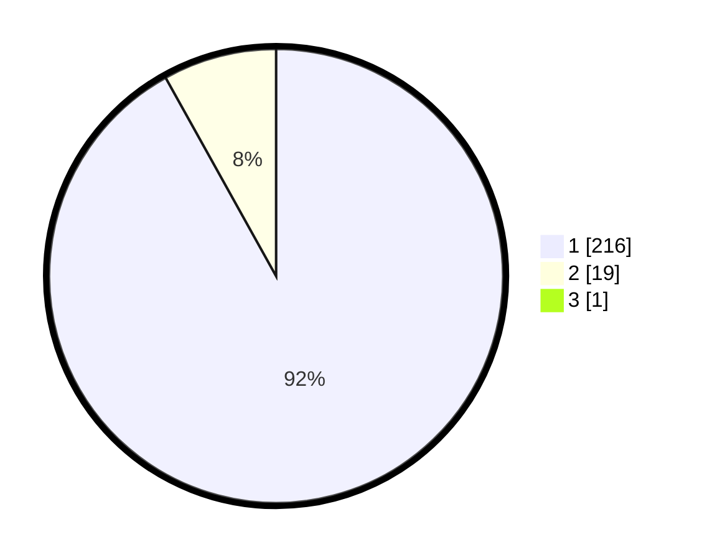

# Hasil

## Grafik

## Tabel

| No. | Nama Paslon    | Suara | Suara (raw) | Persentase |
|:--- |:-------------- | -----:| -----------:| ----------:|
| 1   | ANIES MUHAIMIN | 216   | [216][p-1]  | 91,53      |
| 2   | PRABOWO GIBRAN | 19    | [19][p-2]   | 8,05       |
| 3   | GANJAR MAHFUD  | 1     | [1][p-3]    | 0,42       |

[p-1]: https://github.com/gigit-pemilu/pemilu-2024/blob/main/pilpres/hitung-suara/sub/11-aceh/sub/08-aceh-utara/sub/06-muara-batu/sub/2012-cot-trueng/sub/004-tps/sub/paslon-1.txt
[p-2]: https://github.com/gigit-pemilu/pemilu-2024/blob/main/pilpres/hitung-suara/sub/11-aceh/sub/08-aceh-utara/sub/06-muara-batu/sub/2012-cot-trueng/sub/004-tps/sub/paslon-2.txt
[p-3]: https://github.com/gigit-pemilu/pemilu-2024/blob/main/pilpres/hitung-suara/sub/11-aceh/sub/08-aceh-utara/sub/06-muara-batu/sub/2012-cot-trueng/sub/004-tps/sub/paslon-3.txt

## Foto C Plano

https://sirekap-obj-formc.kpu.go.id/8c8c/pemilu/ppwp/11/08/06/20/12/1108062012004-20240215-112943--5132df58-f57a-4a40-bd6d-2c44ef1df924.jpg

https://sirekap-obj-formc.kpu.go.id/8c8c/pemilu/ppwp/11/08/06/20/12/1108062012004-20240215-113059--8105ad14-c6c5-46b0-92b4-61c1163999fd.jpg

https://sirekap-obj-formc.kpu.go.id/8c8c/pemilu/ppwp/11/08/06/20/12/1108062012004-20240215-113225--fae31061-1d80-4e36-b884-773efbb035ef.jpg

## Metadata

| Key        | Value               |
| ---------- | ------------------- |
| Time Stamp | 2024-02-17 16:00:02 |

