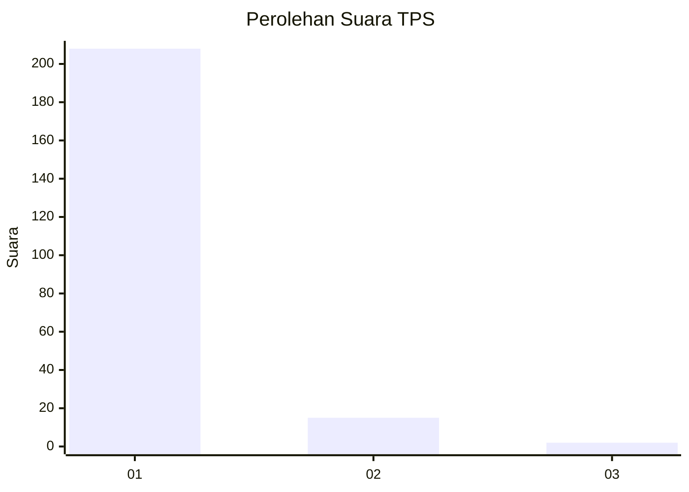
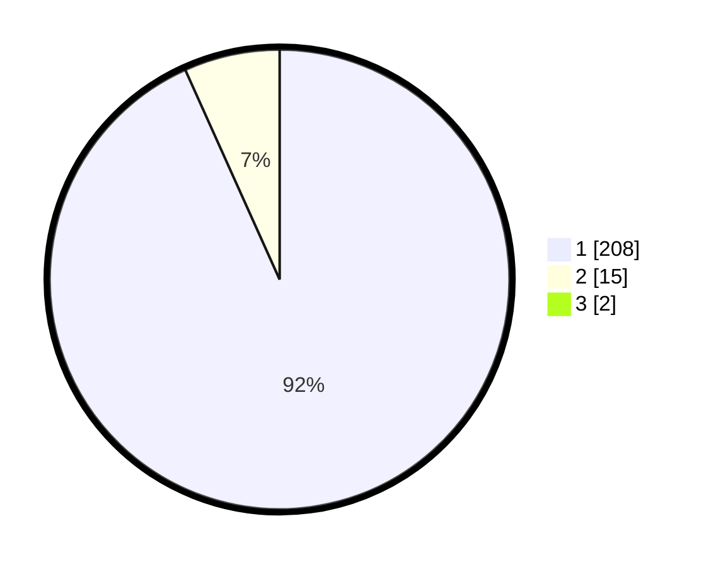

# Hasil

## Grafik

## Tabel

| No. | Nama Paslon    | Suara | Suara (raw) | Persentase |
|:--- |:-------------- | -----:| -----------:| ----------:|
| 1   | ANIES MUHAIMIN | 208   | [208][p-1]  | 92,44      |
| 2   | PRABOWO GIBRAN | 15    | [15][p-2]   | 6,67       |
| 3   | GANJAR MAHFUD  | 2     | [2][p-3]    | 0,89       |

[p-1]: https://github.com/gigit-pemilu/pemilu-2024-11-aceh/blob/main/pilpres/hitung-suara/sub/11-aceh/sub/08-aceh-utara/sub/06-muara-batu/sub/2012-cot-trueng/sub/005-tps/sub/paslon-1.txt
[p-2]: https://github.com/gigit-pemilu/pemilu-2024-11-aceh/blob/main/pilpres/hitung-suara/sub/11-aceh/sub/08-aceh-utara/sub/06-muara-batu/sub/2012-cot-trueng/sub/005-tps/sub/paslon-2.txt
[p-3]: https://github.com/gigit-pemilu/pemilu-2024-11-aceh/blob/main/pilpres/hitung-suara/sub/11-aceh/sub/08-aceh-utara/sub/06-muara-batu/sub/2012-cot-trueng/sub/005-tps/sub/paslon-3.txt

## Foto C Plano

https://sirekap-obj-formc.kpu.go.id/147d/pemilu/ppwp/11/08/06/20/12/1108062012005-20240215-011441--9bf69092-42ad-4957-b238-971f87b93257.jpg

https://sirekap-obj-formc.kpu.go.id/147d/pemilu/ppwp/11/08/06/20/12/1108062012005-20240215-035416--b2df52fb-c215-4f26-81f4-06ef90a15a09.jpg

https://sirekap-obj-formc.kpu.go.id/147d/pemilu/ppwp/11/08/06/20/12/1108062012005-20240215-020628--331df020-44e8-4b3a-8871-a990a75ebe4e.jpg

## Metadata

| Key        | Value               |
| ---------- | ------------------- |
| Time Stamp | 2024-02-15 15:00:29 |

