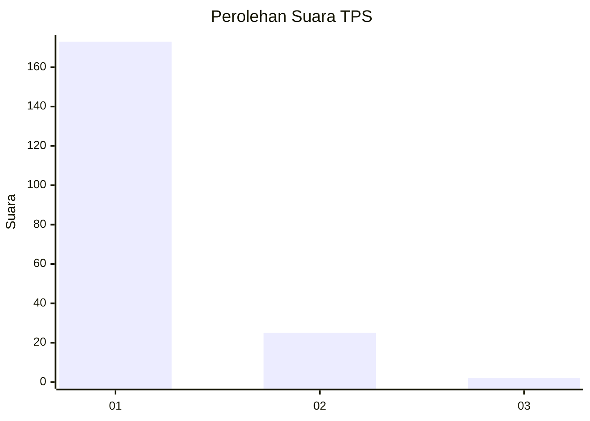
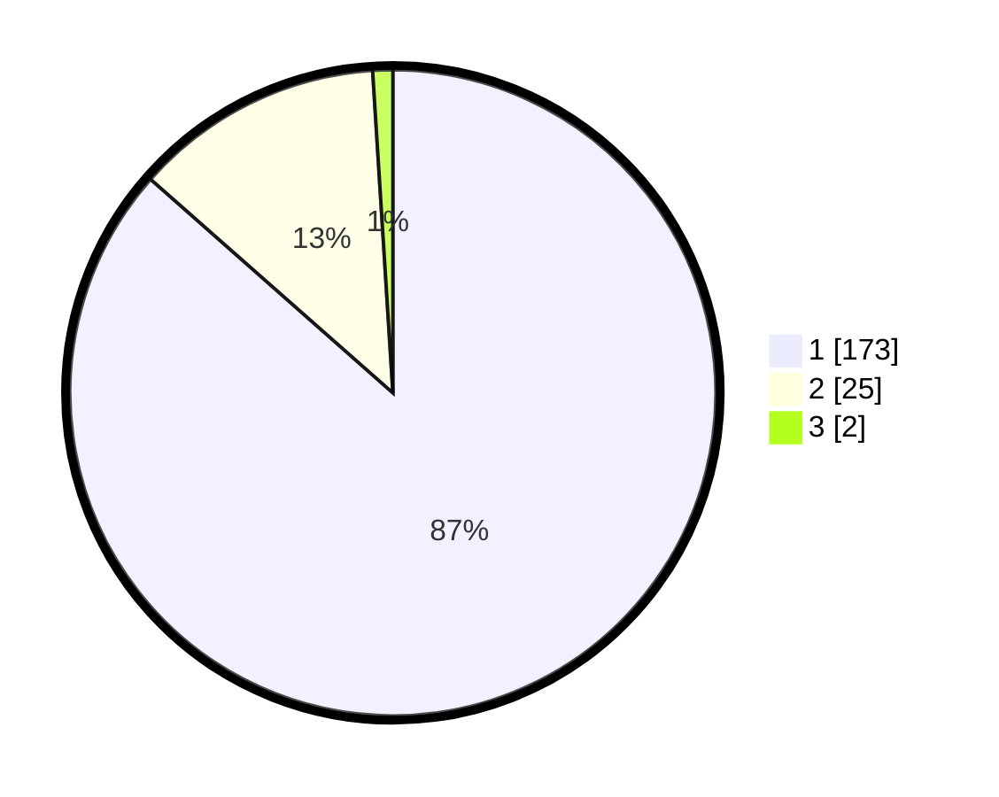

# Hasil

## Grafik

## Tabel

| No. | Nama Paslon    | Suara | Suara (raw) | Persentase |
|:--- |:-------------- | -----:| -----------:| ----------:|
| 1   | ANIES MUHAIMIN | 173   | [173][p-1]  | 86,50      |
| 2   | PRABOWO GIBRAN | 25    | [25][p-2]   | 12,50      |
| 3   | GANJAR MAHFUD  | 2     | [2][p-3]    | 1,00       |

[p-1]: https://github.com/gigit-pemilu/pemilu-2024-11-aceh/blob/main/pilpres/hitung-suara/sub/11-aceh/sub/08-aceh-utara/sub/06-muara-batu/sub/2013-dakuta/sub/005-tps/sub/paslon-1.txt
[p-2]: https://github.com/gigit-pemilu/pemilu-2024-11-aceh/blob/main/pilpres/hitung-suara/sub/11-aceh/sub/08-aceh-utara/sub/06-muara-batu/sub/2013-dakuta/sub/005-tps/sub/paslon-2.txt
[p-3]: https://github.com/gigit-pemilu/pemilu-2024-11-aceh/blob/main/pilpres/hitung-suara/sub/11-aceh/sub/08-aceh-utara/sub/06-muara-batu/sub/2013-dakuta/sub/005-tps/sub/paslon-3.txt

## Foto C Plano

https://sirekap-obj-formc.kpu.go.id/2617/pemilu/ppwp/11/08/06/20/13/1108062013005-20240215-100743--29e2539c-2213-4295-af99-2cb1ab84bbc6.jpg

https://sirekap-obj-formc.kpu.go.id/2617/pemilu/ppwp/11/08/06/20/13/1108062013005-20240215-101138--358f01ee-5605-41c3-a2d1-7268b497d3e6.jpg

https://sirekap-obj-formc.kpu.go.id/2617/pemilu/ppwp/11/08/06/20/13/1108062013005-20240215-101806--96680ea3-597c-4188-afe9-7de8b3fb7e2a.jpg

## Metadata

| Key        | Value               |
| ---------- | ------------------- |
| Time Stamp | 2024-02-15 19:30:26 |

