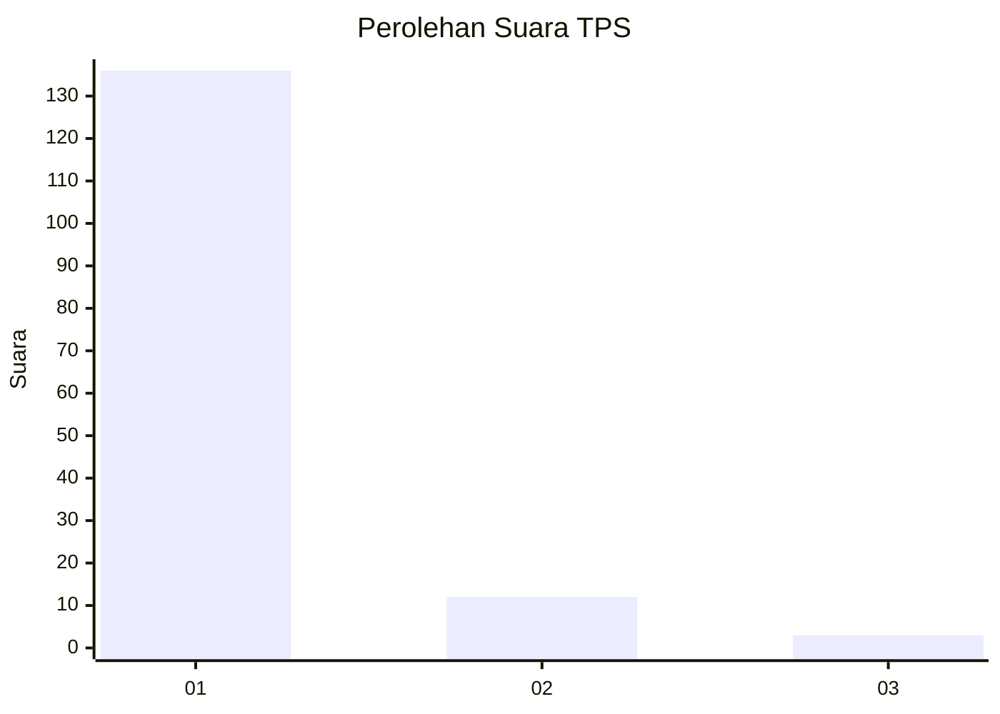
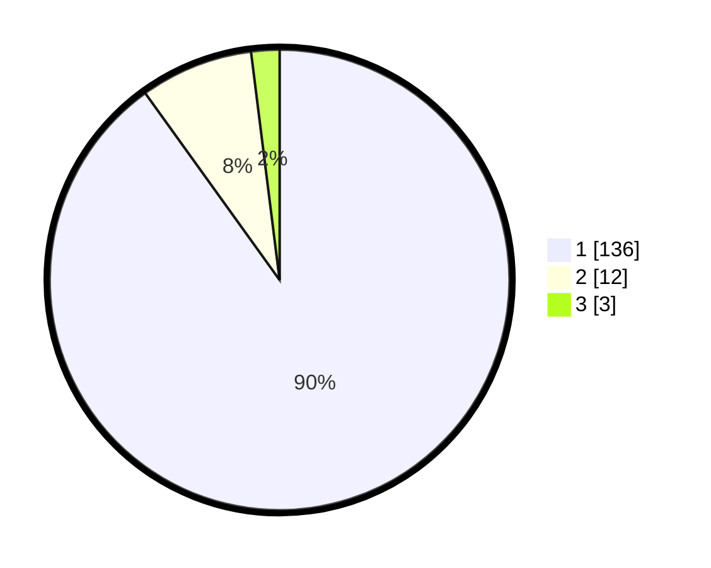

# Hasil

## Grafik

## Tabel

| No. | Nama Paslon    | Suara | Suara (raw) | Persentase |
|:--- |:-------------- | -----:| -----------:| ----------:|
| 1   | ANIES MUHAIMIN | 136   | [136][p-1]  | 90,07      |
| 2   | PRABOWO GIBRAN | 12    | [12][p-2]   | 7,95       |
| 3   | GANJAR MAHFUD  | 3     | [3][p-3]    | 1,99       |

[p-1]: https://github.com/gigit-pemilu/pemilu-2024-11-aceh/blob/main/pilpres/hitung-suara/sub/11-aceh/sub/08-aceh-utara/sub/06-muara-batu/sub/2014-paloh-awe/sub/001-tps/sub/paslon-1.txt
[p-2]: https://github.com/gigit-pemilu/pemilu-2024-11-aceh/blob/main/pilpres/hitung-suara/sub/11-aceh/sub/08-aceh-utara/sub/06-muara-batu/sub/2014-paloh-awe/sub/001-tps/sub/paslon-2.txt
[p-3]: https://github.com/gigit-pemilu/pemilu-2024-11-aceh/blob/main/pilpres/hitung-suara/sub/11-aceh/sub/08-aceh-utara/sub/06-muara-batu/sub/2014-paloh-awe/sub/001-tps/sub/paslon-3.txt

## Foto C Plano

https://sirekap-obj-formc.kpu.go.id/20eb/pemilu/ppwp/11/08/06/20/14/1108062014001-20240215-123327--84f687ce-0b05-4e5f-93e8-8cbbf63a6ec1.jpg

https://sirekap-obj-formc.kpu.go.id/20eb/pemilu/ppwp/11/08/06/20/14/1108062014001-20240215-123511--e010ad86-39b7-4416-9f4d-d4693141387a.jpg

https://sirekap-obj-formc.kpu.go.id/20eb/pemilu/ppwp/11/08/06/20/14/1108062014001-20240215-124150--58f5e97d-62f8-437c-9d09-f181ee5c76bb.jpg

## Metadata

| Key        | Value               |
| ---------- | ------------------- |
| Time Stamp | 2024-02-15 17:00:25 |

