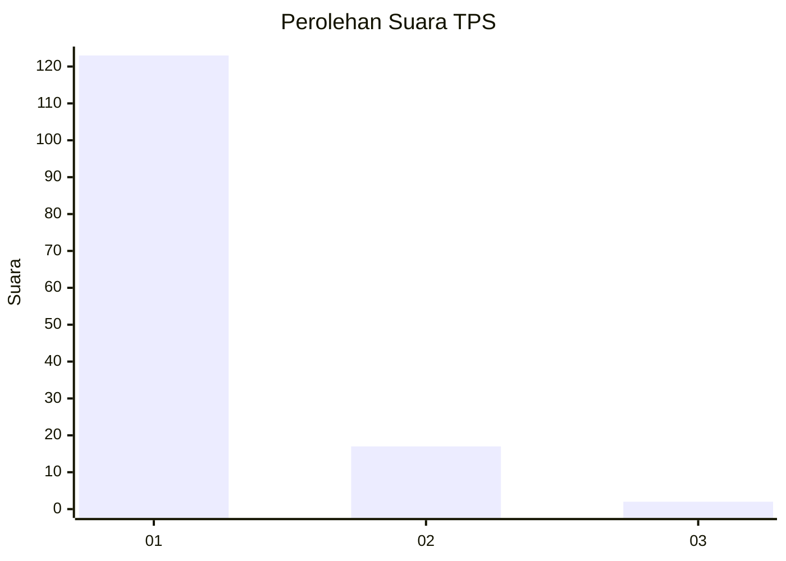
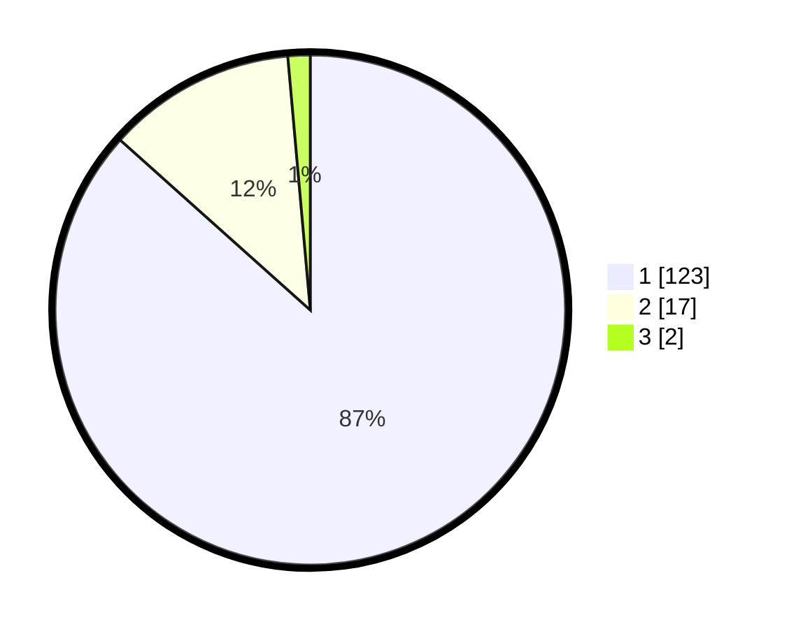

# Hasil

## Grafik

## Tabel

| No. | Nama Paslon    | Suara | Suara (raw) | Persentase |
|:--- |:-------------- | -----:| -----------:| ----------:|
| 1   | ANIES MUHAIMIN | 123   | [123][p-1]  | 86,62      |
| 2   | PRABOWO GIBRAN | 17    | [17][p-2]   | 11,97      |
| 3   | GANJAR MAHFUD  | 2     | [2][p-3]    | 1,41       |

[p-1]: https://github.com/gigit-pemilu/pemilu-2024-11-aceh/blob/main/pilpres/hitung-suara/sub/11-aceh/sub/08-aceh-utara/sub/06-muara-batu/sub/2014-paloh-awe/sub/002-tps/sub/paslon-1.txt
[p-2]: https://github.com/gigit-pemilu/pemilu-2024-11-aceh/blob/main/pilpres/hitung-suara/sub/11-aceh/sub/08-aceh-utara/sub/06-muara-batu/sub/2014-paloh-awe/sub/002-tps/sub/paslon-2.txt
[p-3]: https://github.com/gigit-pemilu/pemilu-2024-11-aceh/blob/main/pilpres/hitung-suara/sub/11-aceh/sub/08-aceh-utara/sub/06-muara-batu/sub/2014-paloh-awe/sub/002-tps/sub/paslon-3.txt

## Foto C Plano

https://sirekap-obj-formc.kpu.go.id/5a53/pemilu/ppwp/11/08/06/20/14/1108062014002-20240215-113417--b5de353b-ca54-4702-8cfa-a2a5d7b030cb.jpg

https://sirekap-obj-formc.kpu.go.id/5a53/pemilu/ppwp/11/08/06/20/14/1108062014002-20240215-114403--c8ff02fb-8ced-4141-92d1-44f5f017ac80.jpg

https://sirekap-obj-formc.kpu.go.id/5a53/pemilu/ppwp/11/08/06/20/14/1108062014002-20240215-114550--1a3ef7ec-2a59-4ac9-9f29-4088b0afdb70.jpg

## Metadata

| Key        | Value               |
| ---------- | ------------------- |
| Time Stamp | 2024-02-17 16:00:02 |

