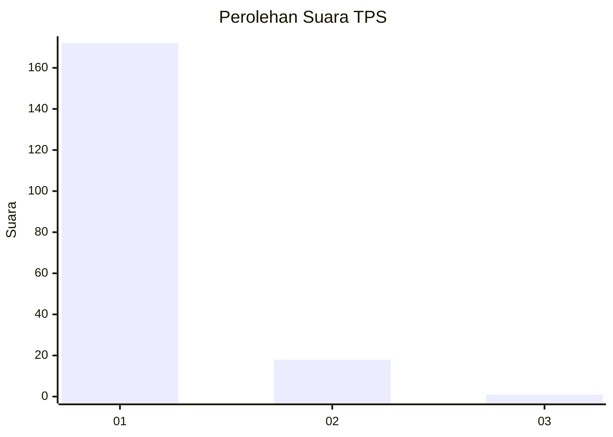
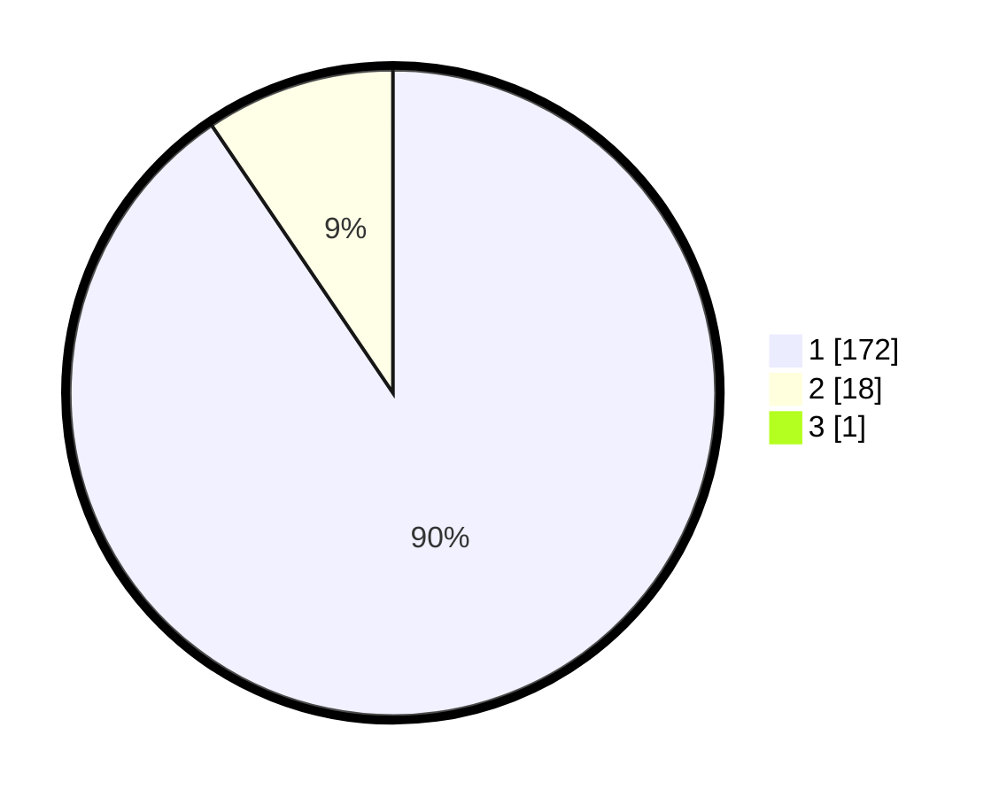

# Hasil

## Grafik

## Tabel

| No. | Nama Paslon    | Suara | Suara (raw) | Persentase |
|:--- |:-------------- | -----:| -----------:| ----------:|
| 1   | ANIES MUHAIMIN | 172   | [172][p-1]  | 90,05      |
| 2   | PRABOWO GIBRAN | 18    | [18][p-2]   | 9,42       |
| 3   | GANJAR MAHFUD  | 1     | [1][p-3]    | 0,52       |

[p-1]: https://github.com/gigit-pemilu/pemilu-2024-11-aceh/blob/main/pilpres/hitung-suara/sub/11-aceh/sub/08-aceh-utara/sub/06-muara-batu/sub/2018-teumpok-beurandang/sub/001-tps/sub/paslon-1.txt
[p-2]: https://github.com/gigit-pemilu/pemilu-2024-11-aceh/blob/main/pilpres/hitung-suara/sub/11-aceh/sub/08-aceh-utara/sub/06-muara-batu/sub/2018-teumpok-beurandang/sub/001-tps/sub/paslon-2.txt
[p-3]: https://github.com/gigit-pemilu/pemilu-2024-11-aceh/blob/main/pilpres/hitung-suara/sub/11-aceh/sub/08-aceh-utara/sub/06-muara-batu/sub/2018-teumpok-beurandang/sub/001-tps/sub/paslon-3.txt

## Foto C Plano

https://sirekap-obj-formc.kpu.go.id/b014/pemilu/ppwp/11/08/06/20/18/1108062018001-20240215-140602--be5e9961-5055-4672-b8a7-801d4b45e4c9.jpg

https://sirekap-obj-formc.kpu.go.id/b014/pemilu/ppwp/11/08/06/20/18/1108062018001-20240215-140705--264f5eef-919b-4b0c-af28-e29004cccb8c.jpg

https://sirekap-obj-formc.kpu.go.id/b014/pemilu/ppwp/11/08/06/20/18/1108062018001-20240215-140751--4e20c1ea-ff0f-4078-a99c-4ed7769a935a.jpg

## Metadata

| Key        | Value               |
| ---------- | ------------------- |
| Time Stamp | 2024-02-17 16:00:02 |

