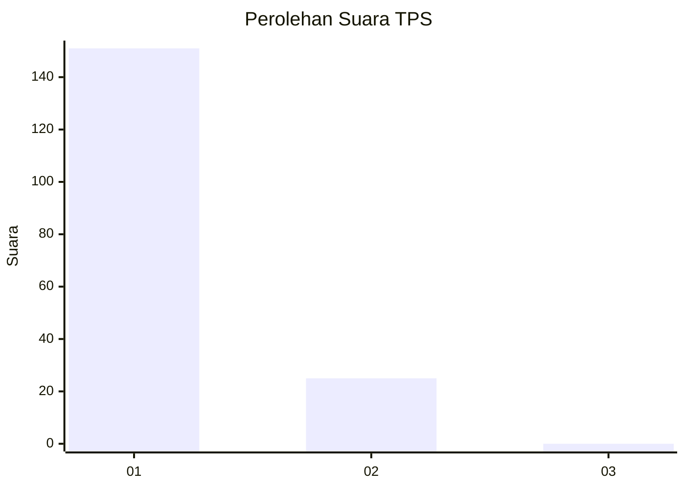
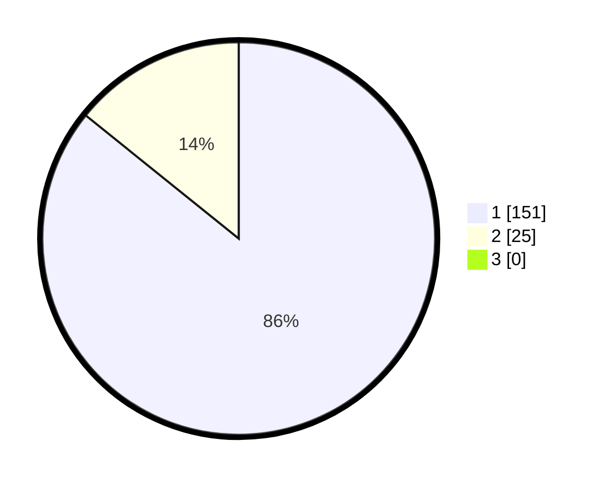

# Hasil

## Grafik

## Tabel

| No. | Nama Paslon    | Suara | Suara (raw) | Persentase |
|:--- |:-------------- | -----:| -----------:| ----------:|
| 1   | ANIES MUHAIMIN | 151   | [151][p-1]  | 85,80      |
| 2   | PRABOWO GIBRAN | 25    | [25][p-2]   | 14,20      |
| 3   | GANJAR MAHFUD  | 0     | [0][p-3]    | 0,00       |

[p-1]: https://github.com/gigit-pemilu/pemilu-2024-11-aceh/blob/main/pilpres/hitung-suara/sub/11-aceh/sub/08-aceh-utara/sub/06-muara-batu/sub/2018-teumpok-beurandang/sub/002-tps/sub/paslon-1.txt
[p-2]: https://github.com/gigit-pemilu/pemilu-2024-11-aceh/blob/main/pilpres/hitung-suara/sub/11-aceh/sub/08-aceh-utara/sub/06-muara-batu/sub/2018-teumpok-beurandang/sub/002-tps/sub/paslon-2.txt
[p-3]: https://github.com/gigit-pemilu/pemilu-2024-11-aceh/blob/main/pilpres/hitung-suara/sub/11-aceh/sub/08-aceh-utara/sub/06-muara-batu/sub/2018-teumpok-beurandang/sub/002-tps/sub/paslon-3.txt

## Foto C Plano

https://sirekap-obj-formc.kpu.go.id/9708/pemilu/ppwp/11/08/06/20/18/1108062018002-20240215-043211--dde98040-0c2d-4731-9a35-f63c7b6aa391.jpg

https://sirekap-obj-formc.kpu.go.id/9708/pemilu/ppwp/11/08/06/20/18/1108062018002-20240214-235136--004e56e9-0f18-4826-b15b-c400c0627cf2.jpg

https://sirekap-obj-formc.kpu.go.id/9708/pemilu/ppwp/11/08/06/20/18/1108062018002-20240214-235418--9c15dd61-4bfe-44ba-93bd-47d45c68c641.jpg

## Metadata

| Key        | Value               |
| ---------- | ------------------- |
| Time Stamp | 2024-02-15 20:00:44 |

