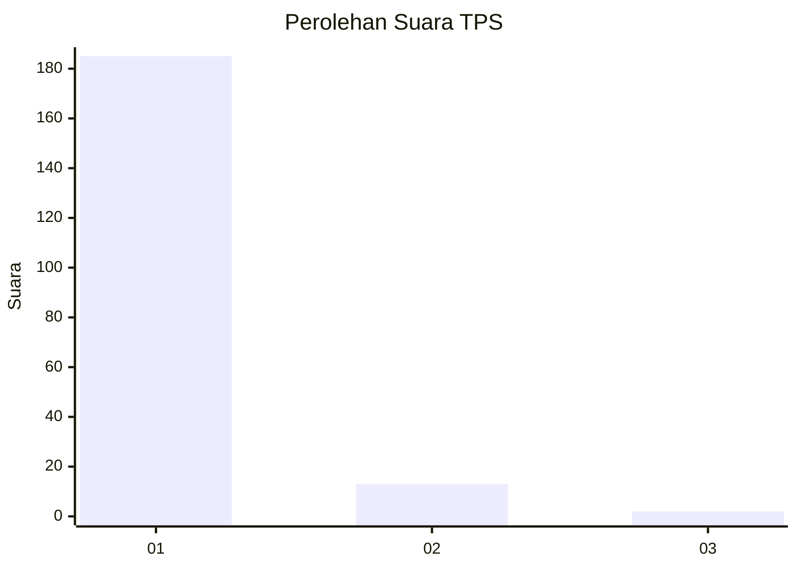
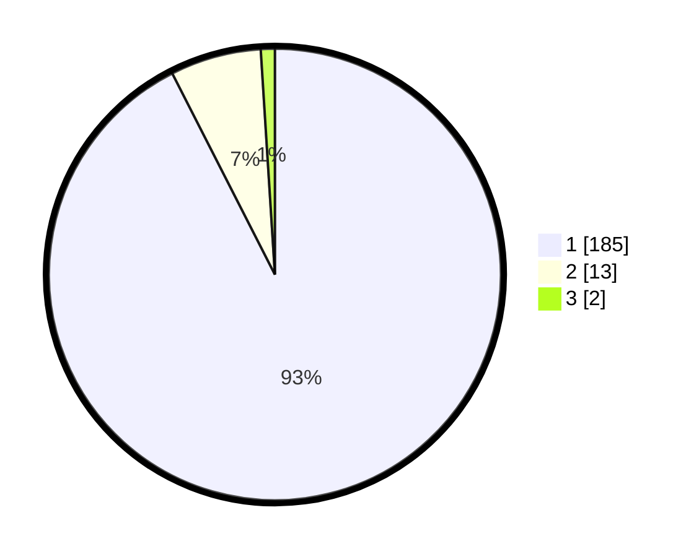

# Hasil

## Grafik

## Tabel

| No. | Nama Paslon    | Suara | Suara (raw) | Persentase |
|:--- |:-------------- | -----:| -----------:| ----------:|
| 1   | ANIES MUHAIMIN | 185   | [185][p-1]  | 92,50      |
| 2   | PRABOWO GIBRAN | 13    | [13][p-2]   | 6,50       |
| 3   | GANJAR MAHFUD  | 2     | [2][p-3]    | 1,00       |

[p-1]: https://github.com/gigit-pemilu/pemilu-2024-11-aceh/blob/main/pilpres/hitung-suara/sub/11-aceh/sub/08-aceh-utara/sub/06-muara-batu/sub/2019-paloh-raya/sub/002-tps/sub/paslon-1.txt
[p-2]: https://github.com/gigit-pemilu/pemilu-2024-11-aceh/blob/main/pilpres/hitung-suara/sub/11-aceh/sub/08-aceh-utara/sub/06-muara-batu/sub/2019-paloh-raya/sub/002-tps/sub/paslon-2.txt
[p-3]: https://github.com/gigit-pemilu/pemilu-2024-11-aceh/blob/main/pilpres/hitung-suara/sub/11-aceh/sub/08-aceh-utara/sub/06-muara-batu/sub/2019-paloh-raya/sub/002-tps/sub/paslon-3.txt

## Foto C Plano

https://sirekap-obj-formc.kpu.go.id/1527/pemilu/ppwp/11/08/06/20/19/1108062019002-20240215-095617--53c03c69-be73-4e26-9d33-cfe9c944ca9d.jpg

https://sirekap-obj-formc.kpu.go.id/1527/pemilu/ppwp/11/08/06/20/19/1108062019002-20240215-100003--ebf3eb7d-3c6d-4446-b19e-636f08fdb708.jpg

https://sirekap-obj-formc.kpu.go.id/1527/pemilu/ppwp/11/08/06/20/19/1108062019002-20240215-100130--1c809577-253d-446b-a879-b654f6cbca07.jpg

## Metadata

| Key        | Value               |
| ---------- | ------------------- |
| Time Stamp | 2024-02-16 12:51:22 |

