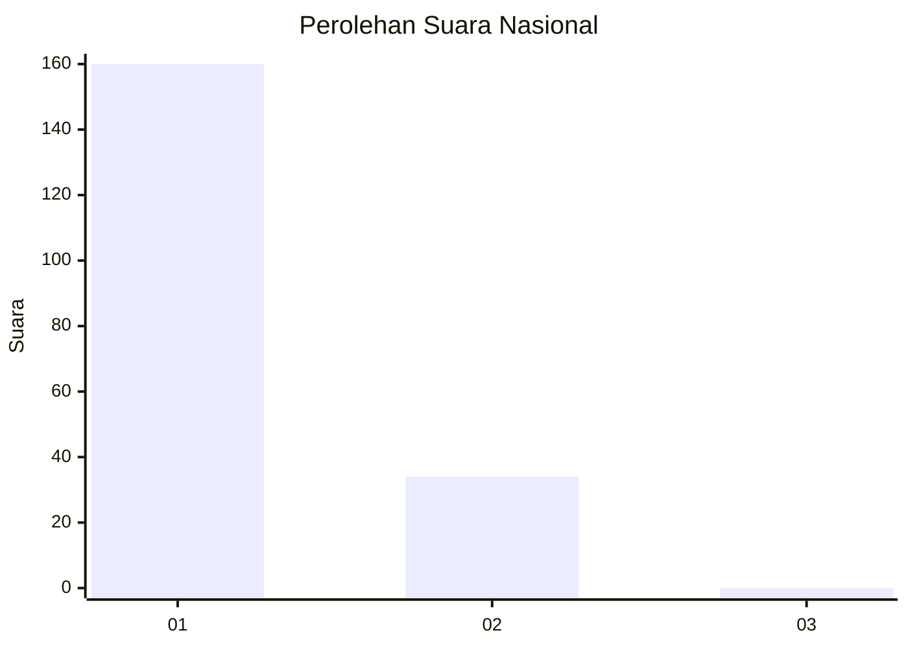
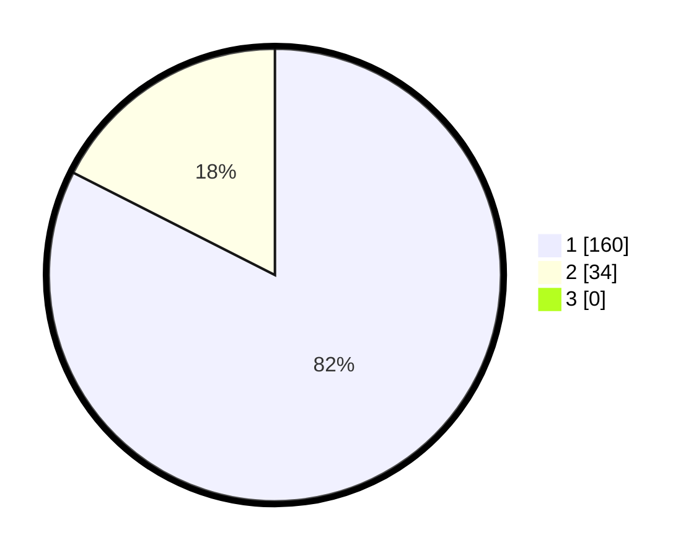

# Hasil

## Grafik

## Tabel

| No. | Nama Paslon    | Suara | Suara (raw) | Persentase |
|:--- |:-------------- | -----:| -----------:| ----------:|
| 1   | ANIES MUHAIMIN | 160   | [160][p-1]  | 82,47      |
| 2   | PRABOWO GIBRAN | 34    | [34][p-2]   | 17,53      |
| 3   | GANJAR MAHFUD  | 0     | [0][p-3]    | 0,00       |

[p-1]: https://github.com/gigit-pemilu/pemilu-2024/blob/main/pilpres/hitung-suara/sub/11-aceh/sub/08-aceh-utara/sub/06-muara-batu/sub/2022-reuleut-timu/sub/001-tps/sub/paslon-1.txt
[p-2]: https://github.com/gigit-pemilu/pemilu-2024/blob/main/pilpres/hitung-suara/sub/11-aceh/sub/08-aceh-utara/sub/06-muara-batu/sub/2022-reuleut-timu/sub/001-tps/sub/paslon-2.txt
[p-3]: https://github.com/gigit-pemilu/pemilu-2024/blob/main/pilpres/hitung-suara/sub/11-aceh/sub/08-aceh-utara/sub/06-muara-batu/sub/2022-reuleut-timu/sub/001-tps/sub/paslon-3.txt

## Foto C Plano

https://sirekap-obj-formc.kpu.go.id/acdf/pemilu/ppwp/11/08/06/20/22/1108062022001-20240215-001716--87df5a9c-144c-4328-933a-85c3597d5302.jpg

https://sirekap-obj-formc.kpu.go.id/acdf/pemilu/ppwp/11/08/06/20/22/1108062022001-20240215-001815--1411f226-43d3-4d85-9302-bcd075ae0d28.jpg

https://sirekap-obj-formc.kpu.go.id/acdf/pemilu/ppwp/11/08/06/20/22/1108062022001-20240215-001915--a39b0f5f-5bc9-4448-bea8-b808f97fca18.jpg

## Metadata

| Key        | Value               |
| ---------- | ------------------- |
| Time Stamp | 2024-02-17 16:00:02 |

