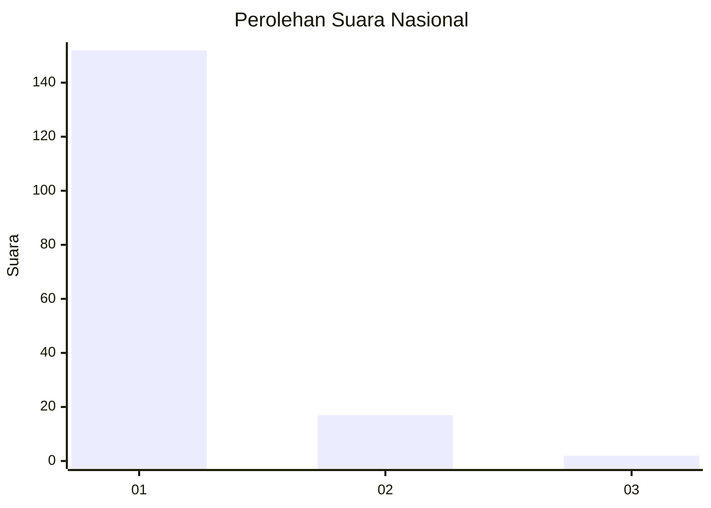
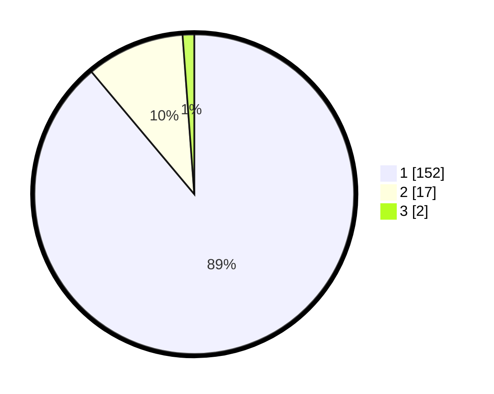

# Hasil

## Grafik

## Tabel

| No. | Nama Paslon    | Suara | Suara (raw) | Persentase |
|:--- |:-------------- | -----:| -----------:| ----------:|
| 1   | ANIES MUHAIMIN | 152   | [152][p-1]  | 88,89      |
| 2   | PRABOWO GIBRAN | 17    | [17][p-2]   | 9,94       |
| 3   | GANJAR MAHFUD  | 2     | [2][p-3]    | 1,17       |

[p-1]: https://github.com/gigit-pemilu/pemilu-2024/blob/main/pilpres/hitung-suara/sub/11-aceh/sub/08-aceh-utara/sub/06-muara-batu/sub/2023-reuleut-barat/sub/002-tps/sub/paslon-1.txt
[p-2]: https://github.com/gigit-pemilu/pemilu-2024/blob/main/pilpres/hitung-suara/sub/11-aceh/sub/08-aceh-utara/sub/06-muara-batu/sub/2023-reuleut-barat/sub/002-tps/sub/paslon-2.txt
[p-3]: https://github.com/gigit-pemilu/pemilu-2024/blob/main/pilpres/hitung-suara/sub/11-aceh/sub/08-aceh-utara/sub/06-muara-batu/sub/2023-reuleut-barat/sub/002-tps/sub/paslon-3.txt

## Foto C Plano

https://sirekap-obj-formc.kpu.go.id/7854/pemilu/ppwp/11/08/06/20/23/1108062023002-20240215-114714--981641bf-ee7e-4354-9fd8-558c9800e4ae.jpg

https://sirekap-obj-formc.kpu.go.id/7854/pemilu/ppwp/11/08/06/20/23/1108062023002-20240215-112035--0bf5e003-d431-4177-8399-58a3f2e067d2.jpg

https://sirekap-obj-formc.kpu.go.id/7854/pemilu/ppwp/11/08/06/20/23/1108062023002-20240215-112334--dbc825b3-6d0c-4597-b6dd-b3c5e157248c.jpg

## Metadata

| Key        | Value               |
| ---------- | ------------------- |
| Time Stamp | 2024-02-15 16:30:25 |

