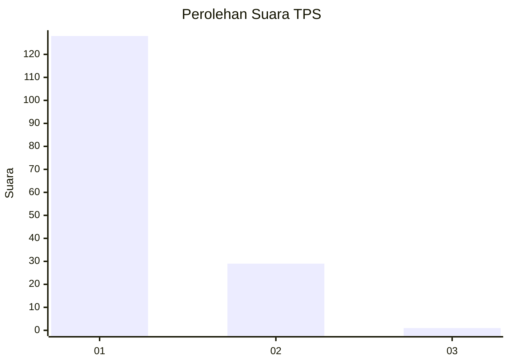
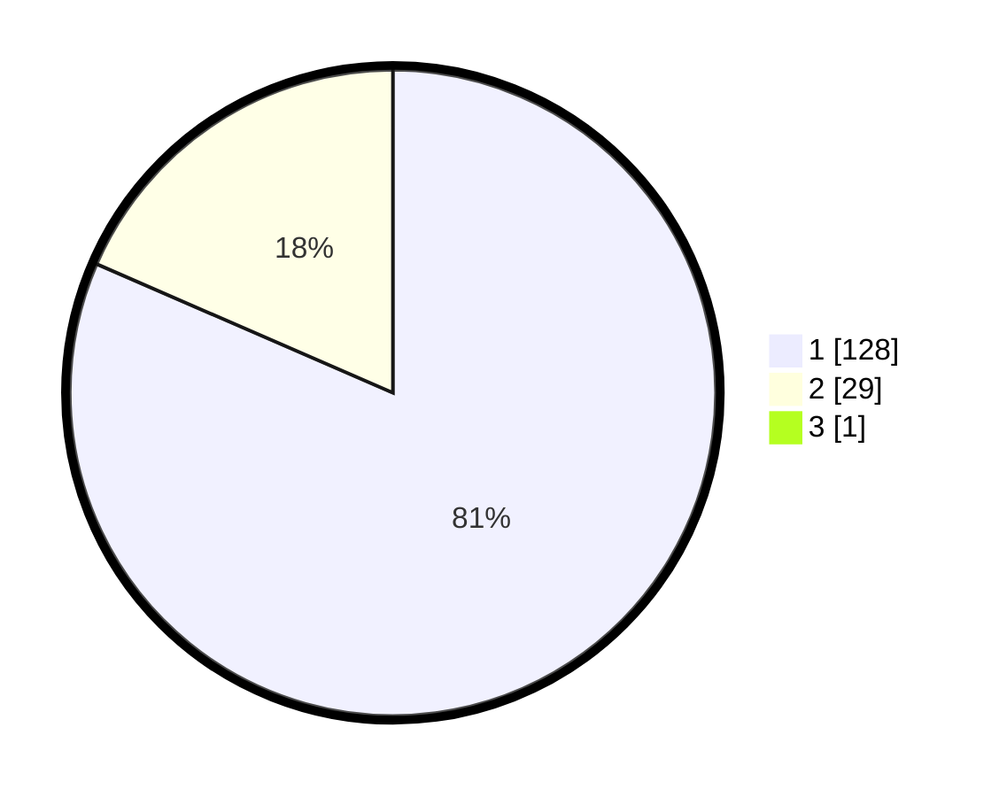

# Hasil

## Grafik

## Tabel

| No. | Nama Paslon    | Suara | Suara (raw) | Persentase |
|:--- |:-------------- | -----:| -----------:| ----------:|
| 1   | ANIES MUHAIMIN | 128   | [128][p-1]  | 81,01      |
| 2   | PRABOWO GIBRAN | 29    | [29][p-2]   | 18,35      |
| 3   | GANJAR MAHFUD  | 1     | [1][p-3]    | 0,63       |

[p-1]: https://github.com/gigit-pemilu/pemilu-2024-11-aceh/blob/main/pilpres/hitung-suara/sub/11-aceh/sub/08-aceh-utara/sub/07-meurah-mulia/sub/2001-dayah-bluek/sub/001-tps/sub/paslon-1.txt
[p-2]: https://github.com/gigit-pemilu/pemilu-2024-11-aceh/blob/main/pilpres/hitung-suara/sub/11-aceh/sub/08-aceh-utara/sub/07-meurah-mulia/sub/2001-dayah-bluek/sub/001-tps/sub/paslon-2.txt
[p-3]: https://github.com/gigit-pemilu/pemilu-2024-11-aceh/blob/main/pilpres/hitung-suara/sub/11-aceh/sub/08-aceh-utara/sub/07-meurah-mulia/sub/2001-dayah-bluek/sub/001-tps/sub/paslon-3.txt

## Foto C Plano

https://sirekap-obj-formc.kpu.go.id/423b/pemilu/ppwp/11/08/07/20/01/1108072001001-20240215-105403--83ad9b55-1ffa-4409-87e6-43ae5716ba2b.jpg

https://sirekap-obj-formc.kpu.go.id/423b/pemilu/ppwp/11/08/07/20/01/1108072001001-20240215-110916--6caa92fd-79ea-4ef6-9b0e-968d522d2862.jpg

https://sirekap-obj-formc.kpu.go.id/423b/pemilu/ppwp/11/08/07/20/01/1108072001001-20240215-110720--18216487-0d0e-4112-97c8-5a0328a0707a.jpg

## Metadata

| Key        | Value               |
| ---------- | ------------------- |
| Time Stamp | 2024-02-15 16:30:25 |

