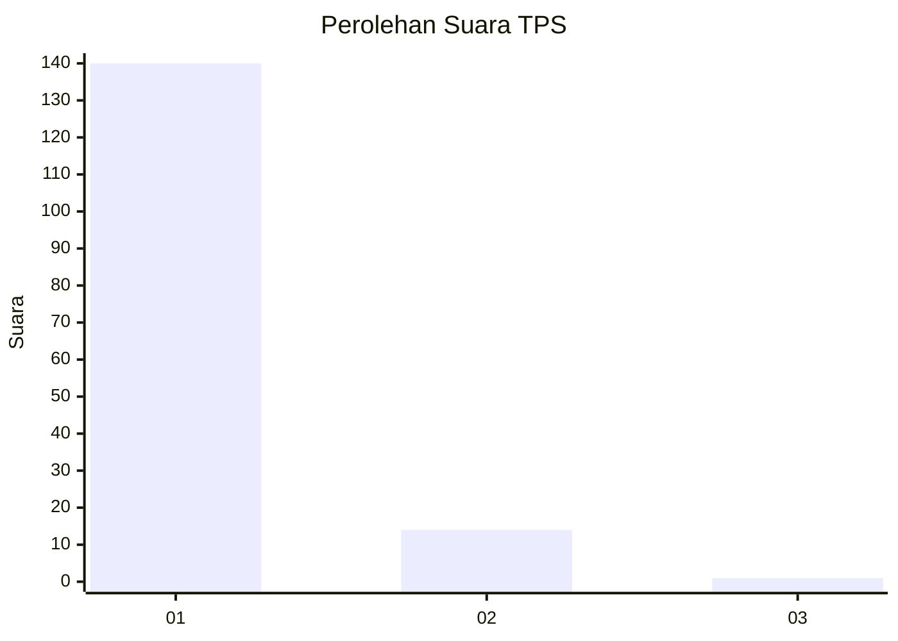
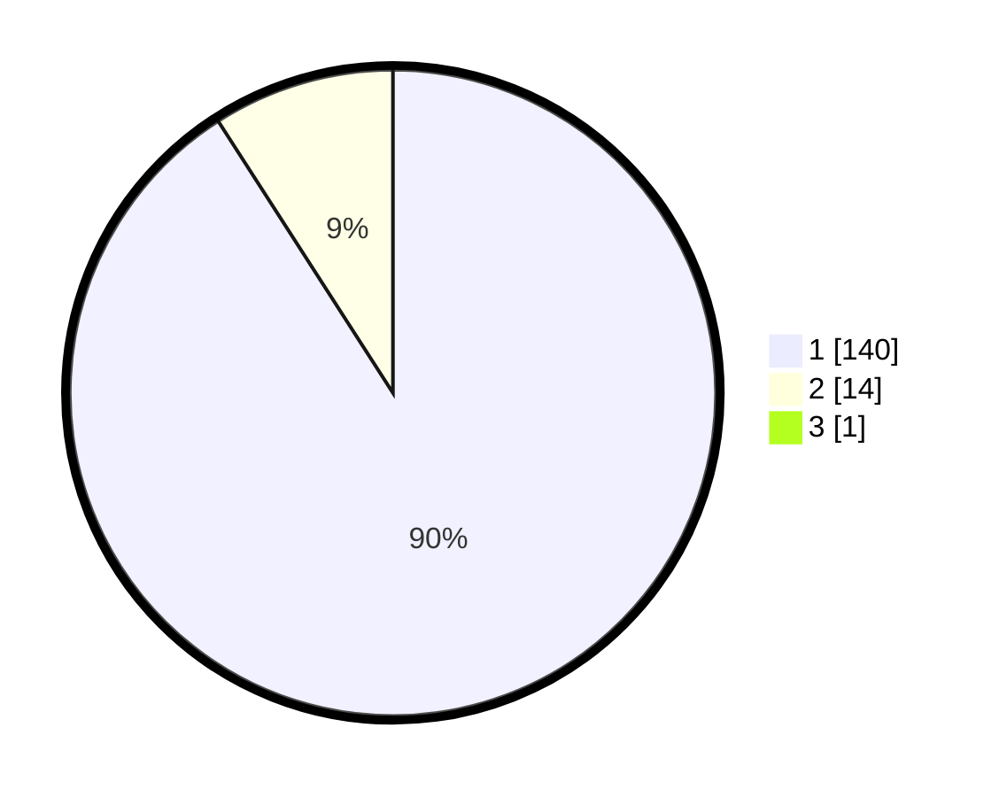

# Hasil

## Grafik

## Tabel

| No. | Nama Paslon    | Suara | Suara (raw) | Persentase |
|:--- |:-------------- | -----:| -----------:| ----------:|
| 1   | ANIES MUHAIMIN | 140   | [140][p-1]  | 90,32      |
| 2   | PRABOWO GIBRAN | 14    | [14][p-2]   | 9,03       |
| 3   | GANJAR MAHFUD  | 1     | [1][p-3]    | 0,65       |

[p-1]: https://github.com/gigit-pemilu/pemilu-2024-11-aceh/blob/main/pilpres/hitung-suara/sub/11-aceh/sub/08-aceh-utara/sub/07-meurah-mulia/sub/2003-meuria-bluek/sub/001-tps/sub/paslon-1.txt
[p-2]: https://github.com/gigit-pemilu/pemilu-2024-11-aceh/blob/main/pilpres/hitung-suara/sub/11-aceh/sub/08-aceh-utara/sub/07-meurah-mulia/sub/2003-meuria-bluek/sub/001-tps/sub/paslon-2.txt
[p-3]: https://github.com/gigit-pemilu/pemilu-2024-11-aceh/blob/main/pilpres/hitung-suara/sub/11-aceh/sub/08-aceh-utara/sub/07-meurah-mulia/sub/2003-meuria-bluek/sub/001-tps/sub/paslon-3.txt

## Foto C Plano

https://sirekap-obj-formc.kpu.go.id/c2f6/pemilu/ppwp/11/08/07/20/03/1108072003001-20240215-143409--d717b337-5745-4ab2-b9b9-fd51582eaf93.jpg

https://sirekap-obj-formc.kpu.go.id/c2f6/pemilu/ppwp/11/08/07/20/03/1108072003001-20240215-143617--7b4d93c7-5e2c-4cc7-b2f3-4f4e03850dc2.jpg

https://sirekap-obj-formc.kpu.go.id/c2f6/pemilu/ppwp/11/08/07/20/03/1108072003001-20240215-143837--c407adf1-338b-4900-a69b-7ed253f314b0.jpg

## Metadata

| Key        | Value               |
| ---------- | ------------------- |
| Time Stamp | 2024-02-17 16:00:02 |

