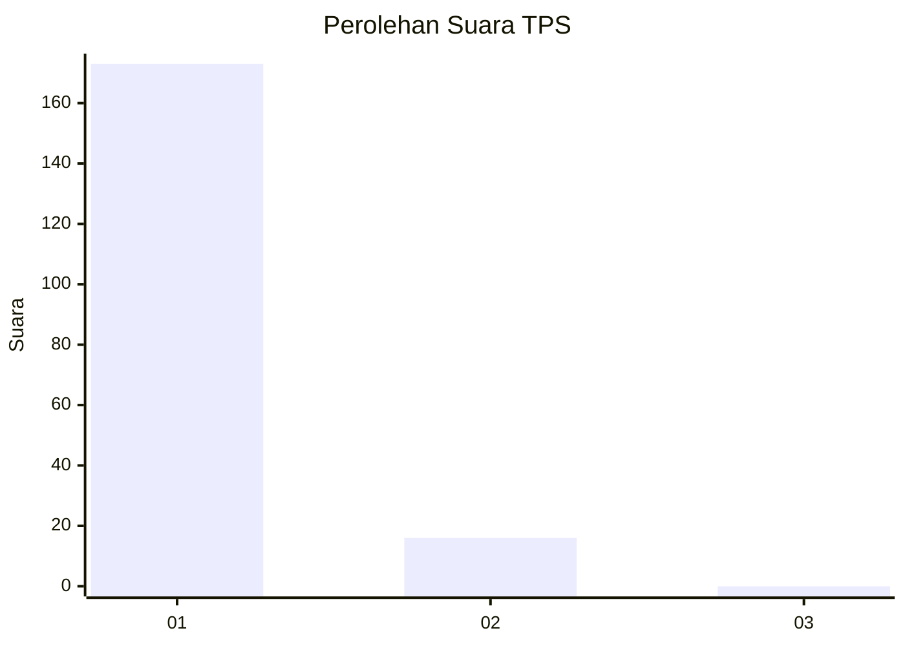
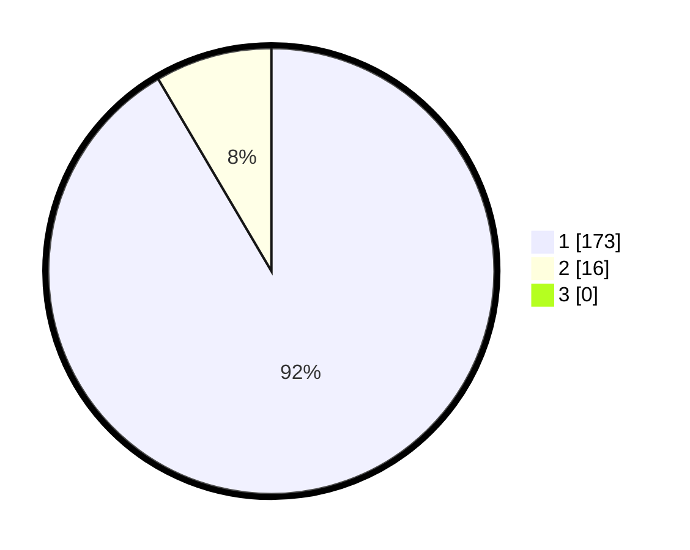

# Hasil

## Grafik

## Tabel

| No. | Nama Paslon    | Suara | Suara (raw) | Persentase |
|:--- |:-------------- | -----:| -----------:| ----------:|
| 1   | ANIES MUHAIMIN | 173   | [173][p-1]  | 91,53      |
| 2   | PRABOWO GIBRAN | 16    | [16][p-2]   | 8,47       |
| 3   | GANJAR MAHFUD  | 0     | [0][p-3]    | 0,00       |

[p-1]: https://github.com/gigit-pemilu/pemilu-2024-11-aceh/blob/main/pilpres/hitung-suara/sub/11-aceh/sub/08-aceh-utara/sub/07-meurah-mulia/sub/2007-rayeuk-matang/sub/002-tps/sub/paslon-1.txt
[p-2]: https://github.com/gigit-pemilu/pemilu-2024-11-aceh/blob/main/pilpres/hitung-suara/sub/11-aceh/sub/08-aceh-utara/sub/07-meurah-mulia/sub/2007-rayeuk-matang/sub/002-tps/sub/paslon-2.txt
[p-3]: https://github.com/gigit-pemilu/pemilu-2024-11-aceh/blob/main/pilpres/hitung-suara/sub/11-aceh/sub/08-aceh-utara/sub/07-meurah-mulia/sub/2007-rayeuk-matang/sub/002-tps/sub/paslon-3.txt

## Foto C Plano

https://sirekap-obj-formc.kpu.go.id/77df/pemilu/ppwp/11/08/07/20/07/1108072007002-20240215-040936--69a358bf-b618-4c1a-9f9f-dda3eda4cb0f.jpg

https://sirekap-obj-formc.kpu.go.id/77df/pemilu/ppwp/11/08/07/20/07/1108072007002-20240215-034716--a1493216-da58-4118-a2a0-23b6224986ff.jpg

https://sirekap-obj-formc.kpu.go.id/77df/pemilu/ppwp/11/08/07/20/07/1108072007002-20240215-034833--0bdc7eef-ac80-46e9-9062-40029e274590.jpg

## Metadata

| Key        | Value               |
| ---------- | ------------------- |
| Time Stamp | 2024-02-16 23:30:00 |

