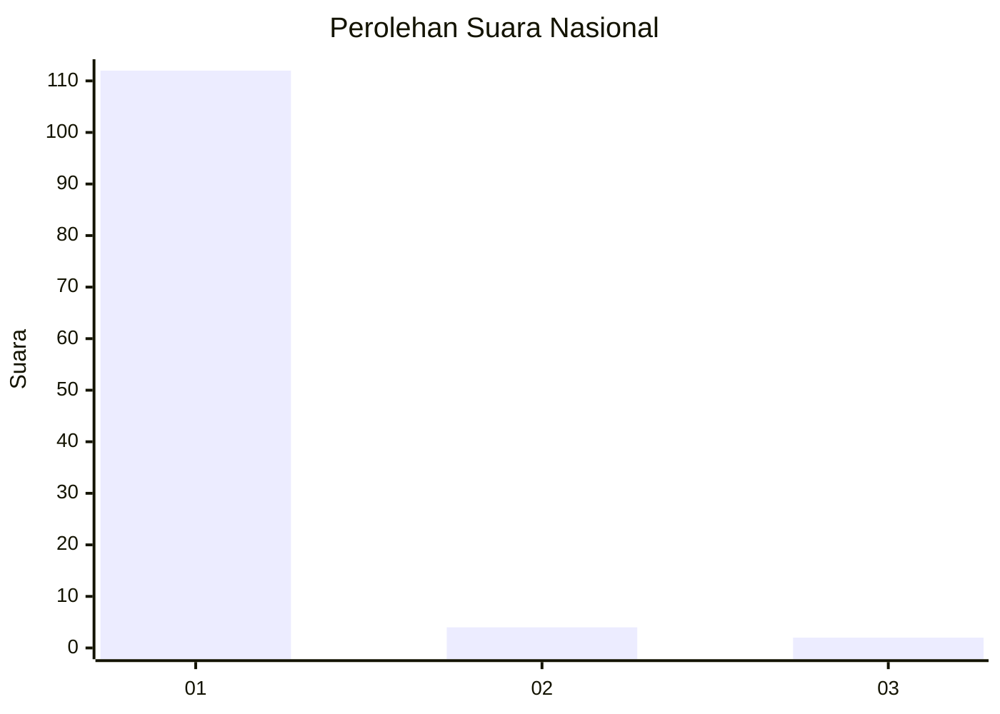
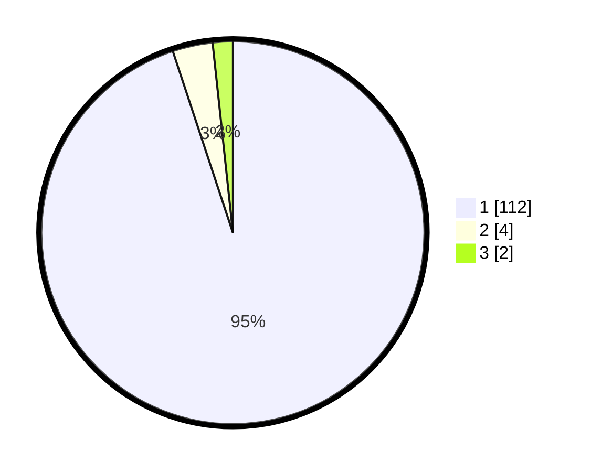

# Hasil

## Grafik

## Tabel

| No. | Nama Paslon    | Suara | Suara (raw) | Persentase |
|:--- |:-------------- | -----:| -----------:| ----------:|
| 1   | ANIES MUHAIMIN | 112   | [112][p-1]  | 94,92      |
| 2   | PRABOWO GIBRAN | 4     | [4][p-2]    | 3,39       |
| 3   | GANJAR MAHFUD  | 2     | [2][p-3]    | 1,69       |

[p-1]: https://github.com/gigit-pemilu/pemilu-2024/blob/main/pilpres/hitung-suara/sub/11-aceh/sub/08-aceh-utara/sub/07-meurah-mulia/sub/2008-ulee-meuria/sub/001-tps/sub/paslon-1.txt
[p-2]: https://github.com/gigit-pemilu/pemilu-2024/blob/main/pilpres/hitung-suara/sub/11-aceh/sub/08-aceh-utara/sub/07-meurah-mulia/sub/2008-ulee-meuria/sub/001-tps/sub/paslon-2.txt
[p-3]: https://github.com/gigit-pemilu/pemilu-2024/blob/main/pilpres/hitung-suara/sub/11-aceh/sub/08-aceh-utara/sub/07-meurah-mulia/sub/2008-ulee-meuria/sub/001-tps/sub/paslon-3.txt

## Foto C Plano

https://sirekap-obj-formc.kpu.go.id/8a42/pemilu/ppwp/11/08/07/20/08/1108072008001-20240219-172603--de7edb8e-ee03-427c-9169-78c99936a8a7.jpg

https://sirekap-obj-formc.kpu.go.id/8a42/pemilu/ppwp/11/08/07/20/08/1108072008001-20240219-213512--5c0198ac-ad38-4469-b73d-3d1a3992f013.jpg

https://sirekap-obj-formc.kpu.go.id/8a42/pemilu/ppwp/11/08/07/20/08/1108072008001-20240219-213511--fa7f5ae8-4c9f-4934-8812-11ff4b9b42d6.jpg

## Metadata

| Key        | Value               |
| ---------- | ------------------- |
| Time Stamp | 2024-02-21 12:00:00 |

