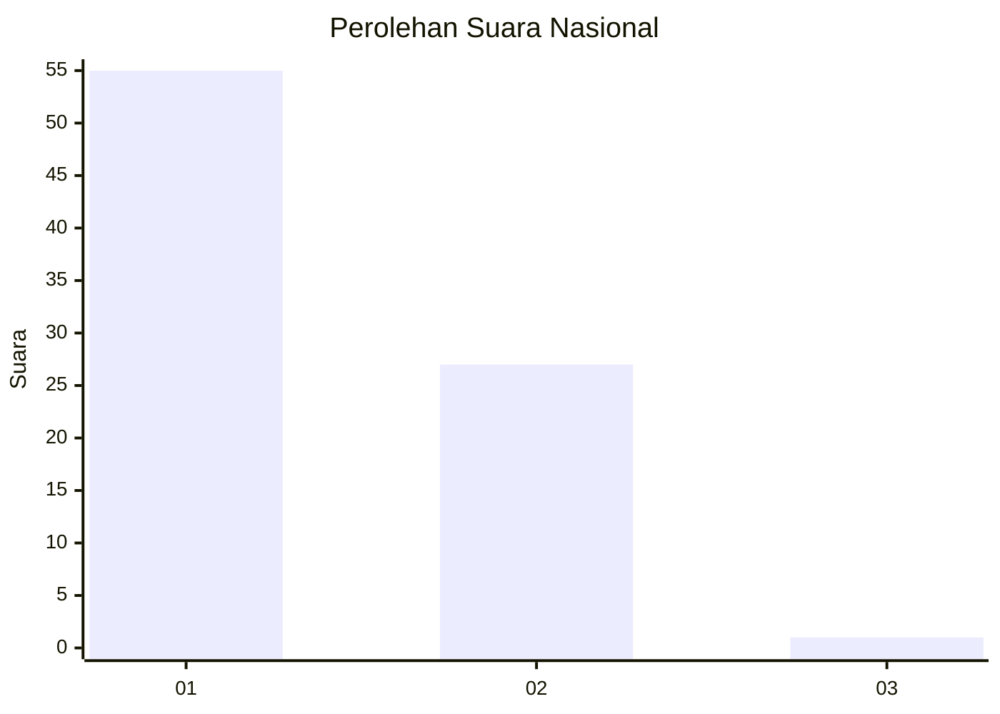
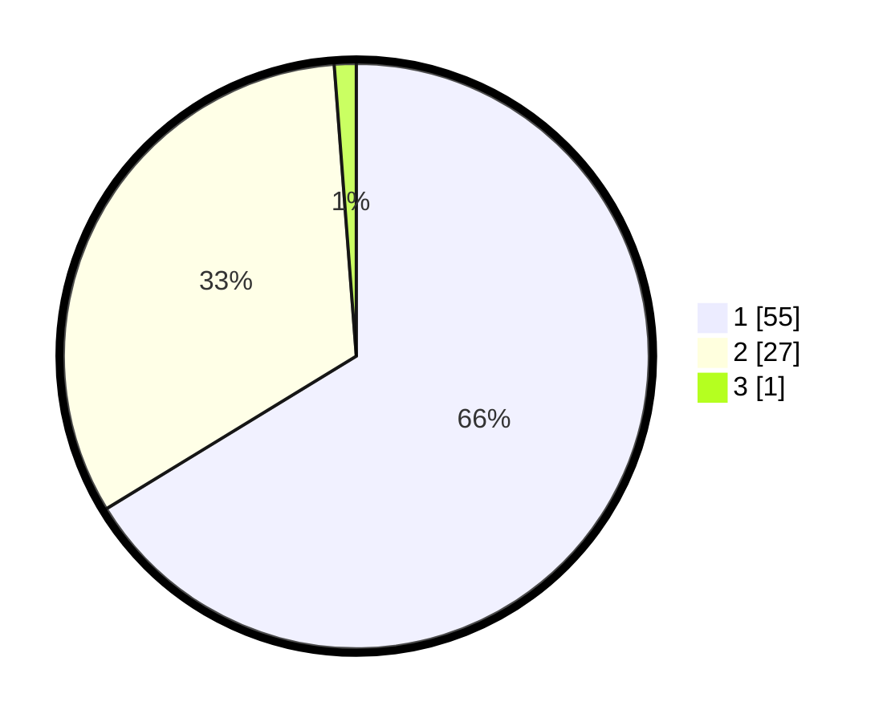

# Hasil

## Grafik

## Tabel

| No. | Nama Paslon    | Suara | Suara (raw) | Persentase |
|:--- |:-------------- | -----:| -----------:| ----------:|
| 1   | ANIES MUHAIMIN | 55    | [55][p-1]   | 66,27      |
| 2   | PRABOWO GIBRAN | 27    | [27][p-2]   | 32,53      |
| 3   | GANJAR MAHFUD  | 1     | [1][p-3]    | 1,20       |

[p-1]: https://github.com/gigit-pemilu/pemilu-2024/blob/main/pilpres/hitung-suara/sub/11-aceh/sub/08-aceh-utara/sub/07-meurah-mulia/sub/2010-keude-karieng/sub/001-tps/sub/paslon-1.txt
[p-2]: https://github.com/gigit-pemilu/pemilu-2024/blob/main/pilpres/hitung-suara/sub/11-aceh/sub/08-aceh-utara/sub/07-meurah-mulia/sub/2010-keude-karieng/sub/001-tps/sub/paslon-2.txt
[p-3]: https://github.com/gigit-pemilu/pemilu-2024/blob/main/pilpres/hitung-suara/sub/11-aceh/sub/08-aceh-utara/sub/07-meurah-mulia/sub/2010-keude-karieng/sub/001-tps/sub/paslon-3.txt

## Foto C Plano

https://sirekap-obj-formc.kpu.go.id/d097/pemilu/ppwp/11/08/07/20/10/1108072010001-20240218-125019--dc0bcf29-1307-4bbb-a95d-d33e88c59694.jpg

https://sirekap-obj-formc.kpu.go.id/d097/pemilu/ppwp/11/08/07/20/10/1108072010001-20240218-125108--6e67061c-b5ee-4ff7-985f-fc9475ad2209.jpg

https://sirekap-obj-formc.kpu.go.id/d097/pemilu/ppwp/11/08/07/20/10/1108072010001-20240218-125115--9dad4040-078f-4b3e-a0b6-1f9b15fa4c0b.jpg

## Metadata

| Key        | Value               |
| ---------- | ------------------- |
| Time Stamp | 2024-02-19 22:00:00 |

## DATA PEMILIH TETAP

Jumlah pemilih dalam DPT: **90**.
 * L: **43**.
 * P: **47**.

## DATA PENGGUNA HAK PILIH

Jumlah pengguna hak pilih dalam DPT: **84**.
 * L: **39**.
 * P: **45**.

Jumlah pengguna hak pilih dalam DPTb: **0**.
 * L: **0**.
 * P: **0**.

Jumlah pengguna hak pilih dalam DPK: **0**.
 * L: **0**.
 * P: **0**.

Jumlah pengguna hak pilih: **84**.
 * L: **39**.
 * P: **45**.

## JUMLAH SUARA SAH DAN TIDAK SAH

JUMLAH SELURUH SUARA SAH: **83**.

JUMLAH SUARA TIDAK SAH: **1**.

JUMLAH SELURUH SUARA SAH DAN SUARA TIDAK SAH: **84**.

