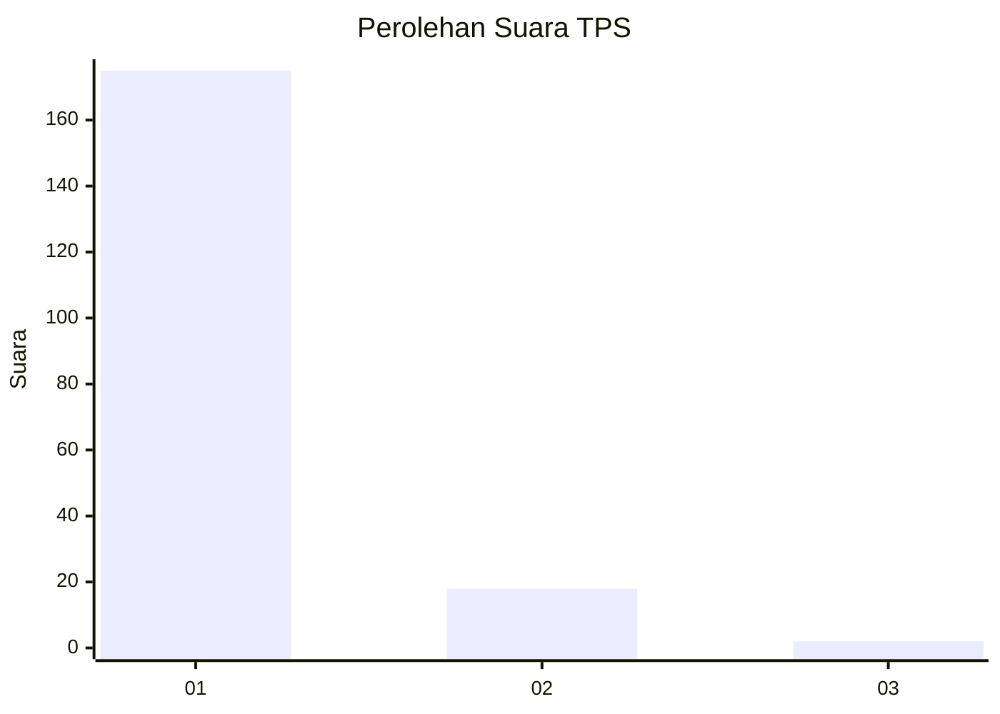
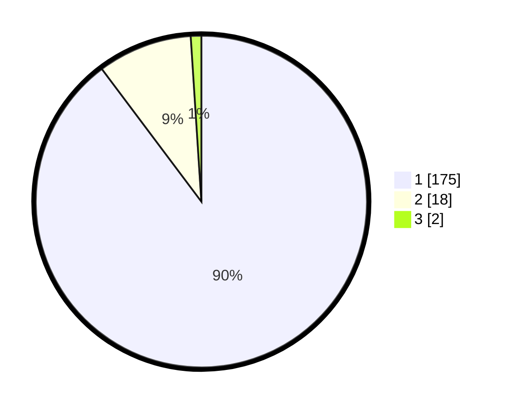

# Hasil

## Grafik

## Tabel

| No. | Nama Paslon    | Suara | Suara (raw) | Persentase |
|:--- |:-------------- | -----:| -----------:| ----------:|
| 1   | ANIES MUHAIMIN | 175   | [175][p-1]  | 89,74      |
| 2   | PRABOWO GIBRAN | 18    | [18][p-2]   | 9,23       |
| 3   | GANJAR MAHFUD  | 2     | [2][p-3]    | 1,03       |

[p-1]: https://github.com/gigit-pemilu/pemilu-2024-11-aceh/blob/main/pilpres/hitung-suara/sub/11-aceh/sub/08-aceh-utara/sub/07-meurah-mulia/sub/2014-geulumpang/sub/001-tps/sub/paslon-1.txt
[p-2]: https://github.com/gigit-pemilu/pemilu-2024-11-aceh/blob/main/pilpres/hitung-suara/sub/11-aceh/sub/08-aceh-utara/sub/07-meurah-mulia/sub/2014-geulumpang/sub/001-tps/sub/paslon-2.txt
[p-3]: https://github.com/gigit-pemilu/pemilu-2024-11-aceh/blob/main/pilpres/hitung-suara/sub/11-aceh/sub/08-aceh-utara/sub/07-meurah-mulia/sub/2014-geulumpang/sub/001-tps/sub/paslon-3.txt

## Foto C Plano

https://sirekap-obj-formc.kpu.go.id/a5c2/pemilu/ppwp/11/08/07/20/14/1108072014001-20240215-063711--9aec2aa2-b873-4a5d-a8fb-3b296bb95e88.jpg

https://sirekap-obj-formc.kpu.go.id/a5c2/pemilu/ppwp/11/08/07/20/14/1108072014001-20240215-063703--35e13171-2d06-4ca0-86da-f87c1cc72b66.jpg

https://sirekap-obj-formc.kpu.go.id/a5c2/pemilu/ppwp/11/08/07/20/14/1108072014001-20240215-063736--ec0a8c79-d11d-4d71-8bd4-21bcd389e772.jpg

## Metadata

| Key        | Value               |
| ---------- | ------------------- |
| Time Stamp | 2024-02-15 17:00:25 |

## DATA PEMILIH TETAP

Jumlah pemilih dalam DPT: **230**.
 * L: **620**.
 * P: **110**.

## DATA PENGGUNA HAK PILIH

Jumlah pengguna hak pilih dalam DPT: **196**.
 * L: **98**.
 * P: **98**.

Jumlah pengguna hak pilih dalam DPTb: **755**.
 * L: **2**.
 * P: **770**.

Jumlah pengguna hak pilih dalam DPK: **200**.
 * L: **222**.
 * P: **222**.

Jumlah pengguna hak pilih: **199**.
 * L: **100**.
 * P: **99**.

## JUMLAH SUARA SAH DAN TIDAK SAH

JUMLAH SELURUH SUARA SAH: **195**.

JUMLAH SUARA TIDAK SAH: **4**.

JUMLAH SELURUH SUARA SAH DAN SUARA TIDAK SAH: **199**.

