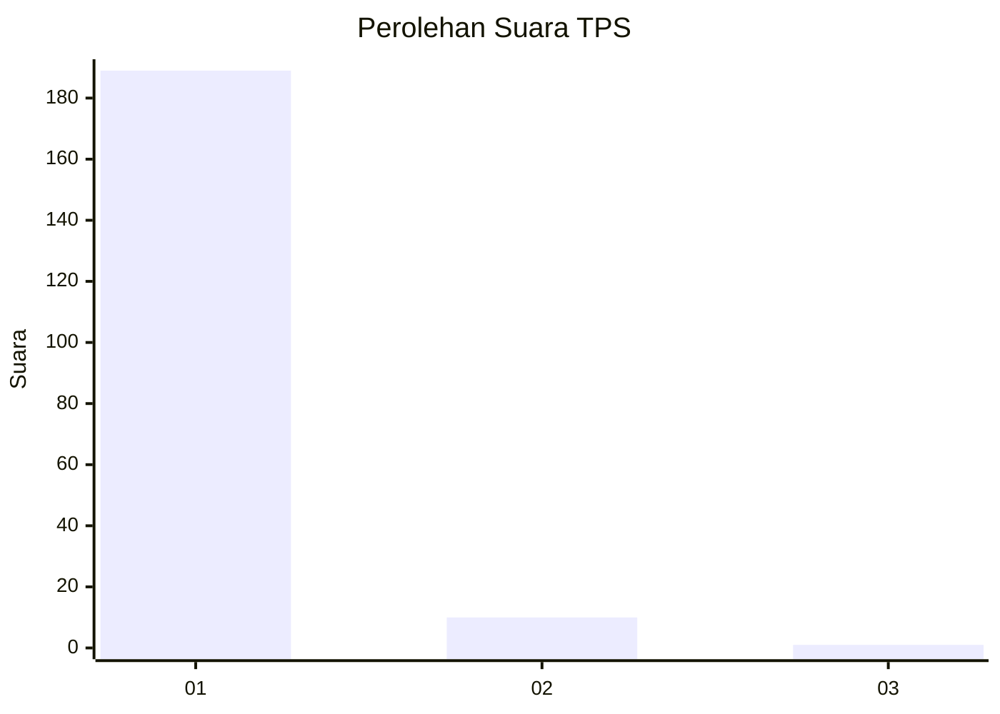
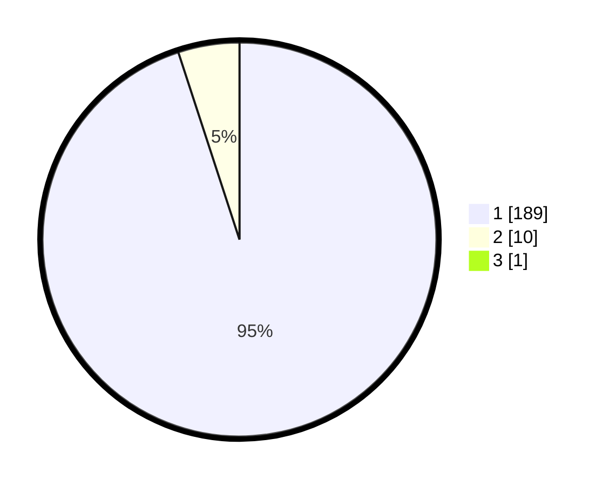

# Hasil

## Grafik

## Tabel

| No. | Nama Paslon    | Suara | Suara (raw) | Persentase |
|:--- |:-------------- | -----:| -----------:| ----------:|
| 1   | ANIES MUHAIMIN | 189   | [189][p-1]  | 94,50      |
| 2   | PRABOWO GIBRAN | 10    | [10][p-2]   | 5,00       |
| 3   | GANJAR MAHFUD  | 1     | [1][p-3]    | 0,50       |

[p-1]: https://github.com/gigit-pemilu/pemilu-2024-11-aceh/blob/main/pilpres/hitung-suara/sub/11-aceh/sub/08-aceh-utara/sub/07-meurah-mulia/sub/2017-paya-kambuk/sub/003-tps/sub/paslon-1.txt
[p-2]: https://github.com/gigit-pemilu/pemilu-2024-11-aceh/blob/main/pilpres/hitung-suara/sub/11-aceh/sub/08-aceh-utara/sub/07-meurah-mulia/sub/2017-paya-kambuk/sub/003-tps/sub/paslon-2.txt
[p-3]: https://github.com/gigit-pemilu/pemilu-2024-11-aceh/blob/main/pilpres/hitung-suara/sub/11-aceh/sub/08-aceh-utara/sub/07-meurah-mulia/sub/2017-paya-kambuk/sub/003-tps/sub/paslon-3.txt

## Foto C Plano

https://sirekap-obj-formc.kpu.go.id/cfa4/pemilu/ppwp/11/08/07/20/17/1108072017003-20240215-113412--d0f30889-2dc4-4a23-b09e-1aee72d68afb.jpg

https://sirekap-obj-formc.kpu.go.id/cfa4/pemilu/ppwp/11/08/07/20/17/1108072017003-20240216-171011--2613fe26-322a-48d8-b1fe-ab855503392e.jpg

https://sirekap-obj-formc.kpu.go.id/cfa4/pemilu/ppwp/11/08/07/20/17/1108072017003-20240215-110837--4356d905-ddc4-4d6e-b058-486a0bddd9dd.jpg

## Metadata

| Key        | Value               |
| ---------- | ------------------- |
| Time Stamp | 2024-02-16 23:30:00 |

