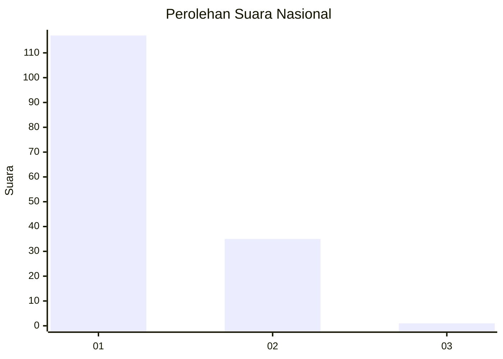
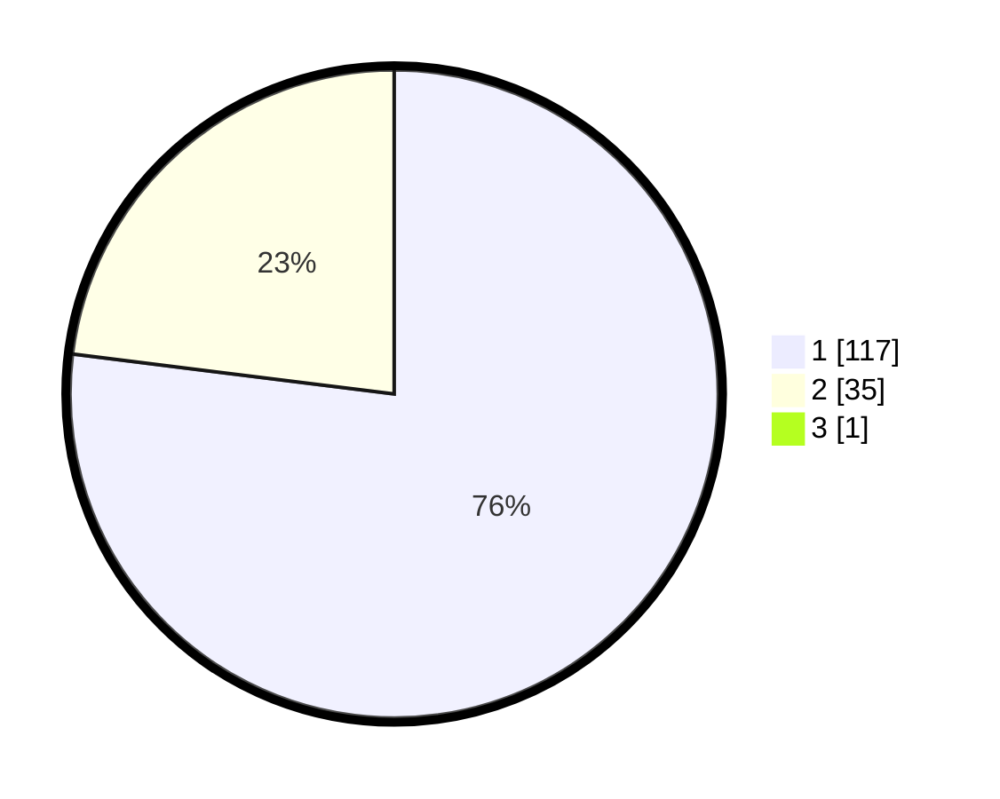

# Hasil

## Grafik

## Tabel

| No. | Nama Paslon    | Suara | Suara (raw) | Persentase |
|:--- |:-------------- | -----:| -----------:| ----------:|
| 1   | ANIES MUHAIMIN | 117   | [117][p-1]  | 76,47      |
| 2   | PRABOWO GIBRAN | 35    | [35][p-2]   | 22,88      |
| 3   | GANJAR MAHFUD  | 1     | [1][p-3]    | 0,65       |

[p-1]: https://github.com/gigit-pemilu/pemilu-2024/blob/main/pilpres/hitung-suara/sub/11-aceh/sub/08-aceh-utara/sub/07-meurah-mulia/sub/2018-paya-bili/sub/002-tps/sub/paslon-1.txt
[p-2]: https://github.com/gigit-pemilu/pemilu-2024/blob/main/pilpres/hitung-suara/sub/11-aceh/sub/08-aceh-utara/sub/07-meurah-mulia/sub/2018-paya-bili/sub/002-tps/sub/paslon-2.txt
[p-3]: https://github.com/gigit-pemilu/pemilu-2024/blob/main/pilpres/hitung-suara/sub/11-aceh/sub/08-aceh-utara/sub/07-meurah-mulia/sub/2018-paya-bili/sub/002-tps/sub/paslon-3.txt

## Foto C Plano

https://sirekap-obj-formc.kpu.go.id/f2e3/pemilu/ppwp/11/08/07/20/18/1108072018002-20240214-214126--78ba1717-874e-4e3b-9297-9b6c463731c4.jpg

https://sirekap-obj-formc.kpu.go.id/f2e3/pemilu/ppwp/11/08/07/20/18/1108072018002-20240214-214350--cd0fb94a-daf9-46fb-b8f1-71b1309fa9d8.jpg

https://sirekap-obj-formc.kpu.go.id/f2e3/pemilu/ppwp/11/08/07/20/18/1108072018002-20240214-214547--86b2564c-695c-4ff7-a211-22e28081d90d.jpg

## Metadata

| Key        | Value               |
| ---------- | ------------------- |
| Time Stamp | 2024-02-17 16:00:02 |

