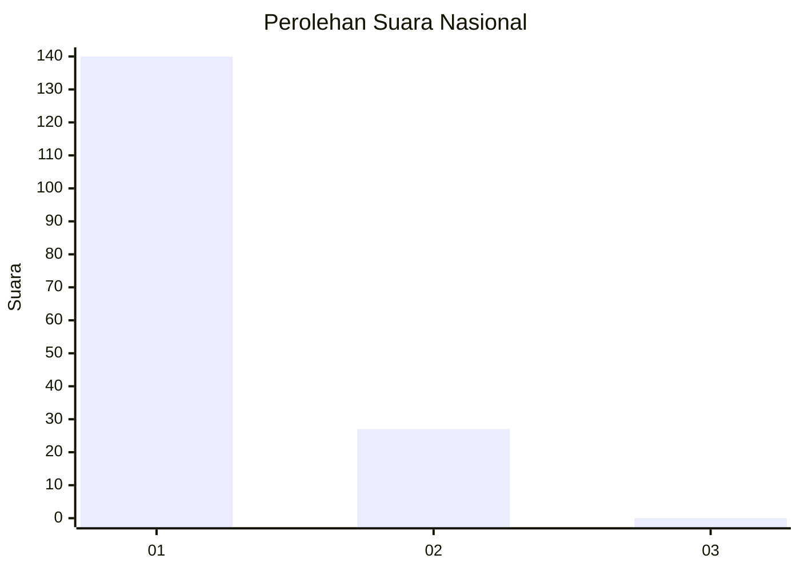
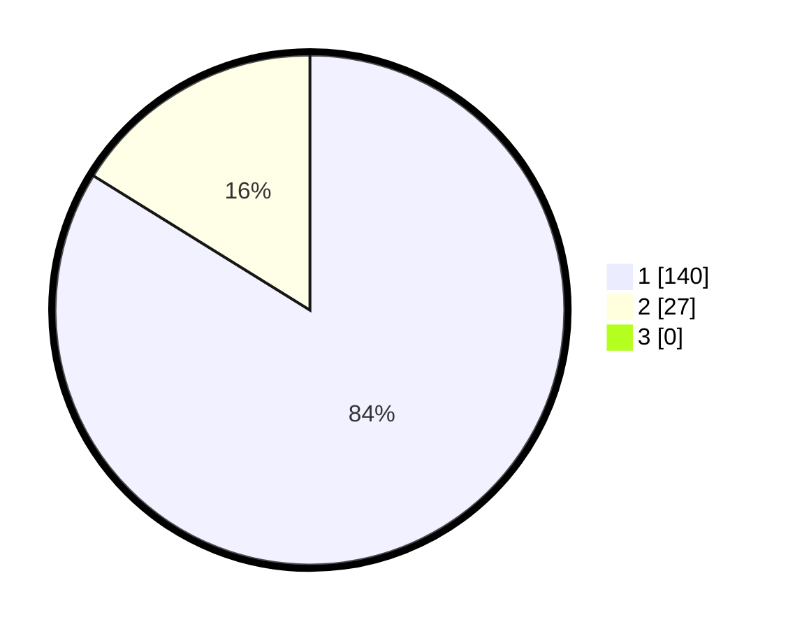

# Hasil

## Grafik

## Tabel

| No. | Nama Paslon    | Suara | Suara (raw) | Persentase |
|:--- |:-------------- | -----:| -----------:| ----------:|
| 1   | ANIES MUHAIMIN | 140   | [140][p-1]  | 83,83      |
| 2   | PRABOWO GIBRAN | 27    | [27][p-2]   | 16,17      |
| 3   | GANJAR MAHFUD  | 0     | [0][p-3]    | 0,00       |

[p-1]: https://github.com/gigit-pemilu/pemilu-2024/blob/main/pilpres/hitung-suara/sub/11-aceh/sub/08-aceh-utara/sub/07-meurah-mulia/sub/2021-ubit-paya-itek/sub/002-tps/sub/paslon-1.txt
[p-2]: https://github.com/gigit-pemilu/pemilu-2024/blob/main/pilpres/hitung-suara/sub/11-aceh/sub/08-aceh-utara/sub/07-meurah-mulia/sub/2021-ubit-paya-itek/sub/002-tps/sub/paslon-2.txt
[p-3]: https://github.com/gigit-pemilu/pemilu-2024/blob/main/pilpres/hitung-suara/sub/11-aceh/sub/08-aceh-utara/sub/07-meurah-mulia/sub/2021-ubit-paya-itek/sub/002-tps/sub/paslon-3.txt

## Foto C Plano

https://sirekap-obj-formc.kpu.go.id/e678/pemilu/ppwp/11/08/07/20/21/1108072021002-20240215-085238--caf9b695-e927-4e32-8b73-d93cc6b513e5.jpg

https://sirekap-obj-formc.kpu.go.id/e678/pemilu/ppwp/11/08/07/20/21/1108072021002-20240215-085336--3dc86d20-9f86-45e3-832d-4a7cf37f401d.jpg

https://sirekap-obj-formc.kpu.go.id/e678/pemilu/ppwp/11/08/07/20/21/1108072021002-20240215-085430--90c619f4-5c31-4562-85aa-1135ec08e6de.jpg

## Metadata

| Key        | Value               |
| ---------- | ------------------- |
| Time Stamp | 2024-02-16 23:30:00 |

