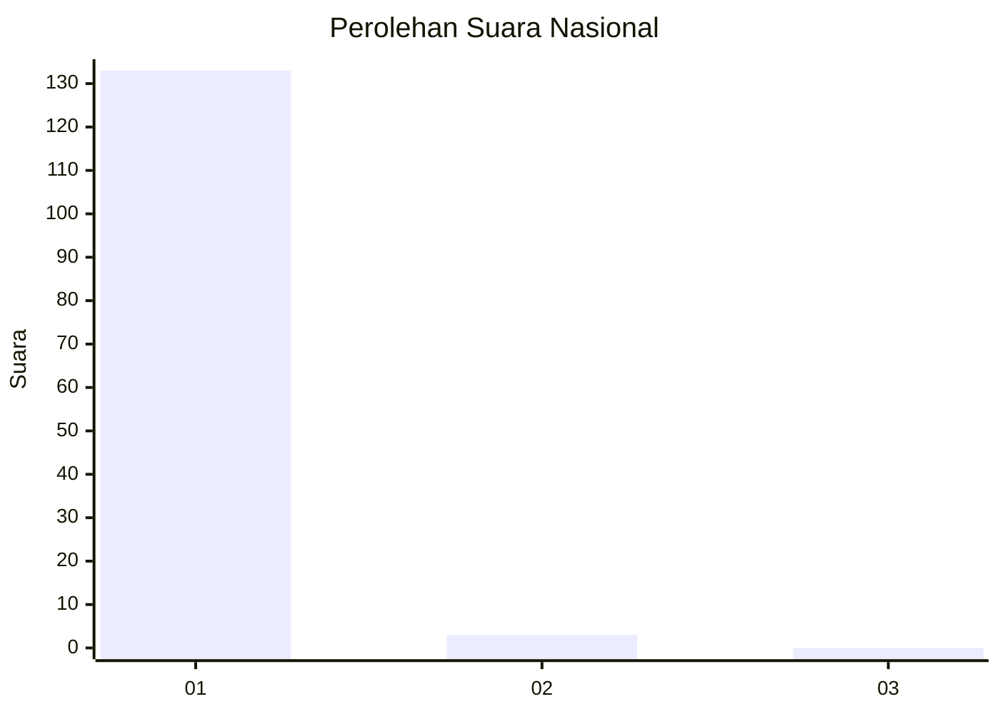
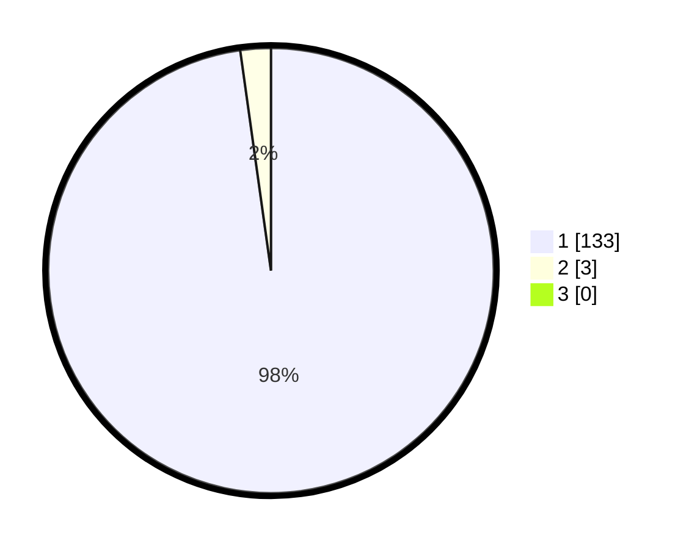

# Hasil

## Grafik

## Tabel

| No. | Nama Paslon    | Suara | Suara (raw) | Persentase |
|:--- |:-------------- | -----:| -----------:| ----------:|
| 1   | ANIES MUHAIMIN | 133   | [133][p-1]  | 97,79      |
| 2   | PRABOWO GIBRAN | 3     | [3][p-2]    | 2,21       |
| 3   | GANJAR MAHFUD  | 0     | [0][p-3]    | 0,00       |

[p-1]: https://github.com/gigit-pemilu/pemilu-2024/blob/main/pilpres/hitung-suara/sub/11-aceh/sub/08-aceh-utara/sub/07-meurah-mulia/sub/2025-kumbang/sub/001-tps/sub/paslon-1.txt
[p-2]: https://github.com/gigit-pemilu/pemilu-2024/blob/main/pilpres/hitung-suara/sub/11-aceh/sub/08-aceh-utara/sub/07-meurah-mulia/sub/2025-kumbang/sub/001-tps/sub/paslon-2.txt
[p-3]: https://github.com/gigit-pemilu/pemilu-2024/blob/main/pilpres/hitung-suara/sub/11-aceh/sub/08-aceh-utara/sub/07-meurah-mulia/sub/2025-kumbang/sub/001-tps/sub/paslon-3.txt

## Foto C Plano

https://sirekap-obj-formc.kpu.go.id/058a/pemilu/ppwp/11/08/07/20/25/1108072025001-20240215-000439--8371706e-3a76-4d4b-afcf-e400c7f303f1.jpg

https://sirekap-obj-formc.kpu.go.id/058a/pemilu/ppwp/11/08/07/20/25/1108072025001-20240215-000931--16ae4727-8326-4e9f-8934-46e38d3df39b.jpg

https://sirekap-obj-formc.kpu.go.id/058a/pemilu/ppwp/11/08/07/20/25/1108072025001-20240215-001157--1139c247-476d-4416-8c06-3556f0098b0a.jpg

## Metadata

| Key        | Value               |
| ---------- | ------------------- |
| Time Stamp | 2024-02-16 23:30:00 |

