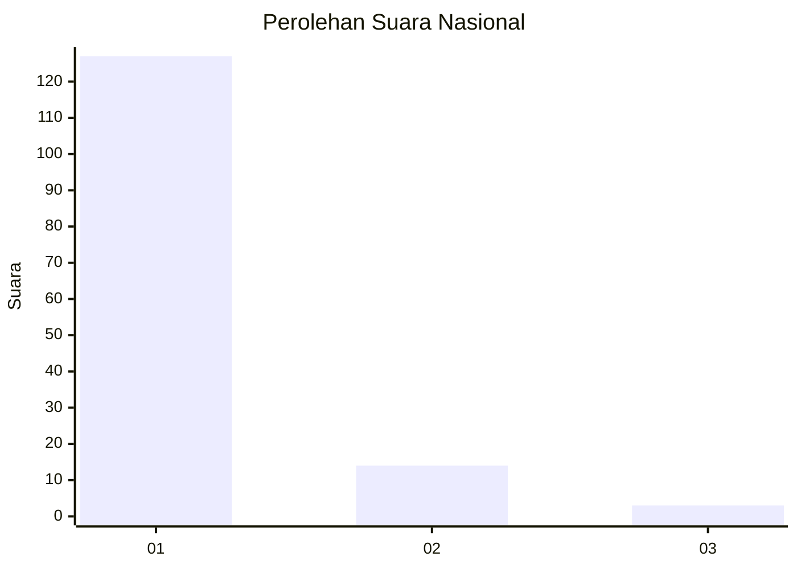
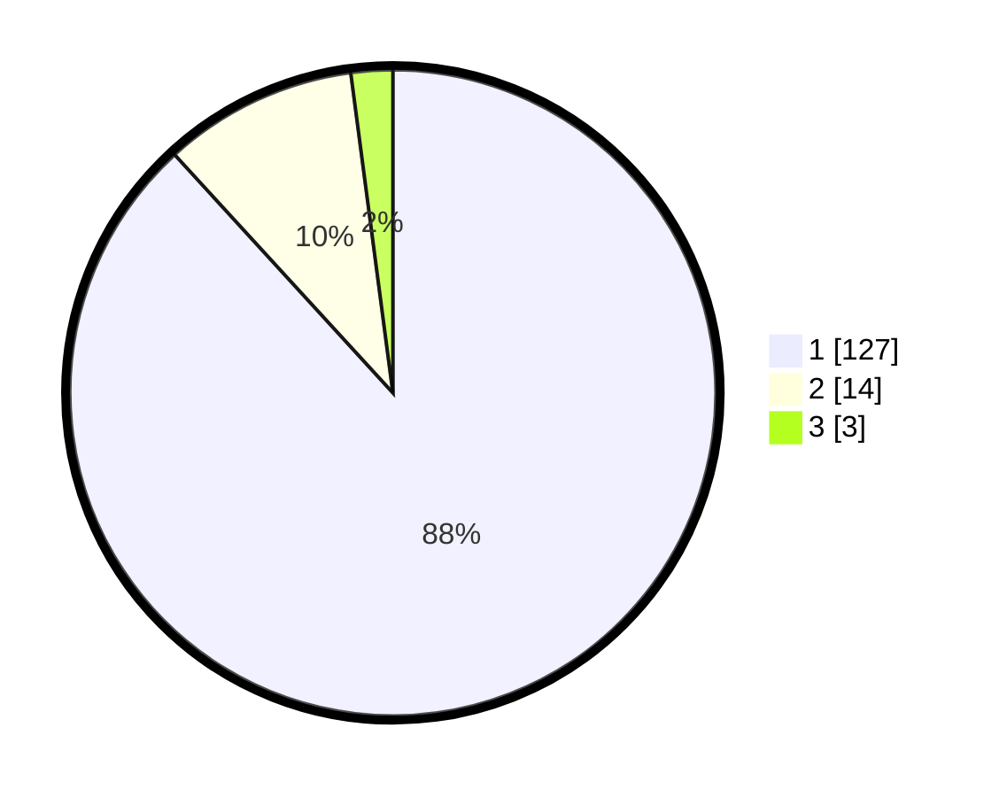

# Hasil

## Grafik

## Tabel

| No. | Nama Paslon    | Suara | Suara (raw) | Persentase |
|:--- |:-------------- | -----:| -----------:| ----------:|
| 1   | ANIES MUHAIMIN | 127   | [127][p-1]  | 88,19      |
| 2   | PRABOWO GIBRAN | 14    | [14][p-2]   | 9,72       |
| 3   | GANJAR MAHFUD  | 3     | [3][p-3]    | 2,08       |

[p-1]: https://github.com/gigit-pemilu/pemilu-2024/blob/main/pilpres/hitung-suara/sub/11-aceh/sub/08-aceh-utara/sub/07-meurah-mulia/sub/2025-kumbang/sub/002-tps/sub/paslon-1.txt
[p-2]: https://github.com/gigit-pemilu/pemilu-2024/blob/main/pilpres/hitung-suara/sub/11-aceh/sub/08-aceh-utara/sub/07-meurah-mulia/sub/2025-kumbang/sub/002-tps/sub/paslon-2.txt
[p-3]: https://github.com/gigit-pemilu/pemilu-2024/blob/main/pilpres/hitung-suara/sub/11-aceh/sub/08-aceh-utara/sub/07-meurah-mulia/sub/2025-kumbang/sub/002-tps/sub/paslon-3.txt

## Foto C Plano

https://sirekap-obj-formc.kpu.go.id/91c2/pemilu/ppwp/11/08/07/20/25/1108072025002-20240215-002352--711bad71-09be-43c5-ad51-edb680747fb7.jpg

https://sirekap-obj-formc.kpu.go.id/91c2/pemilu/ppwp/11/08/07/20/25/1108072025002-20240215-002545--ce22ab44-17c0-4799-98d6-3e6d0374f910.jpg

https://sirekap-obj-formc.kpu.go.id/91c2/pemilu/ppwp/11/08/07/20/25/1108072025002-20240215-000634--0c4a0778-c40b-4a7d-a999-ab0dcc7df877.jpg

## Metadata

| Key        | Value               |
| ---------- | ------------------- |
| Time Stamp | 2024-02-19 06:16:00 |

