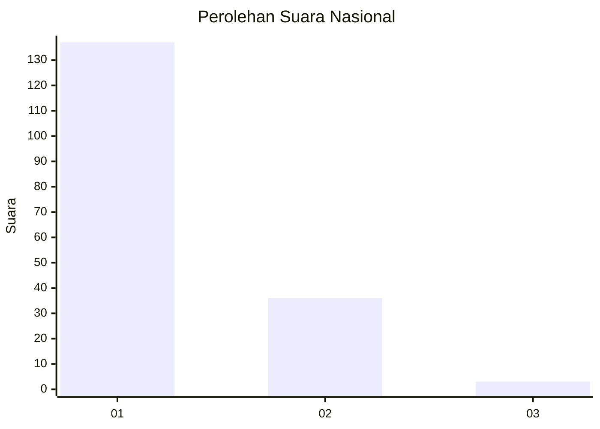
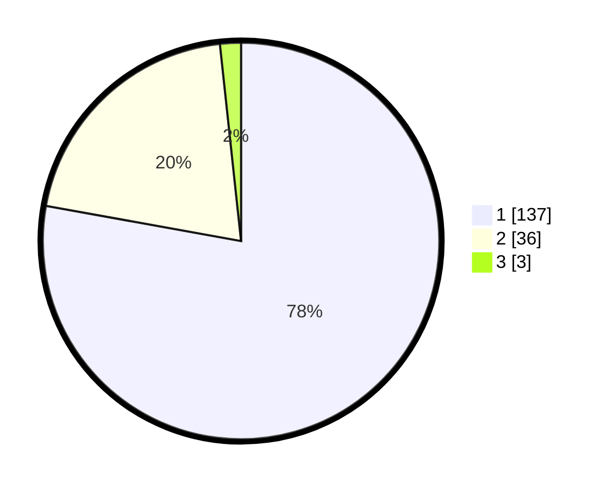

# Hasil

## Grafik

## Tabel

| No. | Nama Paslon    | Suara | Suara (raw) | Persentase |
|:--- |:-------------- | -----:| -----------:| ----------:|
| 1   | ANIES MUHAIMIN | 137   | [137][p-1]  | 77,84      |
| 2   | PRABOWO GIBRAN | 36    | [36][p-2]   | 20,45      |
| 3   | GANJAR MAHFUD  | 3     | [3][p-3]    | 1,70       |

[p-1]: https://github.com/gigit-pemilu/pemilu-2024/blob/main/pilpres/hitung-suara/sub/11-aceh/sub/08-aceh-utara/sub/07-meurah-mulia/sub/2027-mesjid/sub/001-tps/sub/paslon-1.txt
[p-2]: https://github.com/gigit-pemilu/pemilu-2024/blob/main/pilpres/hitung-suara/sub/11-aceh/sub/08-aceh-utara/sub/07-meurah-mulia/sub/2027-mesjid/sub/001-tps/sub/paslon-2.txt
[p-3]: https://github.com/gigit-pemilu/pemilu-2024/blob/main/pilpres/hitung-suara/sub/11-aceh/sub/08-aceh-utara/sub/07-meurah-mulia/sub/2027-mesjid/sub/001-tps/sub/paslon-3.txt

## Foto C Plano

https://sirekap-obj-formc.kpu.go.id/551a/pemilu/ppwp/11/08/07/20/27/1108072027001-20240215-100930--22d5ee6e-3ed0-4c97-bc60-1479cf114bf7.jpg

https://sirekap-obj-formc.kpu.go.id/551a/pemilu/ppwp/11/08/07/20/27/1108072027001-20240215-101102--bfc95607-fb95-4cfc-9361-3a95b11fc2c7.jpg

https://sirekap-obj-formc.kpu.go.id/551a/pemilu/ppwp/11/08/07/20/27/1108072027001-20240215-101221--47706a50-a13b-4102-9234-c00bf8edca04.jpg

## Metadata

| Key        | Value               |
| ---------- | ------------------- |
| Time Stamp | 2024-02-15 17:00:25 |

