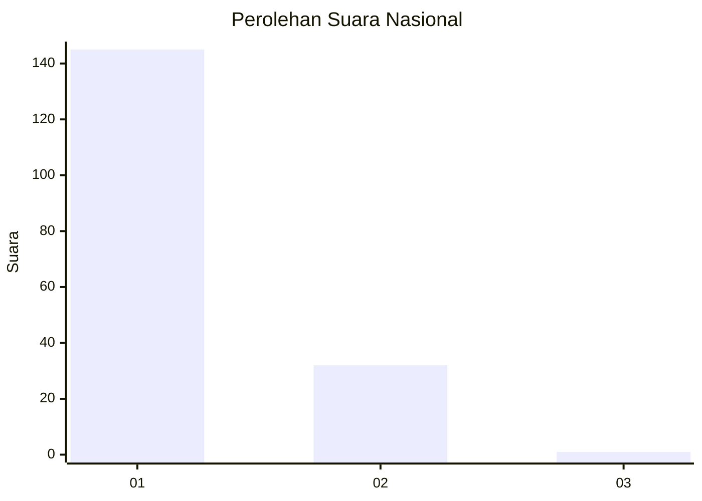
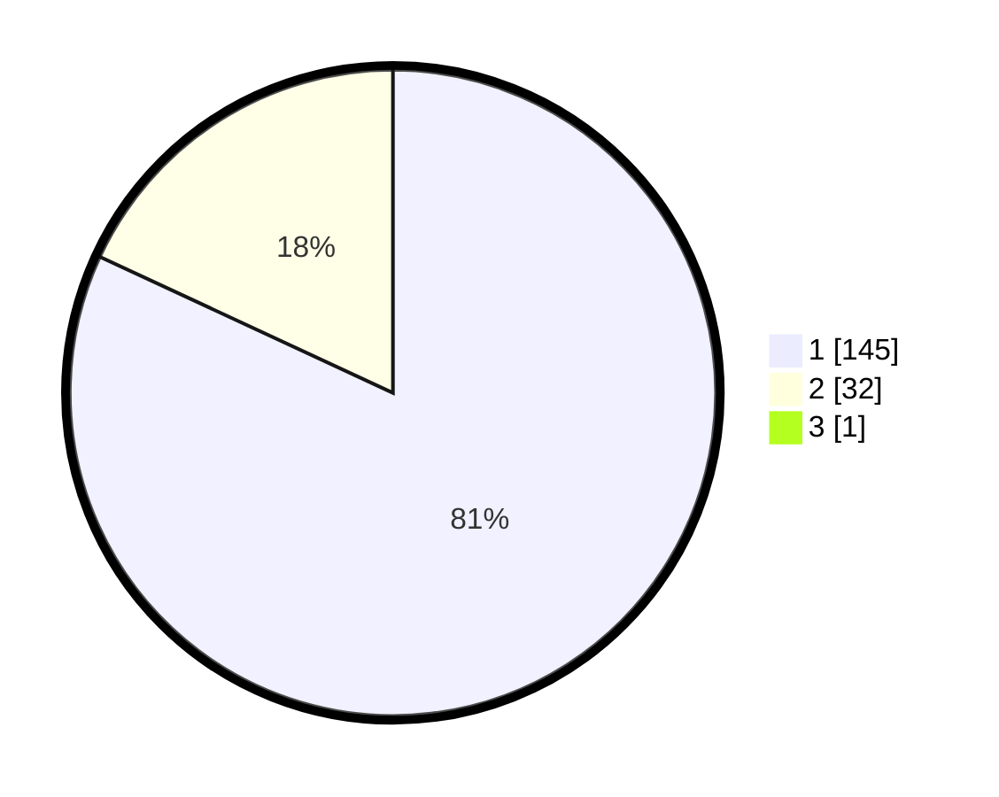

# Hasil

## Grafik

## Tabel

| No. | Nama Paslon    | Suara | Suara (raw) | Persentase |
|:--- |:-------------- | -----:| -----------:| ----------:|
| 1   | ANIES MUHAIMIN | 145   | [145][p-1]  | 81,46      |
| 2   | PRABOWO GIBRAN | 32    | [32][p-2]   | 17,98      |
| 3   | GANJAR MAHFUD  | 1     | [1][p-3]    | 0,56       |

[p-1]: https://github.com/gigit-pemilu/pemilu-2024/blob/main/pilpres/hitung-suara/sub/11-aceh/sub/08-aceh-utara/sub/07-meurah-mulia/sub/2027-mesjid/sub/002-tps/sub/paslon-1.txt
[p-2]: https://github.com/gigit-pemilu/pemilu-2024/blob/main/pilpres/hitung-suara/sub/11-aceh/sub/08-aceh-utara/sub/07-meurah-mulia/sub/2027-mesjid/sub/002-tps/sub/paslon-2.txt
[p-3]: https://github.com/gigit-pemilu/pemilu-2024/blob/main/pilpres/hitung-suara/sub/11-aceh/sub/08-aceh-utara/sub/07-meurah-mulia/sub/2027-mesjid/sub/002-tps/sub/paslon-3.txt

## Foto C Plano

https://sirekap-obj-formc.kpu.go.id/4309/pemilu/ppwp/11/08/07/20/27/1108072027002-20240215-093016--c55a7a33-1aa4-4d95-a4d5-0ad894b48b02.jpg

https://sirekap-obj-formc.kpu.go.id/4309/pemilu/ppwp/11/08/07/20/27/1108072027002-20240215-093124--17e0370b-1541-4257-8273-c86c0a42e3ed.jpg

https://sirekap-obj-formc.kpu.go.id/4309/pemilu/ppwp/11/08/07/20/27/1108072027002-20240215-093213--5f08803f-3df1-4df3-a49f-e5eec604f7bc.jpg

## Metadata

| Key        | Value               |
| ---------- | ------------------- |
| Time Stamp | 2024-02-17 16:00:02 |

