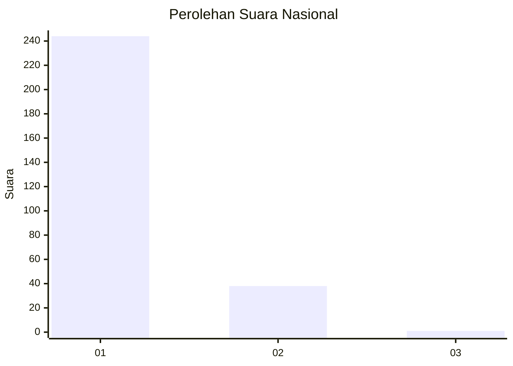
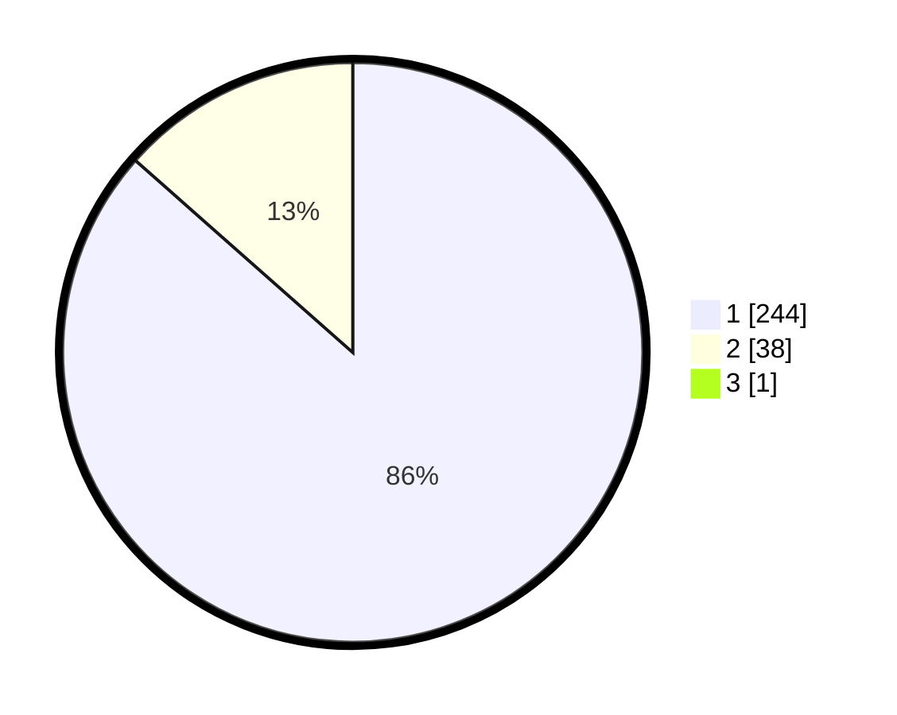

# Hasil

## Grafik

## Tabel

| No. | Nama Paslon    | Suara | Suara (raw) | Persentase |
|:--- |:-------------- | -----:| -----------:| ----------:|
| 1   | ANIES MUHAIMIN | 244   | [244][p-1]  | 86,22      |
| 2   | PRABOWO GIBRAN | 38    | [38][p-2]   | 13,43      |
| 3   | GANJAR MAHFUD  | 1     | [1][p-3]    | 0,35       |

[p-1]: https://github.com/gigit-pemilu/pemilu-2024/blob/main/pilpres/hitung-suara/sub/11-aceh/sub/08-aceh-utara/sub/07-meurah-mulia/sub/2028-teungoh-reuba/sub/001-tps/sub/paslon-1.txt
[p-2]: https://github.com/gigit-pemilu/pemilu-2024/blob/main/pilpres/hitung-suara/sub/11-aceh/sub/08-aceh-utara/sub/07-meurah-mulia/sub/2028-teungoh-reuba/sub/001-tps/sub/paslon-2.txt
[p-3]: https://github.com/gigit-pemilu/pemilu-2024/blob/main/pilpres/hitung-suara/sub/11-aceh/sub/08-aceh-utara/sub/07-meurah-mulia/sub/2028-teungoh-reuba/sub/001-tps/sub/paslon-3.txt

## Foto C Plano

https://sirekap-obj-formc.kpu.go.id/5597/pemilu/ppwp/11/08/07/20/28/1108072028001-20240219-223522--f4434954-4a33-4af9-a9fd-d2b2832d0cf6.jpg

https://sirekap-obj-formc.kpu.go.id/5597/pemilu/ppwp/11/08/07/20/28/1108072028001-20240219-224244--f346157e-6f91-450a-a2d2-d365f28aab65.jpg

https://sirekap-obj-formc.kpu.go.id/5597/pemilu/ppwp/11/08/07/20/28/1108072028001-20240219-223653--9d34ee0a-1b9b-433e-836f-f4def1cd2047.jpg

## Metadata

| Key        | Value               |
| ---------- | ------------------- |
| Time Stamp | 2024-02-19 23:00:00 |

## DATA PEMILIH TETAP

Jumlah pemilih dalam DPT: **288**.
 * L: **138**.
 * P: **150**.

## DATA PENGGUNA HAK PILIH

Jumlah pengguna hak pilih dalam DPT: **283**.
 * L: **135**.
 * P: **148**.

Jumlah pengguna hak pilih dalam DPTb: **0**.
 * L: **0**.
 * P: **0**.

Jumlah pengguna hak pilih dalam DPK: **4**.
 * L: **1**.
 * P: **3**.

Jumlah pengguna hak pilih: **287**.
 * L: **136**.
 * P: **151**.

## JUMLAH SUARA SAH DAN TIDAK SAH

JUMLAH SELURUH SUARA SAH: **283**.

JUMLAH SUARA TIDAK SAH: **4**.

JUMLAH SELURUH SUARA SAH DAN SUARA TIDAK SAH: **287**.

