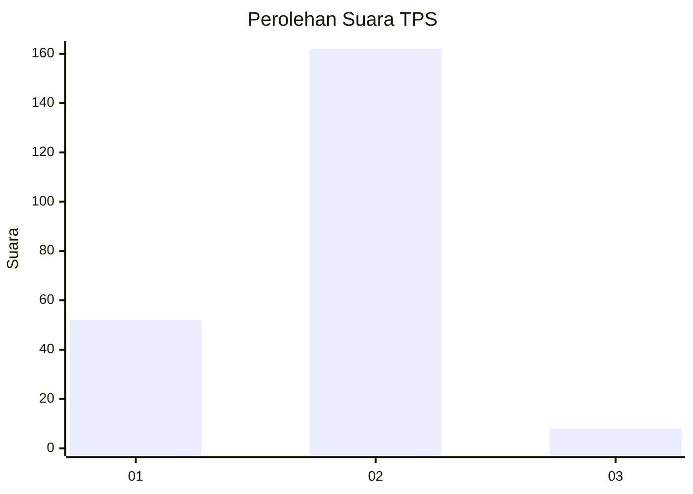

# Hasil

## Grafik

## Tabel

| No. | Nama Paslon    | Suara | Suara (raw) | Persentase |
|:--- |:-------------- | -----:| -----------:| ----------:|
| 1   | ANIES MUHAIMIN | 52    | [52][p-1]   | 23,42      |
| 2   | PRABOWO GIBRAN | 162   | [162][p-2]  | 72,97      |
| 3   | GANJAR MAHFUD  | 8     | [8][p-3]    | 3,60       |

[p-1]: https://github.com/gigit-pemilu/pemilu-2024-11-aceh/blob/main/pilpres/hitung-suara/sub/11-aceh/sub/08-aceh-utara/sub/07-meurah-mulia/sub/2030-drien-puntong/sub/001-tps/sub/paslon-1.txt
[p-2]: https://github.com/gigit-pemilu/pemilu-2024-11-aceh/blob/main/pilpres/hitung-suara/sub/11-aceh/sub/08-aceh-utara/sub/07-meurah-mulia/sub/2030-drien-puntong/sub/001-tps/sub/paslon-2.txt
[p-3]: https://github.com/gigit-pemilu/pemilu-2024-11-aceh/blob/main/pilpres/hitung-suara/sub/11-aceh/sub/08-aceh-utara/sub/07-meurah-mulia/sub/2030-drien-puntong/sub/001-tps/sub/paslon-3.txt

## Foto C Plano

https://sirekap-obj-formc.kpu.go.id/a9ca/pemilu/ppwp/11/08/07/20/30/1108072030001-20240215-111735--e74bc28a-b2c2-4c54-8933-1a7e51735cb5.jpg

https://sirekap-obj-formc.kpu.go.id/a9ca/pemilu/ppwp/11/08/07/20/30/1108072030001-20240215-111843--367d21ed-61d7-4375-b6ea-5eab831c53dc.jpg

## Metadata

| Key        | Value               |
| ---------- | ------------------- |
| Time Stamp | 2024-02-15 16:00:26 |

