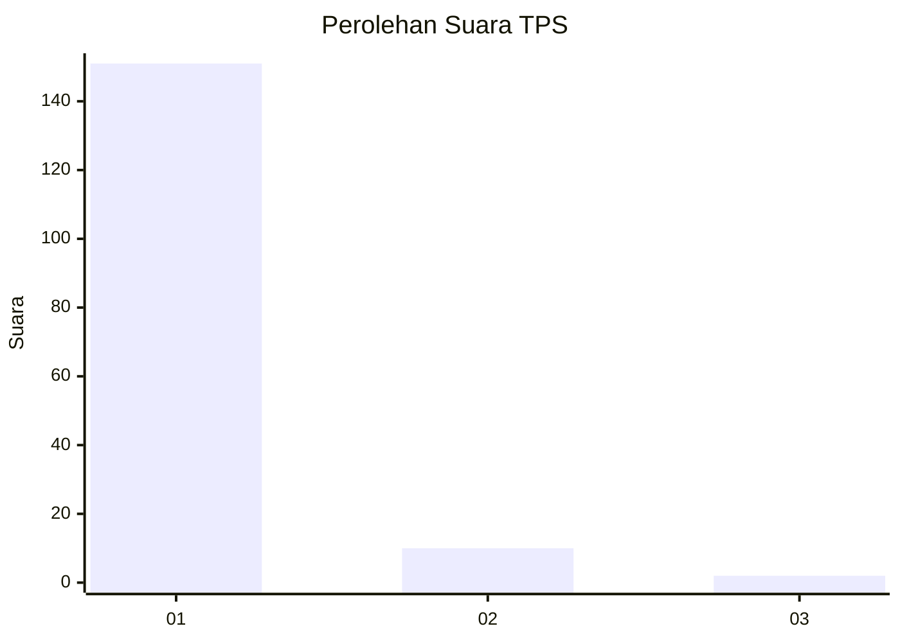
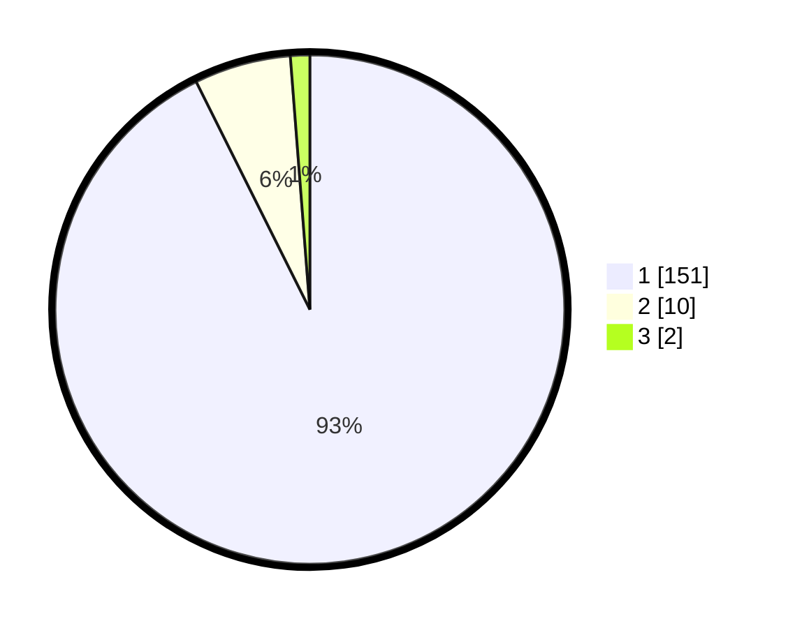

# Hasil

## Grafik

## Tabel

| No. | Nama Paslon    | Suara | Suara (raw) | Persentase |
|:--- |:-------------- | -----:| -----------:| ----------:|
| 1   | ANIES MUHAIMIN | 151   | [151][p-1]  | 92,64      |
| 2   | PRABOWO GIBRAN | 10    | [10][p-2]   | 6,13       |
| 3   | GANJAR MAHFUD  | 2     | [2][p-3]    | 1,23       |

[p-1]: https://github.com/gigit-pemilu/pemilu-2024-11-aceh/blob/main/pilpres/hitung-suara/sub/11-aceh/sub/08-aceh-utara/sub/07-meurah-mulia/sub/2032-ceubrek/sub/001-tps/sub/paslon-1.txt
[p-2]: https://github.com/gigit-pemilu/pemilu-2024-11-aceh/blob/main/pilpres/hitung-suara/sub/11-aceh/sub/08-aceh-utara/sub/07-meurah-mulia/sub/2032-ceubrek/sub/001-tps/sub/paslon-2.txt
[p-3]: https://github.com/gigit-pemilu/pemilu-2024-11-aceh/blob/main/pilpres/hitung-suara/sub/11-aceh/sub/08-aceh-utara/sub/07-meurah-mulia/sub/2032-ceubrek/sub/001-tps/sub/paslon-3.txt

## Foto C Plano

https://sirekap-obj-formc.kpu.go.id/ff10/pemilu/ppwp/11/08/07/20/32/1108072032001-20240219-142500--28aa8fef-621b-4d97-9414-6de0d901f747.jpg

https://sirekap-obj-formc.kpu.go.id/ff10/pemilu/ppwp/11/08/07/20/32/1108072032001-20240219-115230--36135736-e124-4373-b1f4-83ec8636b16d.jpg

https://sirekap-obj-formc.kpu.go.id/ff10/pemilu/ppwp/11/08/07/20/32/1108072032001-20240219-115332--d84ed213-43fe-4124-87ee-398d703e4e3a.jpg

## Metadata

| Key        | Value               |
| ---------- | ------------------- |
| Time Stamp | 2024-02-19 19:00:00 |

