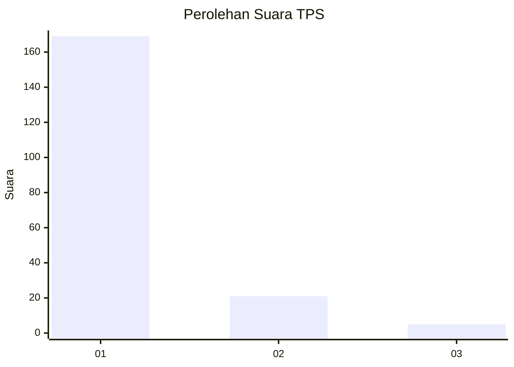
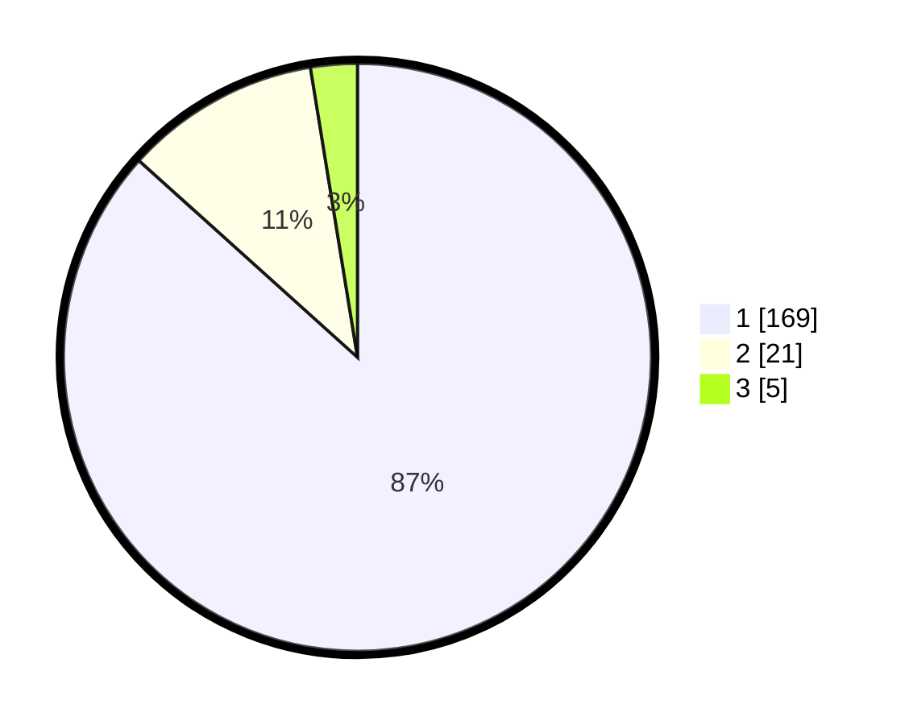

# Hasil

## Grafik

## Tabel

| No. | Nama Paslon    | Suara | Suara (raw) | Persentase |
|:--- |:-------------- | -----:| -----------:| ----------:|
| 1   | ANIES MUHAIMIN | 169   | [169][p-1]  | 86,67      |
| 2   | PRABOWO GIBRAN | 21    | [21][p-2]   | 10,77      |
| 3   | GANJAR MAHFUD  | 5     | [5][p-3]    | 2,56       |

[p-1]: https://github.com/gigit-pemilu/pemilu-2024-11-aceh/blob/main/pilpres/hitung-suara/sub/11-aceh/sub/08-aceh-utara/sub/07-meurah-mulia/sub/2034-beuringen/sub/002-tps/sub/paslon-1.txt
[p-2]: https://github.com/gigit-pemilu/pemilu-2024-11-aceh/blob/main/pilpres/hitung-suara/sub/11-aceh/sub/08-aceh-utara/sub/07-meurah-mulia/sub/2034-beuringen/sub/002-tps/sub/paslon-2.txt
[p-3]: https://github.com/gigit-pemilu/pemilu-2024-11-aceh/blob/main/pilpres/hitung-suara/sub/11-aceh/sub/08-aceh-utara/sub/07-meurah-mulia/sub/2034-beuringen/sub/002-tps/sub/paslon-3.txt

## Foto C Plano

https://sirekap-obj-formc.kpu.go.id/e564/pemilu/ppwp/11/08/07/20/34/1108072034002-20240217-131726--e2b37180-beb4-4d3c-aaa4-e14daa9e5d89.jpg

https://sirekap-obj-formc.kpu.go.id/e564/pemilu/ppwp/11/08/07/20/34/1108072034002-20240217-133041--c529cd37-7b16-4871-8f11-463bae4192f6.jpg

## Metadata

| Key        | Value               |
| ---------- | ------------------- |
| Time Stamp | 2024-02-17 16:00:02 |

