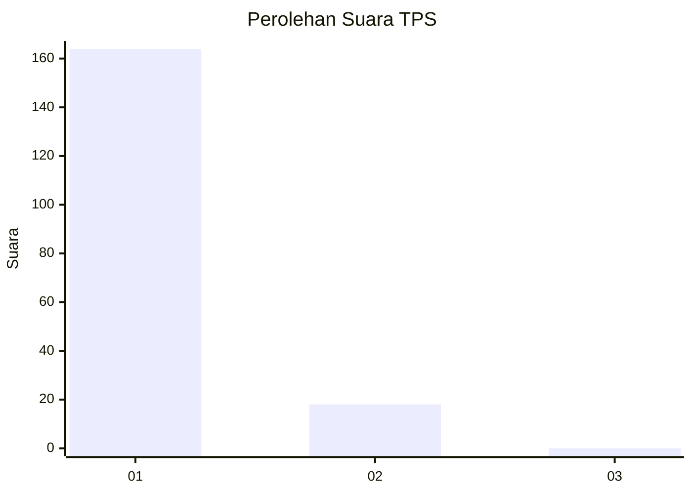
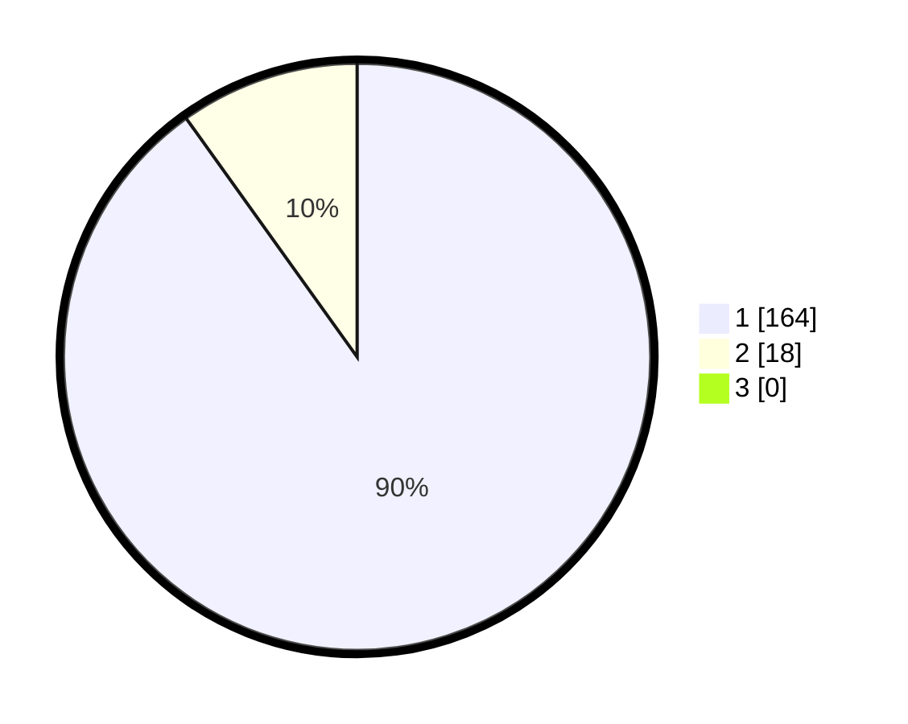

# Hasil

## Grafik

## Tabel

| No. | Nama Paslon    | Suara | Suara (raw) | Persentase |
|:--- |:-------------- | -----:| -----------:| ----------:|
| 1   | ANIES MUHAIMIN | 164   | [164][p-1]  | 90,11      |
| 2   | PRABOWO GIBRAN | 18    | [18][p-2]   | 9,89       |
| 3   | GANJAR MAHFUD  | 0     | [0][p-3]    | 0,00       |

[p-1]: https://github.com/gigit-pemilu/pemilu-2024-11-aceh/blob/main/pilpres/hitung-suara/sub/11-aceh/sub/08-aceh-utara/sub/07-meurah-mulia/sub/2043-gampong-teungoh/sub/002-tps/sub/paslon-1.txt
[p-2]: https://github.com/gigit-pemilu/pemilu-2024-11-aceh/blob/main/pilpres/hitung-suara/sub/11-aceh/sub/08-aceh-utara/sub/07-meurah-mulia/sub/2043-gampong-teungoh/sub/002-tps/sub/paslon-2.txt
[p-3]: https://github.com/gigit-pemilu/pemilu-2024-11-aceh/blob/main/pilpres/hitung-suara/sub/11-aceh/sub/08-aceh-utara/sub/07-meurah-mulia/sub/2043-gampong-teungoh/sub/002-tps/sub/paslon-3.txt

## Foto C Plano

https://sirekap-obj-formc.kpu.go.id/2516/pemilu/ppwp/11/08/07/20/43/1108072043002-20240215-011223--e1bbb84a-5aff-44ae-ac67-b3c39fb486d8.jpg

https://sirekap-obj-formc.kpu.go.id/2516/pemilu/ppwp/11/08/07/20/43/1108072043002-20240215-011403--acecc36d-b924-447d-97c9-6274b338ff96.jpg

https://sirekap-obj-formc.kpu.go.id/2516/pemilu/ppwp/11/08/07/20/43/1108072043002-20240215-011513--c3f53e75-aa7e-4c3f-82d6-da193af161be.jpg

## Metadata

| Key        | Value               |
| ---------- | ------------------- |
| Time Stamp | 2024-02-15 17:00:25 |

