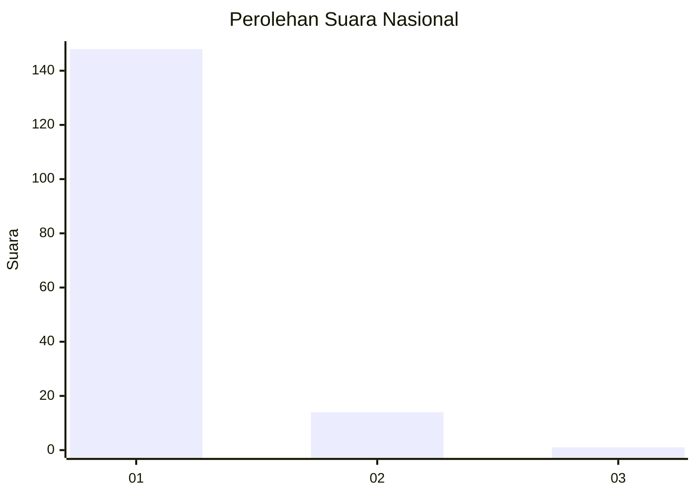
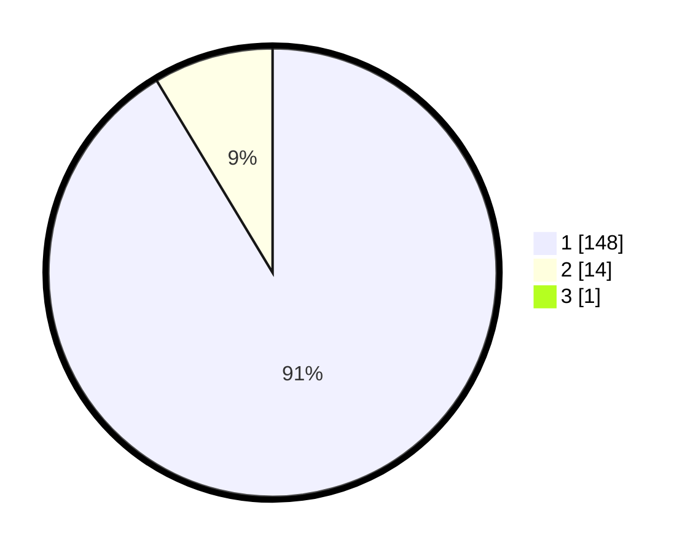

# Hasil

## Grafik

## Tabel

| No. | Nama Paslon    | Suara | Suara (raw) | Persentase |
|:--- |:-------------- | -----:| -----------:| ----------:|
| 1   | ANIES MUHAIMIN | 148   | [148][p-1]  | 90,80      |
| 2   | PRABOWO GIBRAN | 14    | [14][p-2]   | 8,59       |
| 3   | GANJAR MAHFUD  | 1     | [1][p-3]    | 0,61       |

[p-1]: https://github.com/gigit-pemilu/pemilu-2024/blob/main/pilpres/hitung-suara/sub/11-aceh/sub/08-aceh-utara/sub/07-meurah-mulia/sub/2047-paya-sutra/sub/001-tps/sub/paslon-1.txt
[p-2]: https://github.com/gigit-pemilu/pemilu-2024/blob/main/pilpres/hitung-suara/sub/11-aceh/sub/08-aceh-utara/sub/07-meurah-mulia/sub/2047-paya-sutra/sub/001-tps/sub/paslon-2.txt
[p-3]: https://github.com/gigit-pemilu/pemilu-2024/blob/main/pilpres/hitung-suara/sub/11-aceh/sub/08-aceh-utara/sub/07-meurah-mulia/sub/2047-paya-sutra/sub/001-tps/sub/paslon-3.txt

## Foto C Plano

https://sirekap-obj-formc.kpu.go.id/6c10/pemilu/ppwp/11/08/07/20/47/1108072047001-20240215-000501--5bf79b1a-3365-4a52-9cb8-112261421fcb.jpg

https://sirekap-obj-formc.kpu.go.id/6c10/pemilu/ppwp/11/08/07/20/47/1108072047001-20240215-000654--a1ca62d0-f9f0-4a48-88f3-01ff0f3813c2.jpg

https://sirekap-obj-formc.kpu.go.id/6c10/pemilu/ppwp/11/08/07/20/47/1108072047001-20240215-003612--6886dcec-05e6-4af3-8d94-2deab92d3d2c.jpg

## Metadata

| Key        | Value               |
| ---------- | ------------------- |
| Time Stamp | 2024-02-17 16:00:02 |

