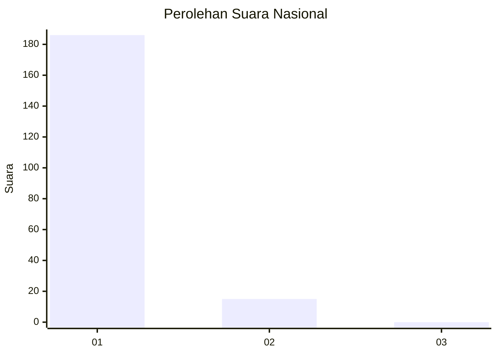
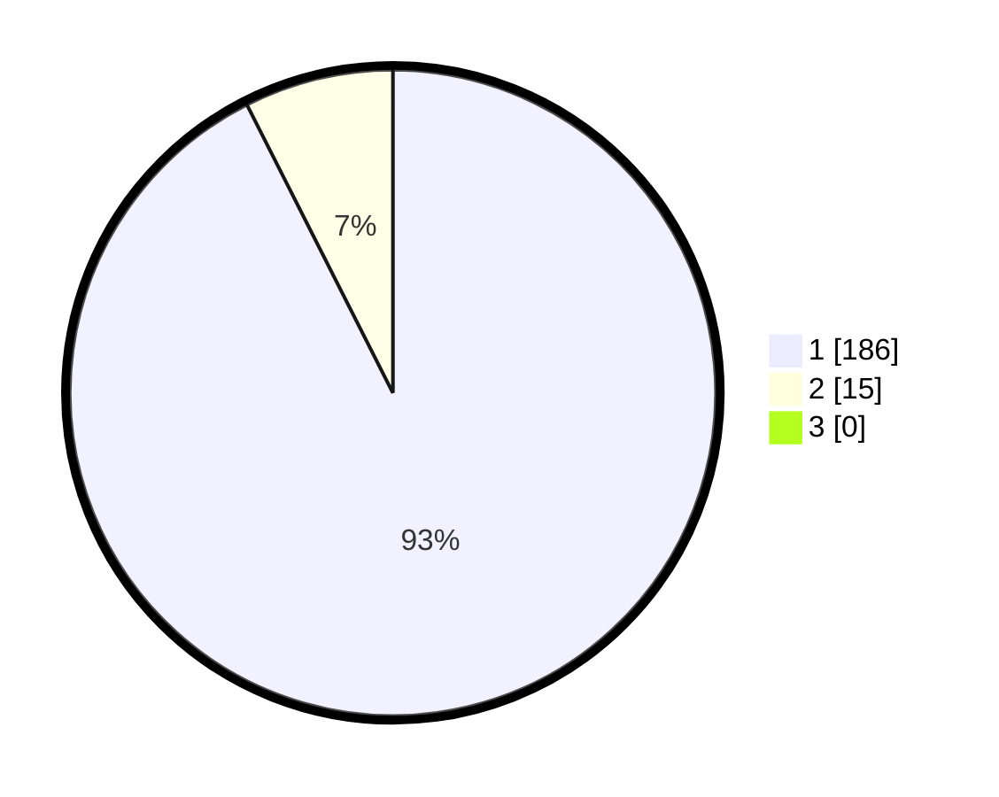

# Hasil

## Grafik

## Tabel

| No. | Nama Paslon    | Suara | Suara (raw) | Persentase |
|:--- |:-------------- | -----:| -----------:| ----------:|
| 1   | ANIES MUHAIMIN | 186   | [186][p-1]  | 92,54      |
| 2   | PRABOWO GIBRAN | 15    | [15][p-2]   | 7,46       |
| 3   | GANJAR MAHFUD  | 0     | [0][p-3]    | 0,00       |

[p-1]: https://github.com/gigit-pemilu/pemilu-2024/blob/main/pilpres/hitung-suara/sub/11-aceh/sub/08-aceh-utara/sub/08-samudera/sub/2003-murong/sub/001-tps/sub/paslon-1.txt
[p-2]: https://github.com/gigit-pemilu/pemilu-2024/blob/main/pilpres/hitung-suara/sub/11-aceh/sub/08-aceh-utara/sub/08-samudera/sub/2003-murong/sub/001-tps/sub/paslon-2.txt
[p-3]: https://github.com/gigit-pemilu/pemilu-2024/blob/main/pilpres/hitung-suara/sub/11-aceh/sub/08-aceh-utara/sub/08-samudera/sub/2003-murong/sub/001-tps/sub/paslon-3.txt

## Foto C Plano

https://sirekap-obj-formc.kpu.go.id/a921/pemilu/ppwp/11/08/08/20/03/1108082003001-20240219-141527--b59dd4e6-432a-45c6-9a19-96c770ec6f9e.jpg

https://sirekap-obj-formc.kpu.go.id/a921/pemilu/ppwp/11/08/08/20/03/1108082003001-20240219-141616--d3b9ecdc-5216-4429-93e6-1f08d6120a14.jpg

https://sirekap-obj-formc.kpu.go.id/a921/pemilu/ppwp/11/08/08/20/03/1108082003001-20240219-141658--ac184fc3-6254-466f-9090-869ae8ee647b.jpg

## Metadata

| Key        | Value               |
| ---------- | ------------------- |
| Time Stamp | 2024-02-24 22:31:28 |

