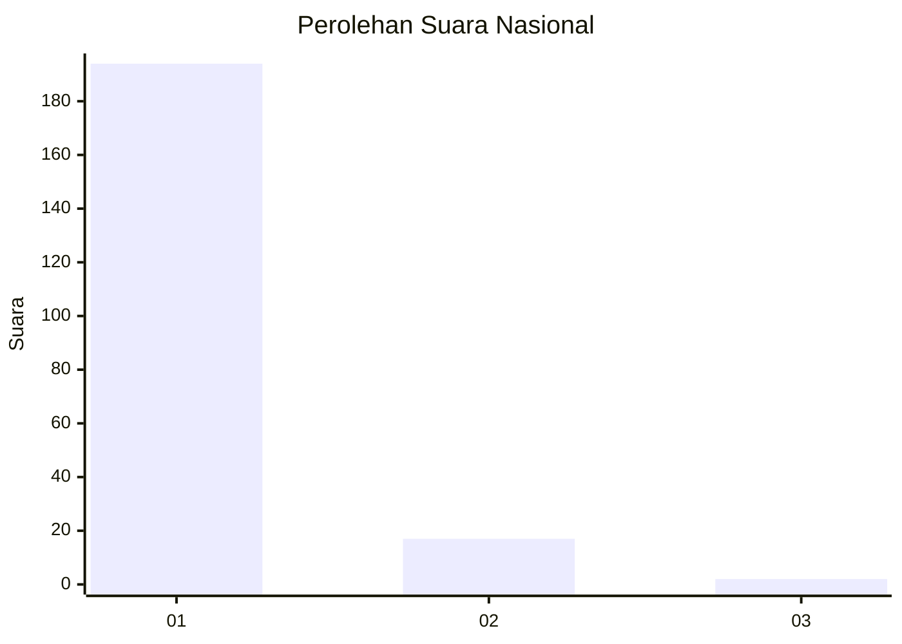
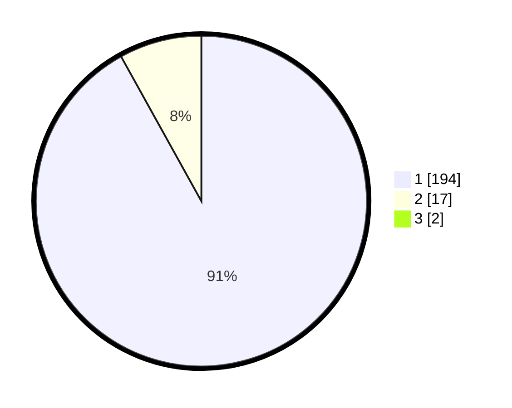

# Hasil

## Grafik

## Tabel

| No. | Nama Paslon    | Suara | Suara (raw) | Persentase |
|:--- |:-------------- | -----:| -----------:| ----------:|
| 1   | ANIES MUHAIMIN | 194   | [194][p-1]  | 91,08      |
| 2   | PRABOWO GIBRAN | 17    | [17][p-2]   | 7,98       |
| 3   | GANJAR MAHFUD  | 2     | [2][p-3]    | 0,94       |

[p-1]: https://github.com/gigit-pemilu/pemilu-2024/blob/main/pilpres/hitung-suara/sub/11-aceh/sub/08-aceh-utara/sub/08-samudera/sub/2003-murong/sub/002-tps/sub/paslon-1.txt
[p-2]: https://github.com/gigit-pemilu/pemilu-2024/blob/main/pilpres/hitung-suara/sub/11-aceh/sub/08-aceh-utara/sub/08-samudera/sub/2003-murong/sub/002-tps/sub/paslon-2.txt
[p-3]: https://github.com/gigit-pemilu/pemilu-2024/blob/main/pilpres/hitung-suara/sub/11-aceh/sub/08-aceh-utara/sub/08-samudera/sub/2003-murong/sub/002-tps/sub/paslon-3.txt

## Foto C Plano

https://sirekap-obj-formc.kpu.go.id/e8f8/pemilu/ppwp/11/08/08/20/03/1108082003002-20240219-115751--d6daaf64-a686-497a-b0d2-7bf058031eed.jpg

https://sirekap-obj-formc.kpu.go.id/e8f8/pemilu/ppwp/11/08/08/20/03/1108082003002-20240219-115922--58f3dfe1-4386-4d25-8a93-ba6151700ef4.jpg

https://sirekap-obj-formc.kpu.go.id/e8f8/pemilu/ppwp/11/08/08/20/03/1108082003002-20240219-115959--a58f481c-e251-4046-9387-35a064232f02.jpg

## Metadata

| Key        | Value               |
| ---------- | ------------------- |
| Time Stamp | 2024-02-24 22:31:28 |

