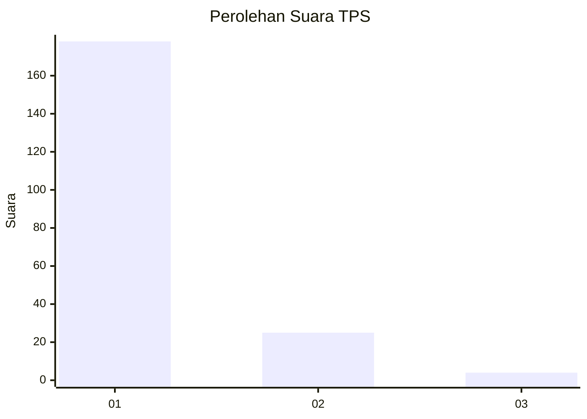
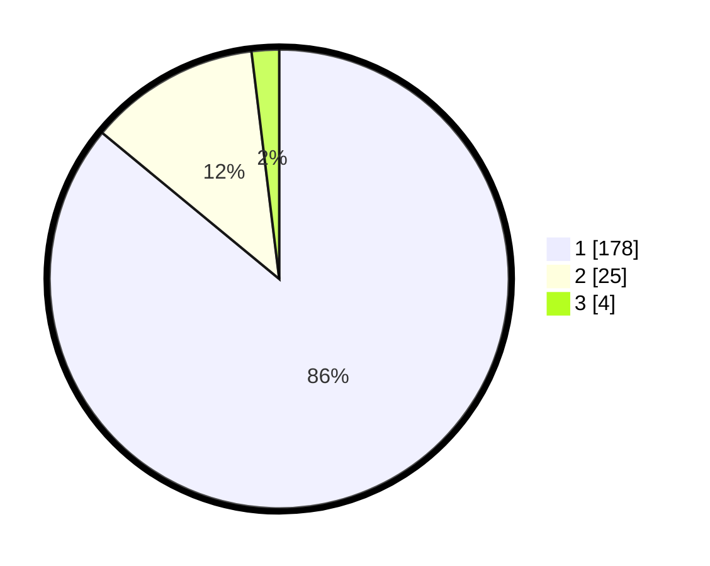

# Hasil

## Grafik

## Tabel

| No. | Nama Paslon    | Suara | Suara (raw) | Persentase |
|:--- |:-------------- | -----:| -----------:| ----------:|
| 1   | ANIES MUHAIMIN | 178   | [178][p-1]  | 85,99      |
| 2   | PRABOWO GIBRAN | 25    | [25][p-2]   | 12,08      |
| 3   | GANJAR MAHFUD  | 4     | [4][p-3]    | 1,93       |

[p-1]: https://github.com/gigit-pemilu/pemilu-2024-11-aceh/blob/main/pilpres/hitung-suara/sub/11-aceh/sub/08-aceh-utara/sub/08-samudera/sub/2005-mancang/sub/002-tps/sub/paslon-1.txt
[p-2]: https://github.com/gigit-pemilu/pemilu-2024-11-aceh/blob/main/pilpres/hitung-suara/sub/11-aceh/sub/08-aceh-utara/sub/08-samudera/sub/2005-mancang/sub/002-tps/sub/paslon-2.txt
[p-3]: https://github.com/gigit-pemilu/pemilu-2024-11-aceh/blob/main/pilpres/hitung-suara/sub/11-aceh/sub/08-aceh-utara/sub/08-samudera/sub/2005-mancang/sub/002-tps/sub/paslon-3.txt

## Foto C Plano

https://sirekap-obj-formc.kpu.go.id/b84d/pemilu/ppwp/11/08/08/20/05/1108082005002-20240218-220959--0f09b487-39f4-4661-ac9e-a8ff43eec6c3.jpg

https://sirekap-obj-formc.kpu.go.id/b84d/pemilu/ppwp/11/08/08/20/05/1108082005002-20240218-221216--ebe8b1b1-4d82-472e-a4a3-536cdf438766.jpg

https://sirekap-obj-formc.kpu.go.id/b84d/pemilu/ppwp/11/08/08/20/05/1108082005002-20240218-221429--fc93a8e5-b091-4c85-9a86-8dffcea505b2.jpg

## Metadata

| Key        | Value               |
| ---------- | ------------------- |
| Time Stamp | 2024-02-24 22:31:28 |

