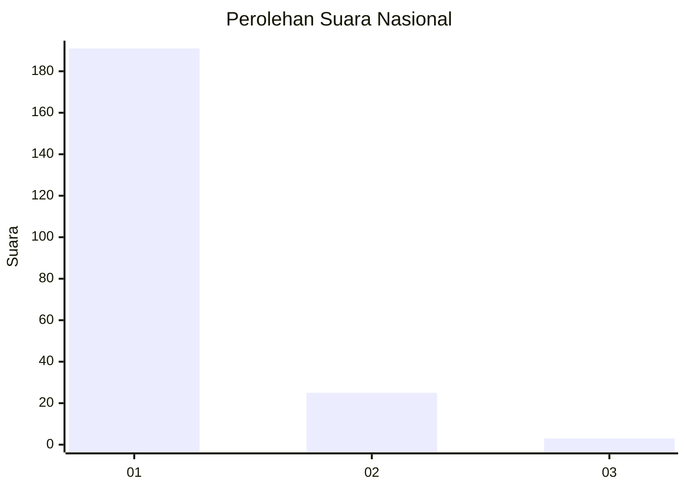
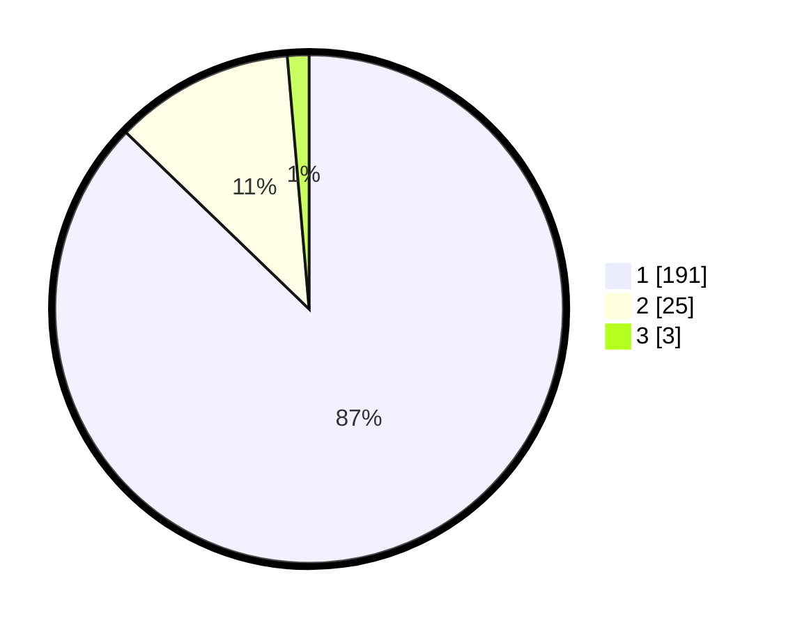

# Hasil

## Grafik

## Tabel

| No. | Nama Paslon    | Suara | Suara (raw) | Persentase |
|:--- |:-------------- | -----:| -----------:| ----------:|
| 1   | ANIES MUHAIMIN | 191   | [191][p-1]  | 87,21      |
| 2   | PRABOWO GIBRAN | 25    | [25][p-2]   | 11,42      |
| 3   | GANJAR MAHFUD  | 3     | [3][p-3]    | 1,37       |

[p-1]: https://github.com/gigit-pemilu/pemilu-2024/blob/main/pilpres/hitung-suara/sub/11-aceh/sub/08-aceh-utara/sub/08-samudera/sub/2007-blang-peuria/sub/005-tps/sub/paslon-1.txt
[p-2]: https://github.com/gigit-pemilu/pemilu-2024/blob/main/pilpres/hitung-suara/sub/11-aceh/sub/08-aceh-utara/sub/08-samudera/sub/2007-blang-peuria/sub/005-tps/sub/paslon-2.txt
[p-3]: https://github.com/gigit-pemilu/pemilu-2024/blob/main/pilpres/hitung-suara/sub/11-aceh/sub/08-aceh-utara/sub/08-samudera/sub/2007-blang-peuria/sub/005-tps/sub/paslon-3.txt

## Foto C Plano

https://sirekap-obj-formc.kpu.go.id/00fe/pemilu/ppwp/11/08/08/20/07/1108082007005-20240215-041751--6de42287-508d-4c80-818d-8c87ea594a1e.jpg

https://sirekap-obj-formc.kpu.go.id/00fe/pemilu/ppwp/11/08/08/20/07/1108082007005-20240215-041958--18adaeb9-1105-4dec-8de2-27f49aa7c80f.jpg

https://sirekap-obj-formc.kpu.go.id/00fe/pemilu/ppwp/11/08/08/20/07/1108082007005-20240215-042153--8b62ef5a-ec50-44ba-984f-98f887687620.jpg

## Metadata

| Key        | Value               |
| ---------- | ------------------- |
| Time Stamp | 2024-02-17 18:30:00 |

