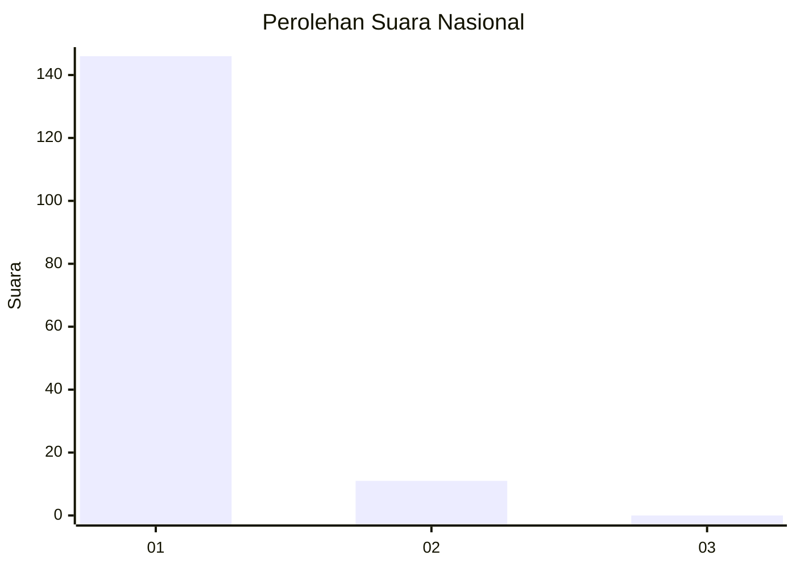
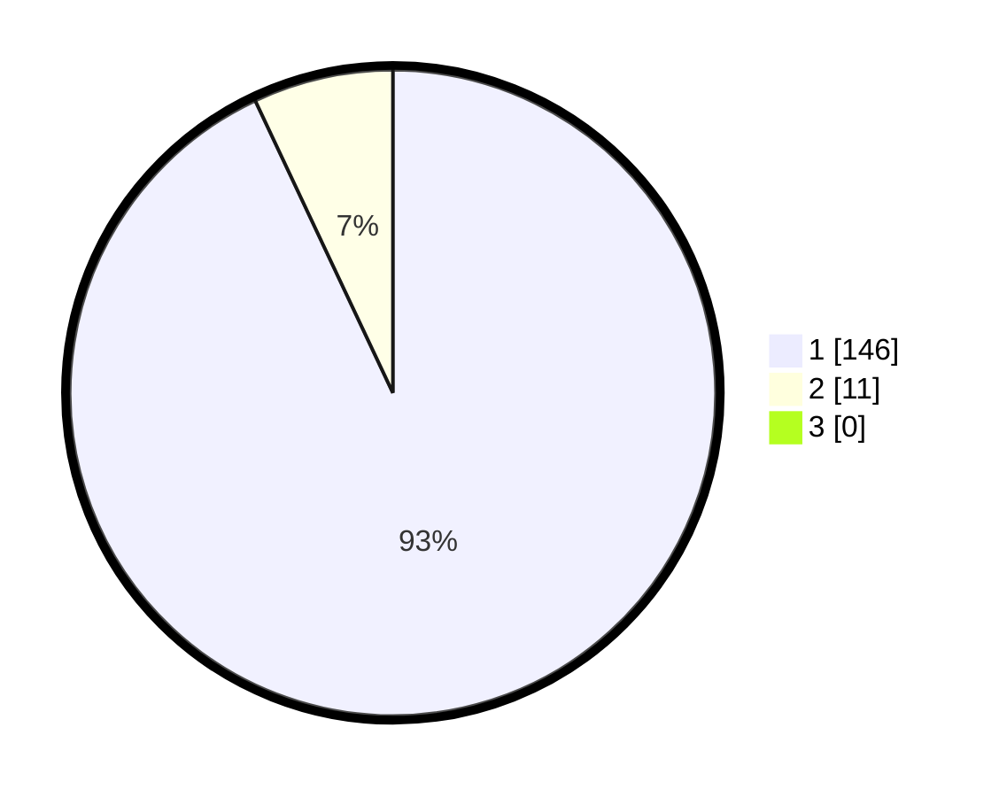

# Hasil

## Grafik

## Tabel

| No. | Nama Paslon    | Suara | Suara (raw) | Persentase |
|:--- |:-------------- | -----:| -----------:| ----------:|
| 1   | ANIES MUHAIMIN | 146   | [146][p-1]  | 92,99      |
| 2   | PRABOWO GIBRAN | 11    | [11][p-2]   | 7,01       |
| 3   | GANJAR MAHFUD  | 0     | [0][p-3]    | 0,00       |

[p-1]: https://github.com/gigit-pemilu/pemilu-2024/blob/main/pilpres/hitung-suara/sub/11-aceh/sub/08-aceh-utara/sub/08-samudera/sub/2014-beuringen/sub/002-tps/sub/paslon-1.txt
[p-2]: https://github.com/gigit-pemilu/pemilu-2024/blob/main/pilpres/hitung-suara/sub/11-aceh/sub/08-aceh-utara/sub/08-samudera/sub/2014-beuringen/sub/002-tps/sub/paslon-2.txt
[p-3]: https://github.com/gigit-pemilu/pemilu-2024/blob/main/pilpres/hitung-suara/sub/11-aceh/sub/08-aceh-utara/sub/08-samudera/sub/2014-beuringen/sub/002-tps/sub/paslon-3.txt

## Foto C Plano

https://sirekap-obj-formc.kpu.go.id/d261/pemilu/ppwp/11/08/08/20/14/1108082014002-20240219-163703--0d8e9541-fcc4-417d-b80b-81bfd3f3389f.jpg

https://sirekap-obj-formc.kpu.go.id/d261/pemilu/ppwp/11/08/08/20/14/1108082014002-20240214-222732--8ddab324-c54c-418c-8f89-be8cc7300983.jpg

https://sirekap-obj-formc.kpu.go.id/d261/pemilu/ppwp/11/08/08/20/14/1108082014002-20240214-222846--76db27a3-41f8-4917-a0e2-d1fc3fdb6e2f.jpg

## Metadata

| Key        | Value               |
| ---------- | ------------------- |
| Time Stamp | 2024-02-19 17:00:00 |

