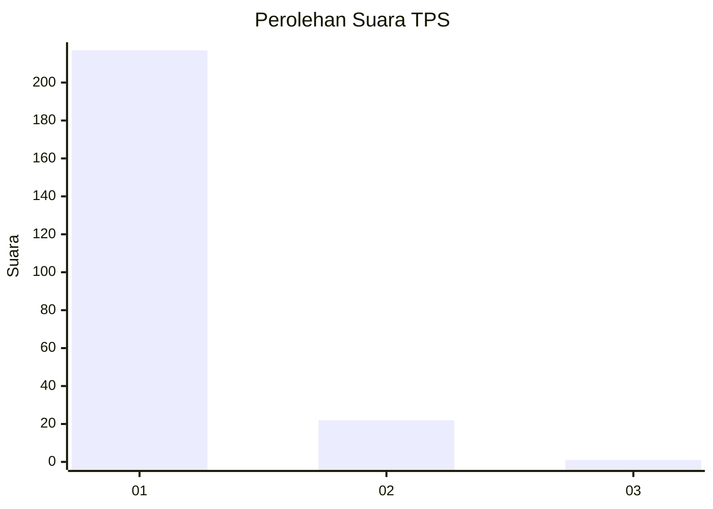
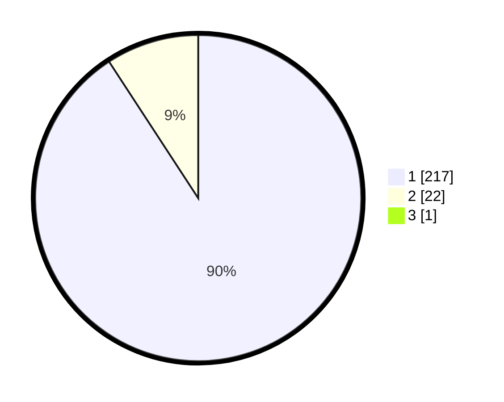

# Hasil

## Grafik

## Tabel

| No. | Nama Paslon    | Suara | Suara (raw) | Persentase |
|:--- |:-------------- | -----:| -----------:| ----------:|
| 1   | ANIES MUHAIMIN | 217   | [217][p-1]  | 90,42      |
| 2   | PRABOWO GIBRAN | 22    | [22][p-2]   | 9,17       |
| 3   | GANJAR MAHFUD  | 1     | [1][p-3]    | 0,42       |

[p-1]: https://github.com/gigit-pemilu/pemilu-2024-11-aceh/blob/main/pilpres/hitung-suara/sub/11-aceh/sub/08-aceh-utara/sub/08-samudera/sub/2015-kuta-krueng/sub/001-tps/sub/paslon-1.txt
[p-2]: https://github.com/gigit-pemilu/pemilu-2024-11-aceh/blob/main/pilpres/hitung-suara/sub/11-aceh/sub/08-aceh-utara/sub/08-samudera/sub/2015-kuta-krueng/sub/001-tps/sub/paslon-2.txt
[p-3]: https://github.com/gigit-pemilu/pemilu-2024-11-aceh/blob/main/pilpres/hitung-suara/sub/11-aceh/sub/08-aceh-utara/sub/08-samudera/sub/2015-kuta-krueng/sub/001-tps/sub/paslon-3.txt

## Foto C Plano

https://sirekap-obj-formc.kpu.go.id/4e35/pemilu/ppwp/11/08/08/20/15/1108082015001-20240224-150959--f8344a3b-0988-4de3-a6a8-eb7a3833f833.jpg

https://sirekap-obj-formc.kpu.go.id/4e35/pemilu/ppwp/11/08/08/20/15/1108082015001-20240224-151519--629bcd84-31ef-4c91-a731-4578666f0309.jpg

https://sirekap-obj-formc.kpu.go.id/4e35/pemilu/ppwp/11/08/08/20/15/1108082015001-20240224-151915--cc9127e8-5ca9-4d87-b6b1-d3d9e904cdae.jpg

## Metadata

| Key        | Value               |
| ---------- | ------------------- |
| Time Stamp | 2024-02-28 20:00:00 |

