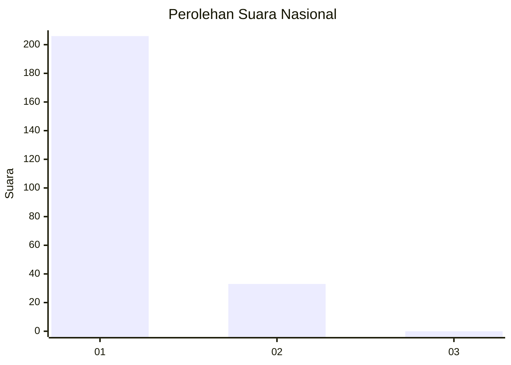
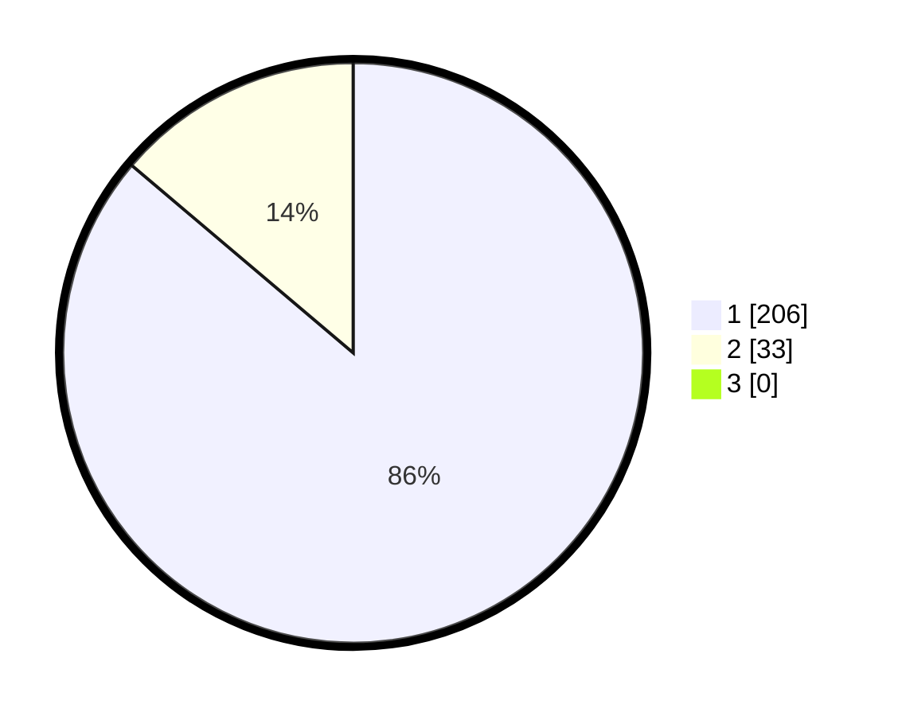

# Hasil

## Grafik

## Tabel

| No. | Nama Paslon    | Suara | Suara (raw) | Persentase |
|:--- |:-------------- | -----:| -----------:| ----------:|
| 1   | ANIES MUHAIMIN | 206   | [206][p-1]  | 86,19      |
| 2   | PRABOWO GIBRAN | 33    | [33][p-2]   | 13,81      |
| 3   | GANJAR MAHFUD  | 0     | [0][p-3]    | 0,00       |

[p-1]: https://github.com/gigit-pemilu/pemilu-2024/blob/main/pilpres/hitung-suara/sub/11-aceh/sub/08-aceh-utara/sub/08-samudera/sub/2015-kuta-krueng/sub/003-tps/sub/paslon-1.txt
[p-2]: https://github.com/gigit-pemilu/pemilu-2024/blob/main/pilpres/hitung-suara/sub/11-aceh/sub/08-aceh-utara/sub/08-samudera/sub/2015-kuta-krueng/sub/003-tps/sub/paslon-2.txt
[p-3]: https://github.com/gigit-pemilu/pemilu-2024/blob/main/pilpres/hitung-suara/sub/11-aceh/sub/08-aceh-utara/sub/08-samudera/sub/2015-kuta-krueng/sub/003-tps/sub/paslon-3.txt

## Foto C Plano

https://sirekap-obj-formc.kpu.go.id/15fc/pemilu/ppwp/11/08/08/20/15/1108082015003-20240224-151110--f783cbdf-3a02-4388-aac8-ef8d71db786e.jpg

https://sirekap-obj-formc.kpu.go.id/15fc/pemilu/ppwp/11/08/08/20/15/1108082015003-20240224-151217--c54af5cc-1a68-4752-92e7-739092f2f836.jpg

https://sirekap-obj-formc.kpu.go.id/15fc/pemilu/ppwp/11/08/08/20/15/1108082015003-20240224-151319--315058bf-748e-4f5a-a927-8cd367e05209.jpg

## Metadata

| Key        | Value               |
| ---------- | ------------------- |
| Time Stamp | 2024-02-28 21:00:00 |

