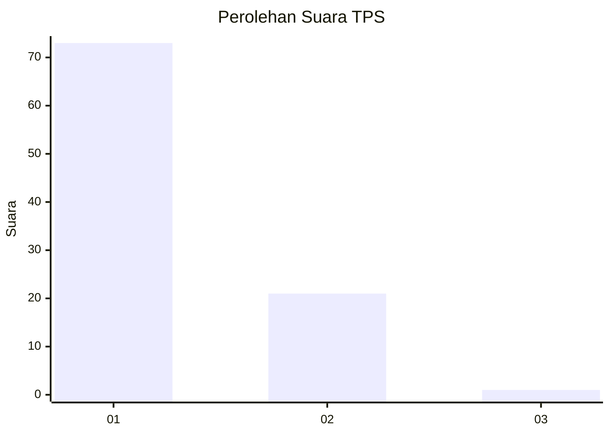
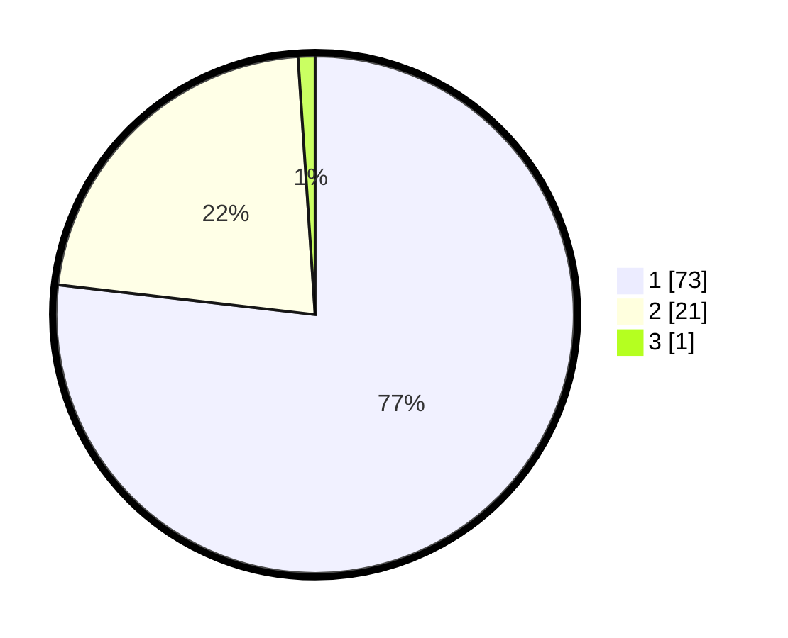

# Hasil

## Grafik

## Tabel

| No. | Nama Paslon    | Suara | Suara (raw) | Persentase |
|:--- |:-------------- | -----:| -----------:| ----------:|
| 1   | ANIES MUHAIMIN | 73    | [73][p-1]   | 76,84      |
| 2   | PRABOWO GIBRAN | 21    | [21][p-2]   | 22,11      |
| 3   | GANJAR MAHFUD  | 1     | [1][p-3]    | 1,05       |

[p-1]: https://github.com/gigit-pemilu/pemilu-2024-11-aceh/blob/main/pilpres/hitung-suara/sub/11-aceh/sub/08-aceh-utara/sub/08-samudera/sub/2016-kuta-glumpang/sub/001-tps/sub/paslon-1.txt
[p-2]: https://github.com/gigit-pemilu/pemilu-2024-11-aceh/blob/main/pilpres/hitung-suara/sub/11-aceh/sub/08-aceh-utara/sub/08-samudera/sub/2016-kuta-glumpang/sub/001-tps/sub/paslon-2.txt
[p-3]: https://github.com/gigit-pemilu/pemilu-2024-11-aceh/blob/main/pilpres/hitung-suara/sub/11-aceh/sub/08-aceh-utara/sub/08-samudera/sub/2016-kuta-glumpang/sub/001-tps/sub/paslon-3.txt

## Foto C Plano

https://sirekap-obj-formc.kpu.go.id/1a11/pemilu/ppwp/11/08/08/20/16/1108082016001-20240225-131346--7868f058-0e08-4242-a82b-3bb30b2c5374.jpg

https://sirekap-obj-formc.kpu.go.id/1a11/pemilu/ppwp/11/08/08/20/16/1108082016001-20240225-131436--e1b878b3-a0d4-4d25-b63b-8651705b7c3e.jpg

https://sirekap-obj-formc.kpu.go.id/1a11/pemilu/ppwp/11/08/08/20/16/1108082016001-20240225-131502--876e60b1-e8d6-4e57-b5c6-602dd57e80c9.jpg

## Metadata

| Key        | Value               |
| ---------- | ------------------- |
| Time Stamp | 2024-02-28 20:00:00 |

