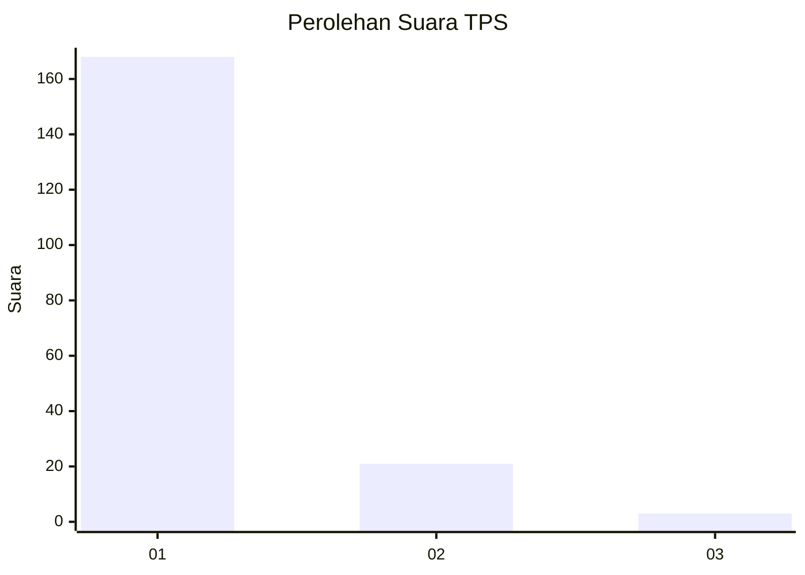
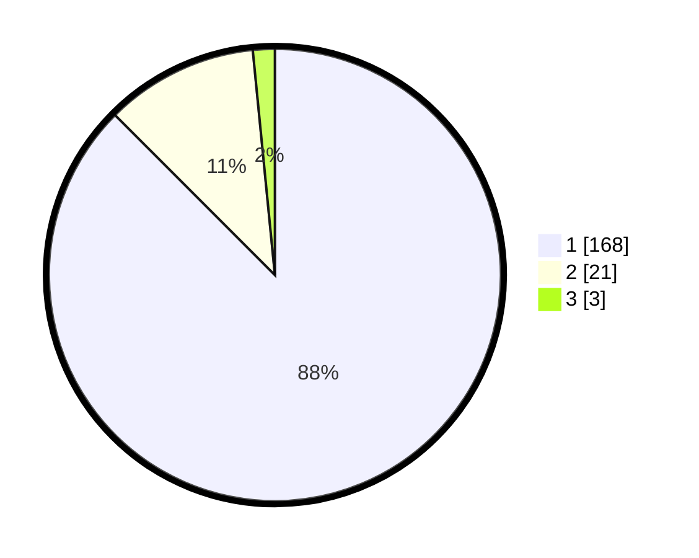

# Hasil

## Grafik

## Tabel

| No. | Nama Paslon    | Suara | Suara (raw) | Persentase |
|:--- |:-------------- | -----:| -----------:| ----------:|
| 1   | ANIES MUHAIMIN | 168   | [168][p-1]  | 87,50      |
| 2   | PRABOWO GIBRAN | 21    | [21][p-2]   | 10,94      |
| 3   | GANJAR MAHFUD  | 3     | [3][p-3]    | 1,56       |

[p-1]: https://github.com/gigit-pemilu/pemilu-2024-11-aceh/blob/main/pilpres/hitung-suara/sub/11-aceh/sub/08-aceh-utara/sub/08-samudera/sub/2016-kuta-glumpang/sub/002-tps/sub/paslon-1.txt
[p-2]: https://github.com/gigit-pemilu/pemilu-2024-11-aceh/blob/main/pilpres/hitung-suara/sub/11-aceh/sub/08-aceh-utara/sub/08-samudera/sub/2016-kuta-glumpang/sub/002-tps/sub/paslon-2.txt
[p-3]: https://github.com/gigit-pemilu/pemilu-2024-11-aceh/blob/main/pilpres/hitung-suara/sub/11-aceh/sub/08-aceh-utara/sub/08-samudera/sub/2016-kuta-glumpang/sub/002-tps/sub/paslon-3.txt

## Foto C Plano

https://sirekap-obj-formc.kpu.go.id/9fa9/pemilu/ppwp/11/08/08/20/16/1108082016002-20240225-124456--8ba93216-6817-4dd6-bcd5-29377f0e9214.jpg

https://sirekap-obj-formc.kpu.go.id/9fa9/pemilu/ppwp/11/08/08/20/16/1108082016002-20240225-124607--a29ba56c-e060-4193-81f6-267acfdead58.jpg

https://sirekap-obj-formc.kpu.go.id/9fa9/pemilu/ppwp/11/08/08/20/16/1108082016002-20240225-124638--36582c20-437f-4536-9fe3-2170a5ed45e3.jpg

## Metadata

| Key        | Value               |
| ---------- | ------------------- |
| Time Stamp | 2024-02-28 22:00:00 |

