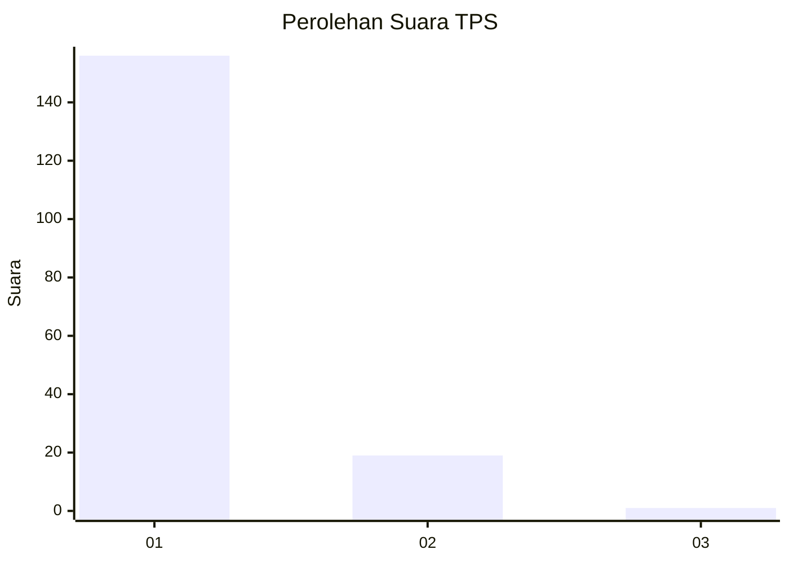
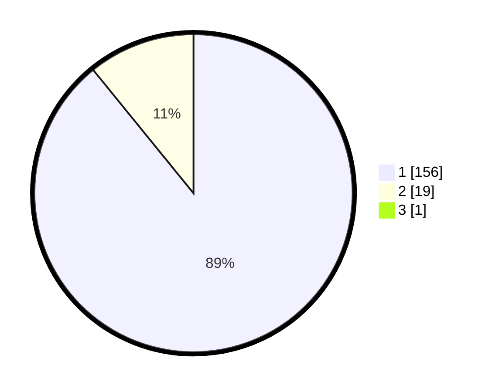

# Hasil

## Grafik

## Tabel

| No. | Nama Paslon    | Suara | Suara (raw) | Persentase |
|:--- |:-------------- | -----:| -----------:| ----------:|
| 1   | ANIES MUHAIMIN | 156   | [156][p-1]  | 88,64      |
| 2   | PRABOWO GIBRAN | 19    | [19][p-2]   | 10,80      |
| 3   | GANJAR MAHFUD  | 1     | [1][p-3]    | 0,57       |

[p-1]: https://github.com/gigit-pemilu/pemilu-2024-11-aceh/blob/main/pilpres/hitung-suara/sub/11-aceh/sub/08-aceh-utara/sub/08-samudera/sub/2016-kuta-glumpang/sub/003-tps/sub/paslon-1.txt
[p-2]: https://github.com/gigit-pemilu/pemilu-2024-11-aceh/blob/main/pilpres/hitung-suara/sub/11-aceh/sub/08-aceh-utara/sub/08-samudera/sub/2016-kuta-glumpang/sub/003-tps/sub/paslon-2.txt
[p-3]: https://github.com/gigit-pemilu/pemilu-2024-11-aceh/blob/main/pilpres/hitung-suara/sub/11-aceh/sub/08-aceh-utara/sub/08-samudera/sub/2016-kuta-glumpang/sub/003-tps/sub/paslon-3.txt

## Foto C Plano

https://sirekap-obj-formc.kpu.go.id/e8f8/pemilu/ppwp/11/08/08/20/16/1108082016003-20240225-123000--e0b31aa4-21ea-463b-8c8a-ec3f950e18f7.jpg

https://sirekap-obj-formc.kpu.go.id/e8f8/pemilu/ppwp/11/08/08/20/16/1108082016003-20240225-123042--d1006fcd-34c4-4cd9-bc42-d0c2a303c1f9.jpg

https://sirekap-obj-formc.kpu.go.id/e8f8/pemilu/ppwp/11/08/08/20/16/1108082016003-20240225-133109--58ebe423-855c-4c82-aa81-851ca4cc7ce1.jpg

## Metadata

| Key        | Value               |
| ---------- | ------------------- |
| Time Stamp | 2024-02-28 21:00:00 |

