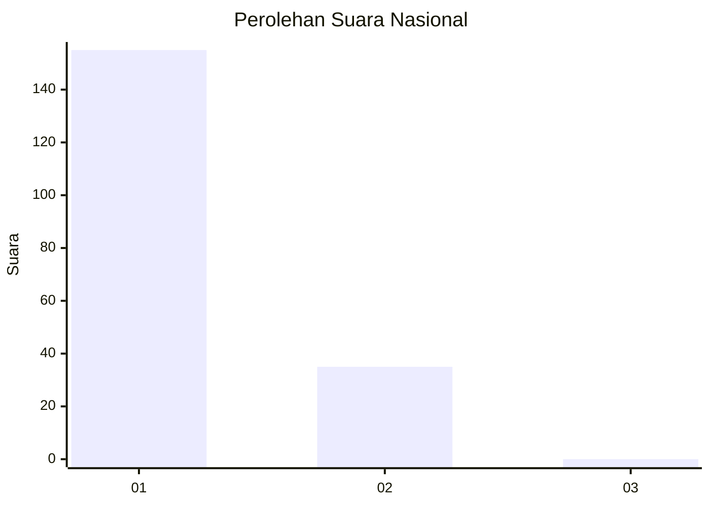
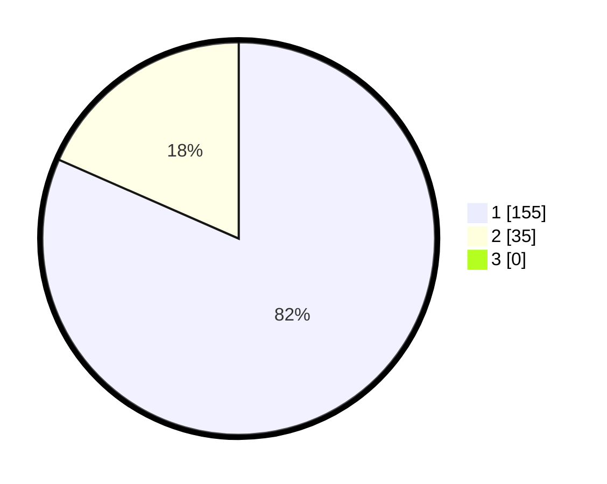

# Hasil

## Grafik

## Tabel

| No. | Nama Paslon    | Suara | Suara (raw) | Persentase |
|:--- |:-------------- | -----:| -----------:| ----------:|
| 1   | ANIES MUHAIMIN | 155   | [155][p-1]  | 81,58      |
| 2   | PRABOWO GIBRAN | 35    | [35][p-2]   | 18,42      |
| 3   | GANJAR MAHFUD  | 0     | [0][p-3]    | 0,00       |

[p-1]: https://github.com/gigit-pemilu/pemilu-2024/blob/main/pilpres/hitung-suara/sub/11-aceh/sub/08-aceh-utara/sub/08-samudera/sub/2017-meucat/sub/002-tps/sub/paslon-1.txt
[p-2]: https://github.com/gigit-pemilu/pemilu-2024/blob/main/pilpres/hitung-suara/sub/11-aceh/sub/08-aceh-utara/sub/08-samudera/sub/2017-meucat/sub/002-tps/sub/paslon-2.txt
[p-3]: https://github.com/gigit-pemilu/pemilu-2024/blob/main/pilpres/hitung-suara/sub/11-aceh/sub/08-aceh-utara/sub/08-samudera/sub/2017-meucat/sub/002-tps/sub/paslon-3.txt

## Foto C Plano

https://sirekap-obj-formc.kpu.go.id/50d6/pemilu/ppwp/11/08/08/20/17/1108082017002-20240223-202433--1b6774d5-86bb-40f7-bc3b-797ad449e3d0.jpg

https://sirekap-obj-formc.kpu.go.id/50d6/pemilu/ppwp/11/08/08/20/17/1108082017002-20240215-112301--d3c2eb23-2a90-4189-bb8d-b26db41a2d9a.jpg

https://sirekap-obj-formc.kpu.go.id/50d6/pemilu/ppwp/11/08/08/20/17/1108082017002-20240215-112427--587b59a1-c685-4da7-a8d1-de8531a8780a.jpg

## Metadata

| Key        | Value               |
| ---------- | ------------------- |
| Time Stamp | 2024-02-24 22:31:28 |

