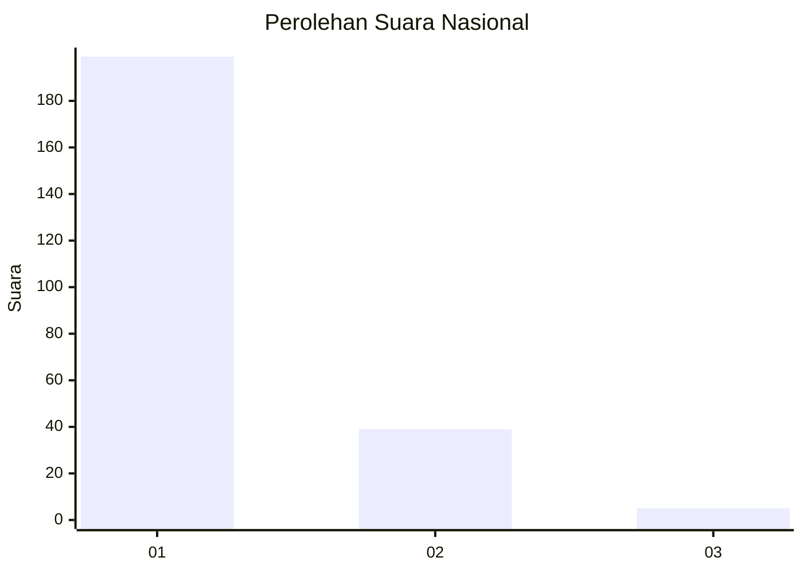
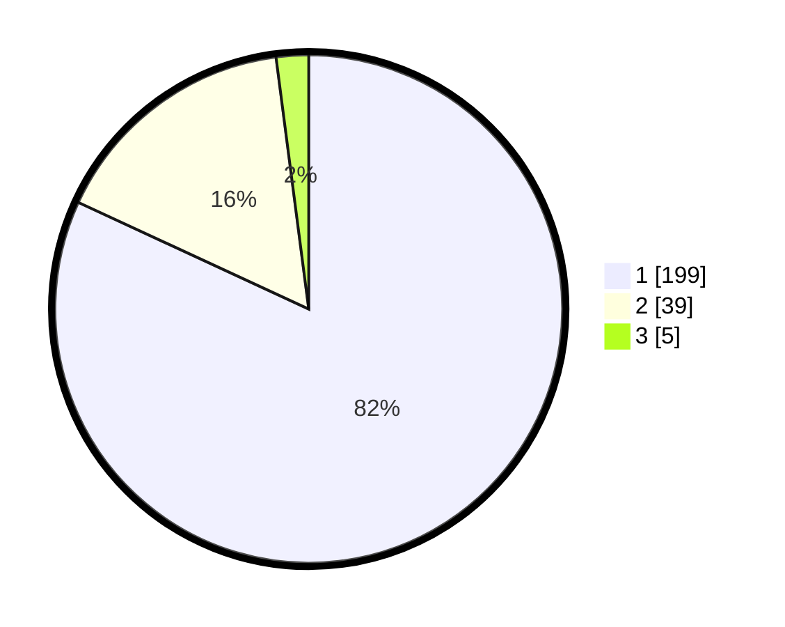

# Hasil

## Grafik

## Tabel

| No. | Nama Paslon    | Suara | Suara (raw) | Persentase |
|:--- |:-------------- | -----:| -----------:| ----------:|
| 1   | ANIES MUHAIMIN | 199   | [199][p-1]  | 81,89      |
| 2   | PRABOWO GIBRAN | 39    | [39][p-2]   | 16,05      |
| 3   | GANJAR MAHFUD  | 5     | [5][p-3]    | 2,06       |

[p-1]: https://github.com/gigit-pemilu/pemilu-2024/blob/main/pilpres/hitung-suara/sub/11-aceh/sub/08-aceh-utara/sub/08-samudera/sub/2020-mesjid/sub/001-tps/sub/paslon-1.txt
[p-2]: https://github.com/gigit-pemilu/pemilu-2024/blob/main/pilpres/hitung-suara/sub/11-aceh/sub/08-aceh-utara/sub/08-samudera/sub/2020-mesjid/sub/001-tps/sub/paslon-2.txt
[p-3]: https://github.com/gigit-pemilu/pemilu-2024/blob/main/pilpres/hitung-suara/sub/11-aceh/sub/08-aceh-utara/sub/08-samudera/sub/2020-mesjid/sub/001-tps/sub/paslon-3.txt

## Foto C Plano

https://sirekap-obj-formc.kpu.go.id/6682/pemilu/ppwp/11/08/08/20/20/1108082020001-20240219-174916--064ab428-0976-46fc-9690-96b0a0a587ae.jpg

https://sirekap-obj-formc.kpu.go.id/6682/pemilu/ppwp/11/08/08/20/20/1108082020001-20240219-180741--891580fd-64f5-4f4c-be64-47b0486731fb.jpg

https://sirekap-obj-formc.kpu.go.id/6682/pemilu/ppwp/11/08/08/20/20/1108082020001-20240219-181113--1bb9c2b7-01a9-4ac2-b4aa-a151608b1772.jpg

## Metadata

| Key        | Value               |
| ---------- | ------------------- |
| Time Stamp | 2024-02-25 21:00:00 |

## DATA PEMILIH TETAP

Jumlah pemilih dalam DPT: **278**.
 * L: **138**.
 * P: **140**.

## DATA PENGGUNA HAK PILIH

Jumlah pengguna hak pilih dalam DPT: **278**.
 * L: **138**.
 * P: **140**.

Jumlah pengguna hak pilih dalam DPTb: **0**.
 * L: **0**.
 * P: **0**.

Jumlah pengguna hak pilih dalam DPK: **0**.
 * L: **0**.
 * P: **0**.

Jumlah pengguna hak pilih: **278**.
 * L: **138**.
 * P: **140**.

## JUMLAH SUARA SAH DAN TIDAK SAH

JUMLAH SELURUH SUARA SAH: **243**.

JUMLAH SUARA TIDAK SAH: **35**.

JUMLAH SELURUH SUARA SAH DAN SUARA TIDAK SAH: **278**.

