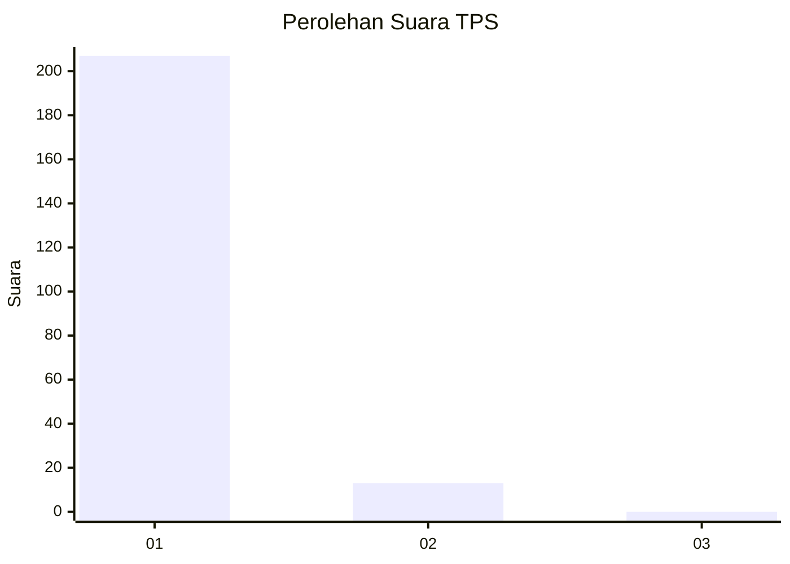
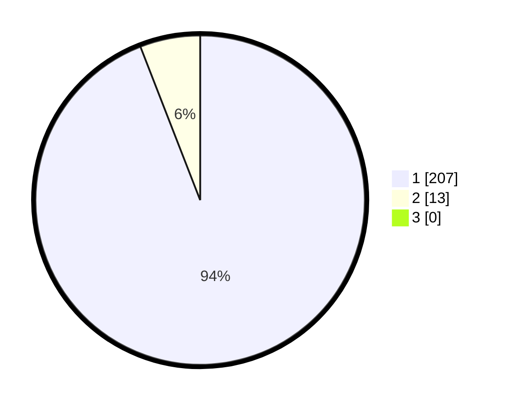

# Hasil

## Grafik

## Tabel

| No. | Nama Paslon    | Suara | Suara (raw) | Persentase |
|:--- |:-------------- | -----:| -----------:| ----------:|
| 1   | ANIES MUHAIMIN | 207   | [207][p-1]  | 94,09      |
| 2   | PRABOWO GIBRAN | 13    | [13][p-2]   | 5,91       |
| 3   | GANJAR MAHFUD  | 0     | [0][p-3]    | 0,00       |

[p-1]: https://github.com/gigit-pemilu/pemilu-2024-11-aceh/blob/main/pilpres/hitung-suara/sub/11-aceh/sub/08-aceh-utara/sub/08-samudera/sub/2027-laga-baro/sub/001-tps/sub/paslon-1.txt
[p-2]: https://github.com/gigit-pemilu/pemilu-2024-11-aceh/blob/main/pilpres/hitung-suara/sub/11-aceh/sub/08-aceh-utara/sub/08-samudera/sub/2027-laga-baro/sub/001-tps/sub/paslon-2.txt
[p-3]: https://github.com/gigit-pemilu/pemilu-2024-11-aceh/blob/main/pilpres/hitung-suara/sub/11-aceh/sub/08-aceh-utara/sub/08-samudera/sub/2027-laga-baro/sub/001-tps/sub/paslon-3.txt

## Foto C Plano

https://sirekap-obj-formc.kpu.go.id/c09c/pemilu/ppwp/11/08/08/20/27/1108082027001-20240215-215050--ffe66158-b62f-44fc-99fb-2e40062945d6.jpg

https://sirekap-obj-formc.kpu.go.id/c09c/pemilu/ppwp/11/08/08/20/27/1108082027001-20240215-215137--e8b9c5cb-f987-40f6-8911-b50799363471.jpg

https://sirekap-obj-formc.kpu.go.id/c09c/pemilu/ppwp/11/08/08/20/27/1108082027001-20240215-111717--7464230e-6eaa-4f85-a758-dcba0a7e2720.jpg

## Metadata

| Key        | Value               |
| ---------- | ------------------- |
| Time Stamp | 2024-02-17 19:00:04 |

