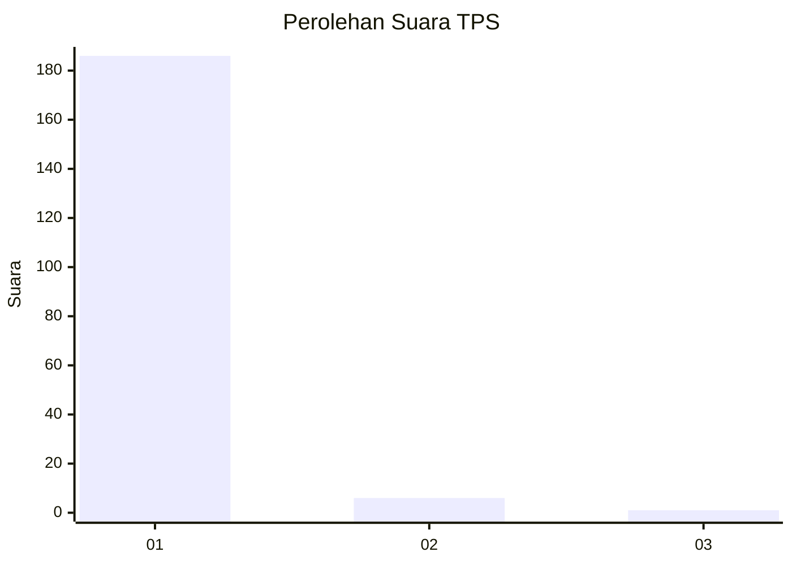
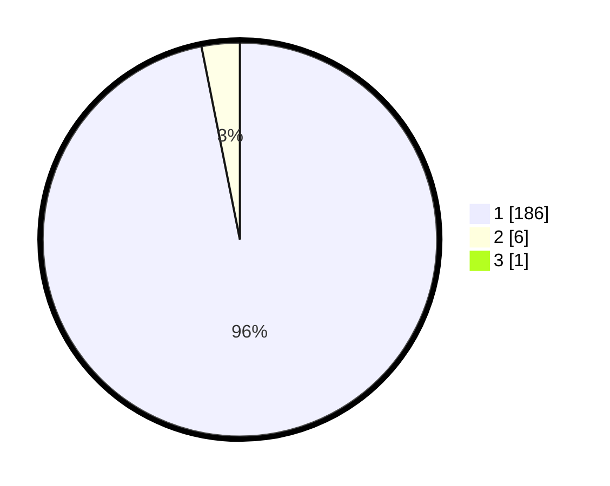

# Hasil

## Grafik

## Tabel

| No. | Nama Paslon    | Suara | Suara (raw) | Persentase |
|:--- |:-------------- | -----:| -----------:| ----------:|
| 1   | ANIES MUHAIMIN | 186   | [186][p-1]  | 96,37      |
| 2   | PRABOWO GIBRAN | 6     | [6][p-2]    | 3,11       |
| 3   | GANJAR MAHFUD  | 1     | [1][p-3]    | 0,52       |

[p-1]: https://github.com/gigit-pemilu/pemilu-2024-11-aceh/blob/main/pilpres/hitung-suara/sub/11-aceh/sub/08-aceh-utara/sub/08-samudera/sub/2030-matang-puntong/sub/002-tps/sub/paslon-1.txt
[p-2]: https://github.com/gigit-pemilu/pemilu-2024-11-aceh/blob/main/pilpres/hitung-suara/sub/11-aceh/sub/08-aceh-utara/sub/08-samudera/sub/2030-matang-puntong/sub/002-tps/sub/paslon-2.txt
[p-3]: https://github.com/gigit-pemilu/pemilu-2024-11-aceh/blob/main/pilpres/hitung-suara/sub/11-aceh/sub/08-aceh-utara/sub/08-samudera/sub/2030-matang-puntong/sub/002-tps/sub/paslon-3.txt

## Foto C Plano

https://sirekap-obj-formc.kpu.go.id/7728/pemilu/ppwp/11/08/08/20/30/1108082030002-20240222-211125--e765cb52-6bc5-42b6-9088-132369171340.jpg

https://sirekap-obj-formc.kpu.go.id/7728/pemilu/ppwp/11/08/08/20/30/1108082030002-20240222-205530--f02b9d95-e682-4af2-b579-52a32ee53a46.jpg

https://sirekap-obj-formc.kpu.go.id/7728/pemilu/ppwp/11/08/08/20/30/1108082030002-20240222-204531--ed8768c2-c6e6-4e02-a800-fb11bdc1f305.jpg

## Metadata

| Key        | Value               |
| ---------- | ------------------- |
| Time Stamp | 2024-02-24 22:31:28 |

