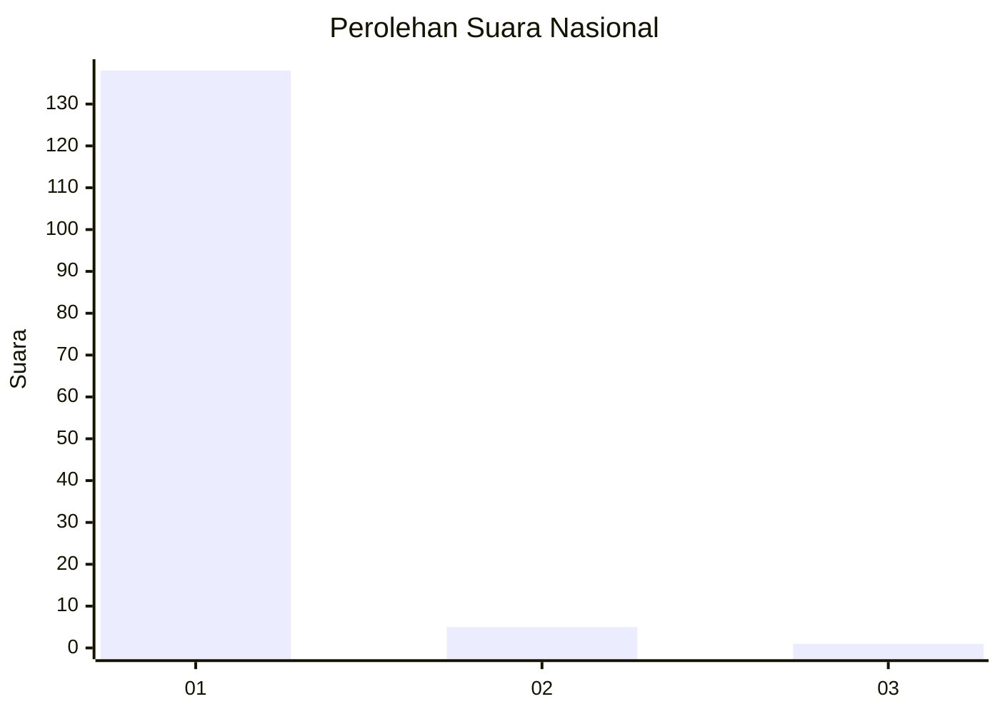
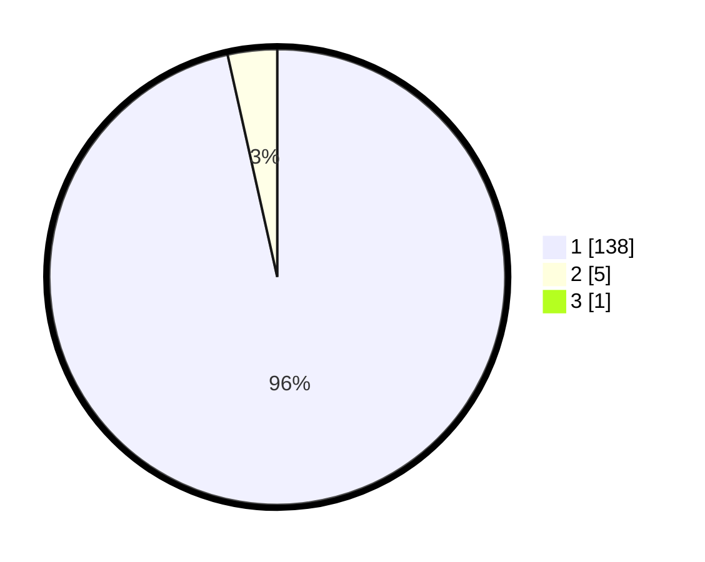

# Hasil

## Grafik

## Tabel

| No. | Nama Paslon    | Suara | Suara (raw) | Persentase |
|:--- |:-------------- | -----:| -----------:| ----------:|
| 1   | ANIES MUHAIMIN | 138   | [138][p-1]  | 95,83      |
| 2   | PRABOWO GIBRAN | 5     | [5][p-2]    | 3,47       |
| 3   | GANJAR MAHFUD  | 1     | [1][p-3]    | 0,69       |

[p-1]: https://github.com/gigit-pemilu/pemilu-2024/blob/main/pilpres/hitung-suara/sub/11-aceh/sub/08-aceh-utara/sub/08-samudera/sub/2033-tanjong-hagu/sub/001-tps/sub/paslon-1.txt
[p-2]: https://github.com/gigit-pemilu/pemilu-2024/blob/main/pilpres/hitung-suara/sub/11-aceh/sub/08-aceh-utara/sub/08-samudera/sub/2033-tanjong-hagu/sub/001-tps/sub/paslon-2.txt
[p-3]: https://github.com/gigit-pemilu/pemilu-2024/blob/main/pilpres/hitung-suara/sub/11-aceh/sub/08-aceh-utara/sub/08-samudera/sub/2033-tanjong-hagu/sub/001-tps/sub/paslon-3.txt

## Foto C Plano

https://sirekap-obj-formc.kpu.go.id/0f27/pemilu/ppwp/11/08/08/20/33/1108082033001-20240219-204125--bceb8b64-25e2-45aa-ba0b-2b8102bd5fd9.jpg

https://sirekap-obj-formc.kpu.go.id/0f27/pemilu/ppwp/11/08/08/20/33/1108082033001-20240215-030754--bd19dd55-db55-4453-89c5-f12c0b578083.jpg

https://sirekap-obj-formc.kpu.go.id/0f27/pemilu/ppwp/11/08/08/20/33/1108082033001-20240215-030918--49251b83-c74d-440a-90b1-46551a82920c.jpg

## Metadata

| Key        | Value               |
| ---------- | ------------------- |
| Time Stamp | 2024-02-19 21:00:00 |

