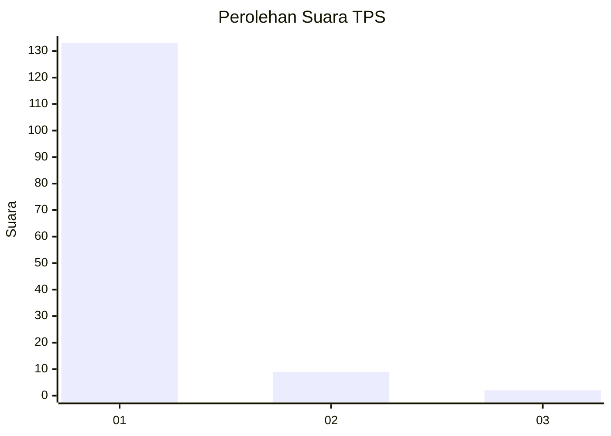
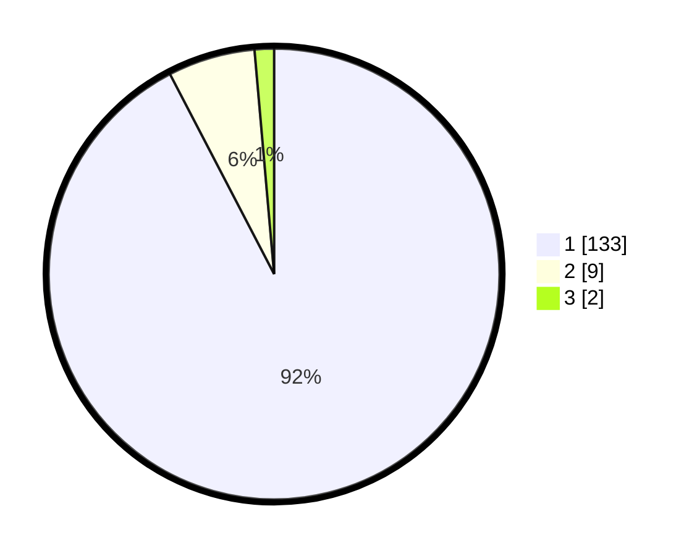

# Hasil

## Grafik

## Tabel

| No. | Nama Paslon    | Suara | Suara (raw) | Persentase |
|:--- |:-------------- | -----:| -----------:| ----------:|
| 1   | ANIES MUHAIMIN | 133   | [133][p-1]  | 92,36      |
| 2   | PRABOWO GIBRAN | 9     | [9][p-2]    | 6,25       |
| 3   | GANJAR MAHFUD  | 2     | [2][p-3]    | 1,39       |

[p-1]: https://github.com/gigit-pemilu/pemilu-2024-11-aceh/blob/main/pilpres/hitung-suara/sub/11-aceh/sub/08-aceh-utara/sub/08-samudera/sub/2033-tanjong-hagu/sub/002-tps/sub/paslon-1.txt
[p-2]: https://github.com/gigit-pemilu/pemilu-2024-11-aceh/blob/main/pilpres/hitung-suara/sub/11-aceh/sub/08-aceh-utara/sub/08-samudera/sub/2033-tanjong-hagu/sub/002-tps/sub/paslon-2.txt
[p-3]: https://github.com/gigit-pemilu/pemilu-2024-11-aceh/blob/main/pilpres/hitung-suara/sub/11-aceh/sub/08-aceh-utara/sub/08-samudera/sub/2033-tanjong-hagu/sub/002-tps/sub/paslon-3.txt

## Foto C Plano

https://sirekap-obj-formc.kpu.go.id/82a0/pemilu/ppwp/11/08/08/20/33/1108082033002-20240219-235423--01279853-a063-4d88-8a1b-24b7dccab243.jpg

https://sirekap-obj-formc.kpu.go.id/82a0/pemilu/ppwp/11/08/08/20/33/1108082033002-20240219-235529--b2305e3b-9649-4d32-9d2e-4ff96fe537d4.jpg

https://sirekap-obj-formc.kpu.go.id/82a0/pemilu/ppwp/11/08/08/20/33/1108082033002-20240219-235639--5381fe54-cbce-48c3-833b-2c602a79d39c.jpg

## Metadata

| Key        | Value               |
| ---------- | ------------------- |
| Time Stamp | 2024-02-24 22:31:28 |

