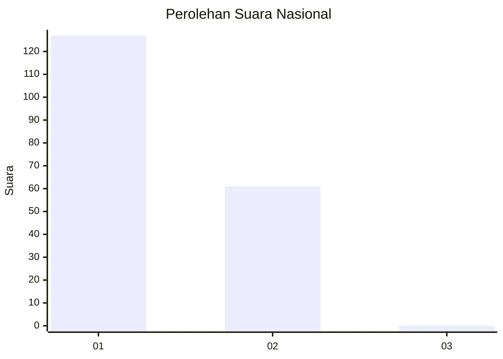
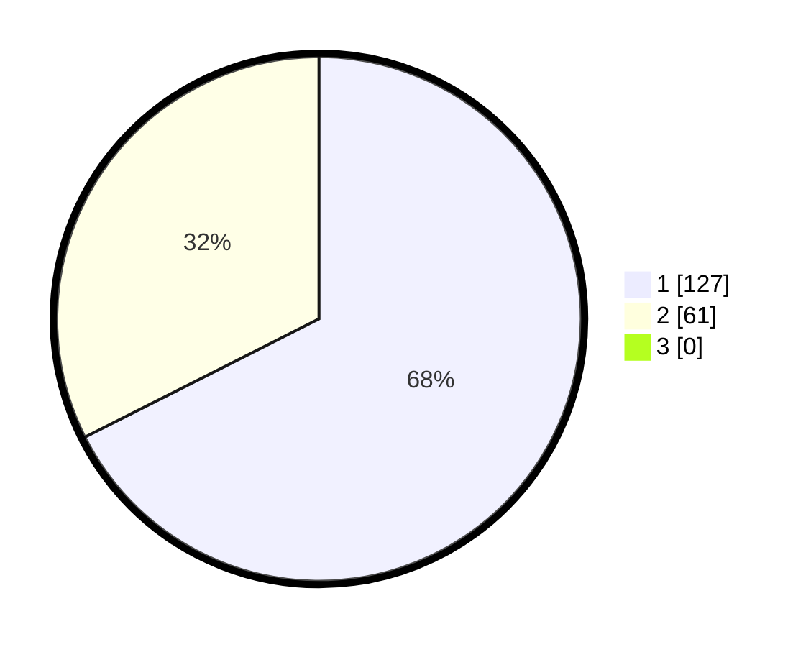

# Hasil

## Grafik

## Tabel

| No. | Nama Paslon    | Suara | Suara (raw) | Persentase |
|:--- |:-------------- | -----:| -----------:| ----------:|
| 1   | ANIES MUHAIMIN | 127   | [127][p-1]  | 67,55      |
| 2   | PRABOWO GIBRAN | 61    | [61][p-2]   | 32,45      |
| 3   | GANJAR MAHFUD  | 0     | [0][p-3]    | 0,00       |

[p-1]: https://github.com/gigit-pemilu/pemilu-2024/blob/main/pilpres/hitung-suara/sub/11-aceh/sub/08-aceh-utara/sub/08-samudera/sub/2036-paya-terbang/sub/002-tps/sub/paslon-1.txt
[p-2]: https://github.com/gigit-pemilu/pemilu-2024/blob/main/pilpres/hitung-suara/sub/11-aceh/sub/08-aceh-utara/sub/08-samudera/sub/2036-paya-terbang/sub/002-tps/sub/paslon-2.txt
[p-3]: https://github.com/gigit-pemilu/pemilu-2024/blob/main/pilpres/hitung-suara/sub/11-aceh/sub/08-aceh-utara/sub/08-samudera/sub/2036-paya-terbang/sub/002-tps/sub/paslon-3.txt

## Foto C Plano

https://sirekap-obj-formc.kpu.go.id/7a79/pemilu/ppwp/11/08/08/20/36/1108082036002-20240220-163750--2439bc72-b153-458f-b5c8-09f82692efc8.jpg

https://sirekap-obj-formc.kpu.go.id/7a79/pemilu/ppwp/11/08/08/20/36/1108082036002-20240220-163909--61ca072b-b48d-4901-9ad1-3ea832939ae3.jpg

https://sirekap-obj-formc.kpu.go.id/7a79/pemilu/ppwp/11/08/08/20/36/1108082036002-20240220-164001--22c6edd1-b367-46cc-b811-14ac96c50014.jpg

## Metadata

| Key        | Value               |
| ---------- | ------------------- |
| Time Stamp | 2024-02-24 22:31:28 |

