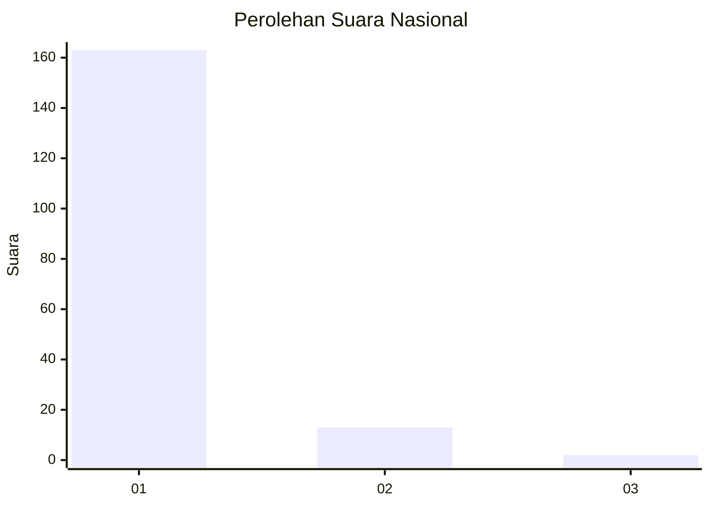
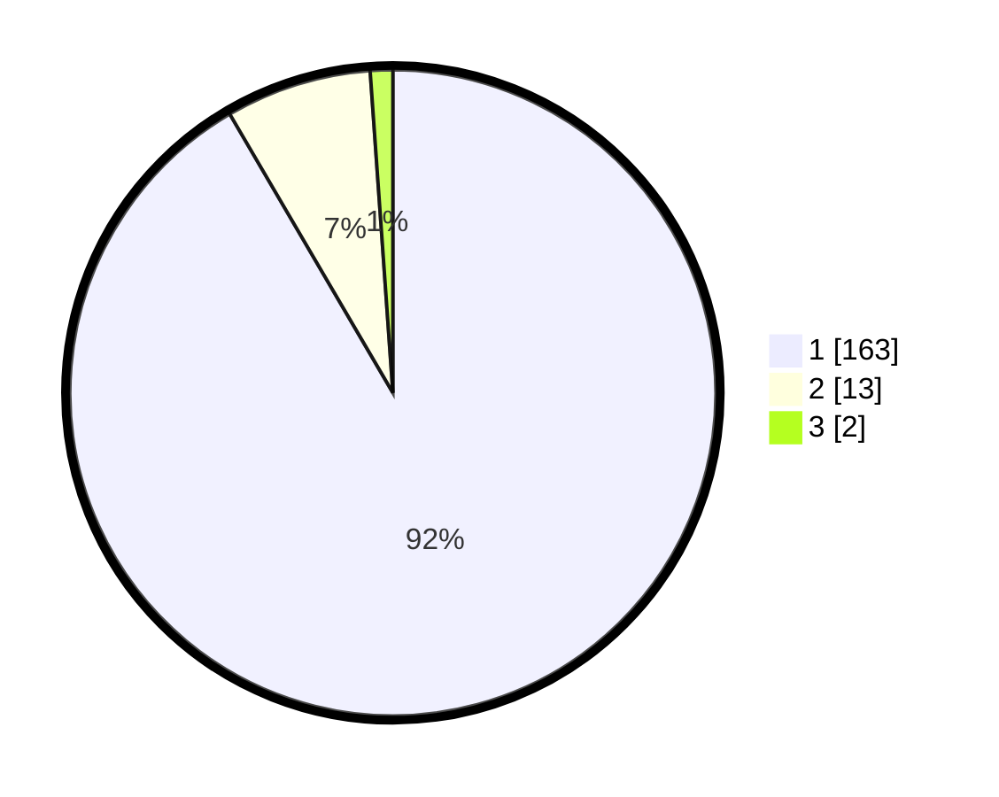

# Hasil

## Grafik

## Tabel

| No. | Nama Paslon    | Suara | Suara (raw) | Persentase |
|:--- |:-------------- | -----:| -----------:| ----------:|
| 1   | ANIES MUHAIMIN | 163   | [163][p-1]  | 91,57      |
| 2   | PRABOWO GIBRAN | 13    | [13][p-2]   | 7,30       |
| 3   | GANJAR MAHFUD  | 2     | [2][p-3]    | 1,12       |

[p-1]: https://github.com/gigit-pemilu/pemilu-2024/blob/main/pilpres/hitung-suara/sub/11-aceh/sub/08-aceh-utara/sub/08-samudera/sub/2037-madan/sub/002-tps/sub/paslon-1.txt
[p-2]: https://github.com/gigit-pemilu/pemilu-2024/blob/main/pilpres/hitung-suara/sub/11-aceh/sub/08-aceh-utara/sub/08-samudera/sub/2037-madan/sub/002-tps/sub/paslon-2.txt
[p-3]: https://github.com/gigit-pemilu/pemilu-2024/blob/main/pilpres/hitung-suara/sub/11-aceh/sub/08-aceh-utara/sub/08-samudera/sub/2037-madan/sub/002-tps/sub/paslon-3.txt

## Foto C Plano

https://sirekap-obj-formc.kpu.go.id/cbba/pemilu/ppwp/11/08/08/20/37/1108082037002-20240214-184520--8310592b-0f40-4ccf-ba41-6bf4d8d5896c.jpg

https://sirekap-obj-formc.kpu.go.id/cbba/pemilu/ppwp/11/08/08/20/37/1108082037002-20240214-192208--e94a34dc-907b-4a38-ac1d-87e226760407.jpg

https://sirekap-obj-formc.kpu.go.id/cbba/pemilu/ppwp/11/08/08/20/37/1108082037002-20240215-001553--58d08d2a-5e88-47c9-a56e-b37115d07a89.jpg

## Metadata

| Key        | Value               |
| ---------- | ------------------- |
| Time Stamp | 2024-02-15 06:00:23 |

