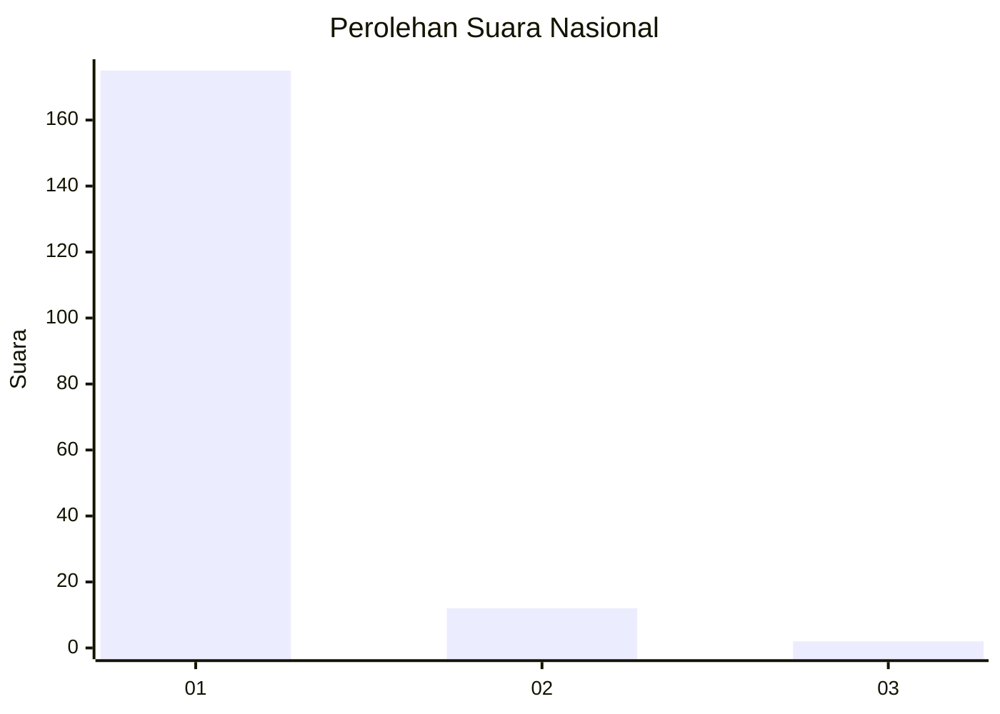
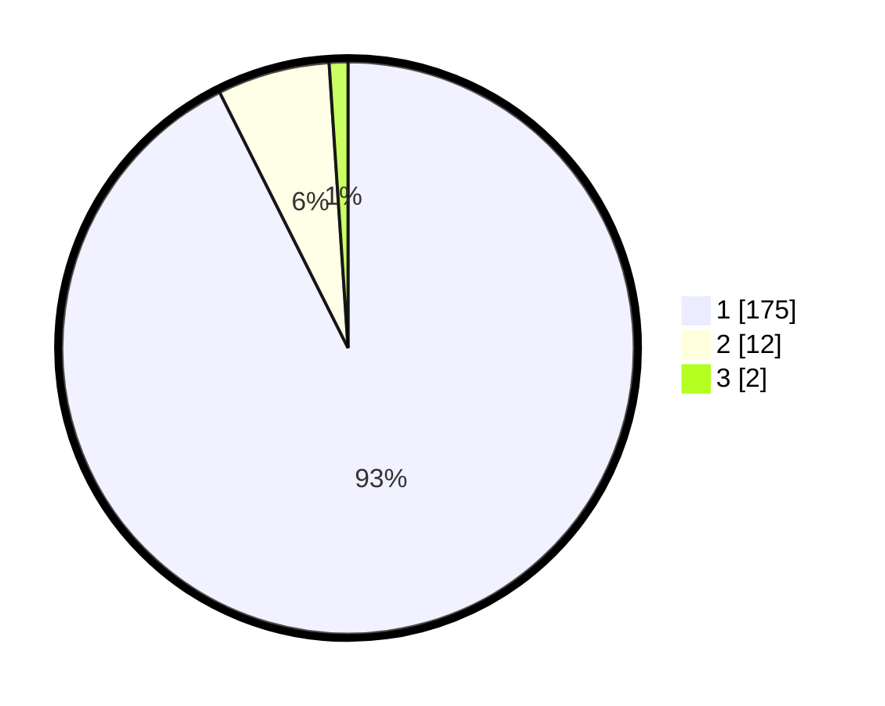

# Hasil

## Grafik

## Tabel

| No. | Nama Paslon    | Suara | Suara (raw) | Persentase |
|:--- |:-------------- | -----:| -----------:| ----------:|
| 1   | ANIES MUHAIMIN | 175   | [175][p-1]  | 92,59      |
| 2   | PRABOWO GIBRAN | 12    | [12][p-2]   | 6,35       |
| 3   | GANJAR MAHFUD  | 2     | [2][p-3]    | 1,06       |

[p-1]: https://github.com/gigit-pemilu/pemilu-2024/blob/main/pilpres/hitung-suara/sub/11-aceh/sub/08-aceh-utara/sub/08-samudera/sub/2038-tanjong-awe/sub/002-tps/sub/paslon-1.txt
[p-2]: https://github.com/gigit-pemilu/pemilu-2024/blob/main/pilpres/hitung-suara/sub/11-aceh/sub/08-aceh-utara/sub/08-samudera/sub/2038-tanjong-awe/sub/002-tps/sub/paslon-2.txt
[p-3]: https://github.com/gigit-pemilu/pemilu-2024/blob/main/pilpres/hitung-suara/sub/11-aceh/sub/08-aceh-utara/sub/08-samudera/sub/2038-tanjong-awe/sub/002-tps/sub/paslon-3.txt

## Foto C Plano

https://sirekap-obj-formc.kpu.go.id/6bf9/pemilu/ppwp/11/08/08/20/38/1108082038002-20240220-224604--b1b4f754-58cc-4b43-aebc-efe72e847d22.jpg

https://sirekap-obj-formc.kpu.go.id/6bf9/pemilu/ppwp/11/08/08/20/38/1108082038002-20240215-093527--42e2579c-4365-4d31-9d5f-8cf8767caca0.jpg

https://sirekap-obj-formc.kpu.go.id/6bf9/pemilu/ppwp/11/08/08/20/38/1108082038002-20240215-093731--6d2a129c-d76d-4977-9e81-7b4d89f129eb.jpg

## Metadata

| Key        | Value               |
| ---------- | ------------------- |
| Time Stamp | 2024-02-20 23:00:00 |

